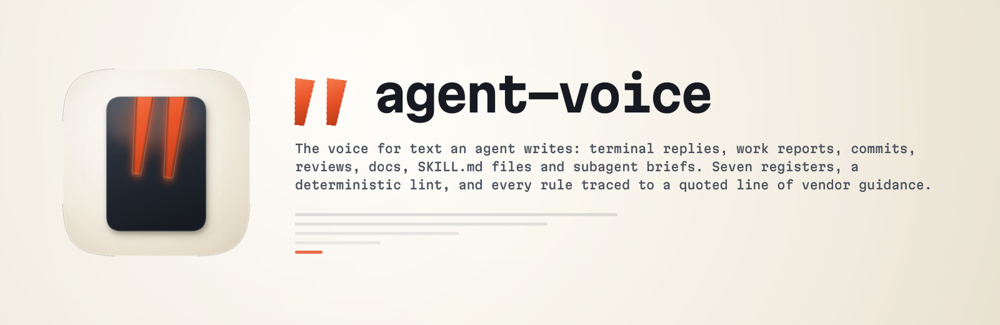

<p align="center">
  
</p>

<h1 align="center"> agent-voice</h1>

<p align="center"><strong>Your agent already has a voice. Nobody chose it.</strong><br />
A SWE skill for Claude Code that gives agent-authored text a register, split by who reads it, with a deterministic lint behind every rule.</p>

<p align="center">
  
  
  
  
  
</p>

---

## Why it exists

Every agent writes all day. Terminal answers, work reports, commit messages, PR bodies, review comments, plans, SKILL.md files, briefs for other agents. All of it has a voice, and the voice arrived by default rather than by decision.

Here's what the default costs, counted over six weeks of one operator's own sessions: **141 answers to plain questions ran a median of 17 lines**, and 79 of those were answers to questions under 70 characters. "How're things going, any gains?" got 27 lines. "Am I trying to reinvent the wheel?" got 28. "Is there anything left we need to do?" got four headed sections and a closing reflection.

The obvious fix is to tell the model to be brief, and that fix is measured, and it backfires. A response-compression style run as a paired arm on a 106-task agentic coding benchmark:

| diolog-swe-bench, Opus 5 at xhigh, 106 paired tasks | pure | compressed |
|---|---|---|
| Score | 63.3% | **55.7%** |
| Cost | $229.02 | $152.34 |
| Steps per task | 24.5 | 16.5 |

Score down 7.61 points, 48 tasks worse against 15 better, p < 0.0001. And the money didn't come from where anyone thought: steps fell 32.7% while tokens per step fell only 13.6, so about **78% of the "saving" was the agent doing less investigating**, not writing more tersely. Worse, 97.5% of the compressed runs still emitted markdown against 98.9% for the control; the instruction-following cost got paid and the register mostly never arrived.

So a voice for agent output has to state countable targets rather than an attitude, and it has to be explicit that it changes how much gets written and never how much gets done.

There's a second half, and it fails in the opposite direction. Text a *model* reads breaks on vagueness rather than on padding. One recorded Gemini run on a rich brief delivered all twelve features the brief named explicitly, then satisfied every requirement named *categorically* with exactly one instance:

| The brief asked for | It delivered |
|---|---|
| all surfaces | 5 |
| all states | **1** |
| all menus | **0** |
| all user flows | **0** |
| all actions | one generic toast, reused |

Same run wrote itself a review claiming a browser engine that failed on all four invocation attempts and never ran, plus "100% pass rate on contrast" from a probe that never executed. Measured afterwards: every primary button at 3.65:1, one glyph at 1.00:1 and invisible.

Padding and ambiguity are both voice problems, they are opposite, and a single set of rules can't hold both. That's the whole design.

## What it actually produces

Seven registers, split by who reads the text, because the reader decides the failure mode.

**Text a person reads** fails as padding. Terminal reply, work report, commit and PR, review comment, written document. The lint hard-fails closing flourishes, self-congratulation and preamble openers.

**Text a model reads** fails as ambiguity. SKILL.md and instruction files, subagent briefs. The lint hard-fails unmeasurable qualifiers, uncounted categorical scope, pressure language and misplaced verification scaffolding.

On top sits a **dialects layer**, because the same rule needs different phrasing per family. Claude Opus 5 runs long and verifies its own work without being told, so you state a ceiling and delete the verification instructions. Gemini 3 runs terse and satisfies a categorical requirement with one instance, so you state a floor and put the verification step back with its command attached. One of those rules is the exact inverse of the other, and it's both vendors' own published guidance saying so.

Every rule carries a marker naming its evidence: a quoted line of Anthropic guidance, a quoted line of Google's, a recorded measurement, or the bundled AI-writing field guide. **82 of those quotes verify verbatim against the source documents**, checked by a script rather than by eye, because a sibling skill in this repo once shipped three of its own sentences inside quotation marks attributed to Google.

## How to use it

Install the plugin, then just work. It fires when someone wants agent output to read better, or before writing an instruction file another model will execute.

```
"why are your answers so long"
"write the commit message"
"tighten this report"
"review this SKILL.md"
"this prompt is too vague"
"rewrite this brief for Gemini"
```

The gate is a script, so "I checked" means checked:

```bash
python3 scripts/agent_voice_lint.py --format reply --target claude draft.md
python3 scripts/agent_voice_lint.py --self-test     # 18 fixtures
./scripts/check_package.sh                          # all four checks
```

`--format` is one of `reply`, `report`, `commit`, `review`, `doc`, `skill`, `brief`. `--target` names the family that will read it and changes one check: verification instructions hard-fail for a Claude reader and are expected for a Gemini one.

## What it refuses to do

- **It won't shorten the work.** The counterweight is a section of the base voice, not a footnote: uncertainty, risk, security implications, destructive-action confirmations and verification that actually happened are content, and they stay whatever the length target says.
- **It won't write in a person's voice.** If the target author is a named human, that person's own content skill governs. To build one from writing samples, `create-voice-persona` is the factory.
- **It won't retrofit a whole skill for another model.** That's `geminify`, which writes a companion `gemini.md`. This one writes prose.
- **It won't ship a rule nobody can source.** Inferences are marked as inferences, and `references/evidence.md` is where every marker points.

## Evals

The honest version, which is in `EVALS.md` with its limits attached.

Three tasks, two arms each: the bare task, then the same task with the base voice plus the matching register file. Generated on `gemini-3.7-flash-high` from a directory with no project instructions, and scored by the lint, which is a fixed program rather than a judge.

| | Hard failures | Advisories | Non-empty lines |
|---|---|---|---|
| no skill | **2** | 6 | 77 |
| with the skill | **0** | 3 | 28 |

The two baseline failures were the ones the design predicts: an uncounted categorical scope in the instruction file, and a preamble opener on the report.

Shorter isn't automatically better, and that's the trap this whole skill is built around, so task 3's log was checked fact by fact. It states twelve discrete facts. Both arms kept **12 of 12**, at 20 lines against 3. The baseline also invented three things the skill arm didn't: fabricated `file:///` links, an unrequested "Recommended Next Steps" section, and LaTeX in a terminal report.

**What that isn't.** Three tasks, one generation each, one model family, no repeats, so there's no variance estimate and no significance claim. Four of the seven registers were never generated in either arm. And the Claude arm is missing: the first attempt generated it with `claude -p`, which inherits the operator's global `CLAUDE.md` (already carrying verbosity rules) and read repo files it wasn't given, so the baseline was contaminated and got discarded rather than reported. The skill has not been measured on the family it's primarily written for. `EVALS.md` names the three runs that would settle it.

The mechanical half is stronger and fully reproducible: 18 lint fixtures, 14 worked examples linted at their own register, 10 shipped files held to the skill's own rules, and the 82 quote verifications. `./scripts/check_package.sh` runs all four and exits 0 only when every one passes.

Found something wrong, or a register that's missing? Open an issue on the repo.
