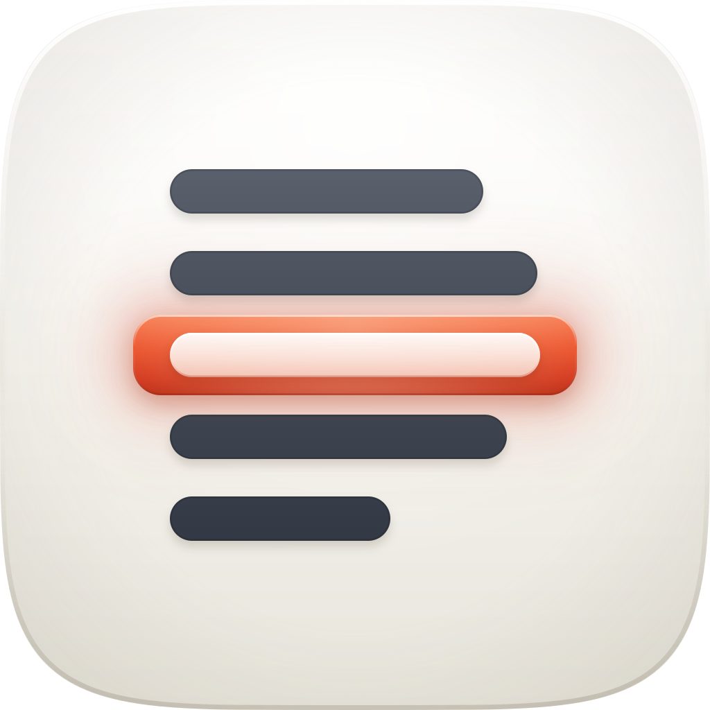

<p align="center">
  
</p>

<h1 align="center"> armada-sync</h1>

<p align="center"><strong>Keeps the portfolio manifest honest. One entry, nothing else.</strong><br />
A maintenance SWE skill for Claude Code, and the quiet counterpart to <a href="../ship-armada">ship-armada</a>.</p>

<p align="center">
  
  
  
  
</p>

---

## Why it exists

`~/Dev/ARMADA.md` is the manifest of record for every active project in `~/Dev`. `ship-armada` plans portfolio-wide work from it, so the file isn't documentation sitting off to one side; it's an input. A stale entry doesn't just look untidy, it produces bad plans.

The catch is that work mostly happens where the orchestrator can't see it. You ship a feature in one repo on a Tuesday and nothing tells the manifest. So every project's `CLAUDE.md` carries a short "Portfolio manifest" section pointing here, and whoever was doing the work, orchestrator or not, the file gets brought back to true before the session ends.

## What it changes

One entry, plus the two lines that reference it.

| Where | What it does |
|---|---|
| The `### <project>` entry | Rewrites it in place and keeps it under about 20 lines: the `updated:` stamp, **Status**, **Features** (at most 8, most important first), the **Read more** paths, and **AI/tech opportunities** if the work closed or created one |
| The index table | Updates that project's row with the same status phrase and the same date |
| `## Changelog` | Appends one line, in the form `- 2026-08-07 <project>: <what changed in one clause>` |

Then it tells you what it changed in a sentence or two, and stops.

> [!NOTE]
> It never touches another project's entry and it never rebuilds the manifest. That's `ship-armada`'s survey. If `ARMADA.md` doesn't exist yet, this skill says so and points you there rather than scaffolding a one-project manifest out of thin air.

## Installing

```text
/plugin marketplace add fledgeling-co/fledgeling-plugins
/plugin install armada-sync@fledgeling-plugins
```

## Using it

Most of the time you won't call it. It runs off the `CLAUDE.md` pointer after meaningful work in a project: a feature shipped, a status change, a new spec, plan or mock, a rename, a new sub-app, a new deploy. `ship-armada` also invokes it directly when its survey turns up a stale entry.

When you do want it by name, it answers to "update the armada manifest", "sync the master file", "refresh ARMADA.md", and "make sure the portfolio file knows about this".

It works out which project you mean by walking up from the current directory to whichever child of `~/Dev` contains it.

> [!TIP]
> Sitting in `~/Dev` itself, there's no project to infer, so it asks which one instead of guessing. That's the one moment it needs you.

## The rules that keep it useful

**Every path is verified before it's written.** The **Read more** line carries repo-relative paths to specs, plans, `ORCHESTRATOR.md`, design docs and the newest mocks, and each one has to exist at write time. A broken reference is worse than no reference; it sends the next orchestrator run somewhere that isn't there.

**Prose states facts, not aspirations.** Status is the current state of the work, in one or two sentences, and nothing about where it's heading.

**Finished and parked projects keep their entries.** If something's done or on ice, that goes in **Status** rather than the entry quietly disappearing.

**The delta is gathered cheaply.** A `git log --oneline --since=<the entry's last stamp>` plus whatever the session already knows, and it only opens the docs whose references it has reason to think moved.

## What's in the box

```text
plugins/armada-sync/
├── skills/armada-sync/SKILL.md   the protocol and the entry template
└── assets/                       icon, banner, and the icon audit
```

It's the smallest thing in this marketplace and it should be. One job, done surgically, so the file `ship-armada` reads is true when it reads it.
