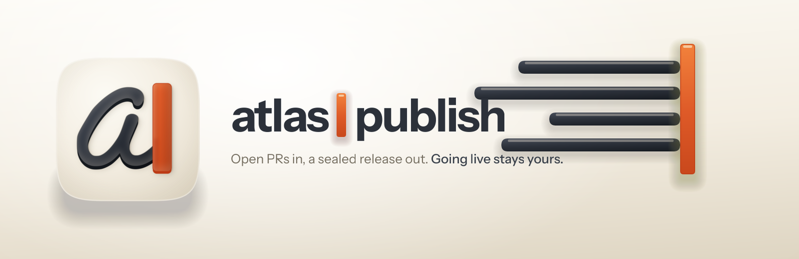
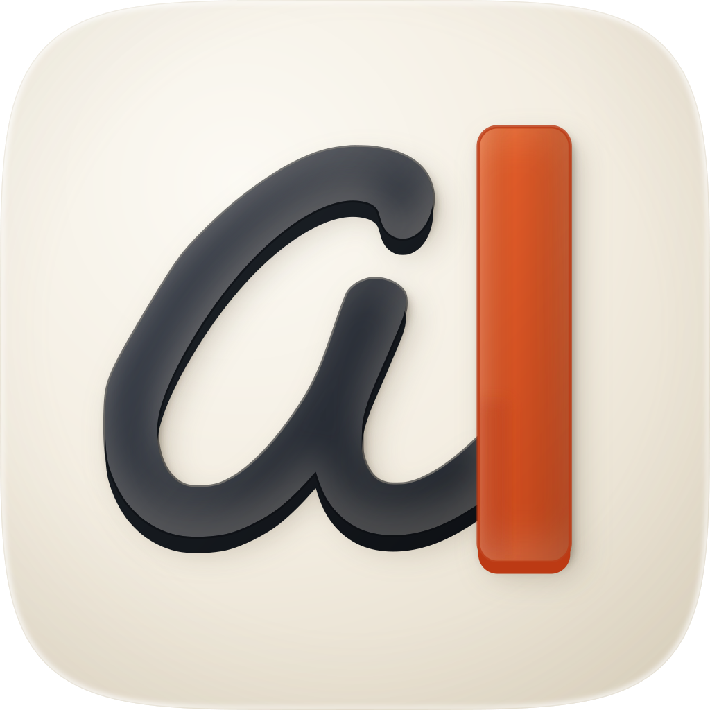

<p align="center">
  
</p>

<h1 align="center"> atlas-publish</h1>

<p align="center"><strong>Ships the Atlas release, and stops before the part that's yours.</strong><br />
Drives the open PRs of the Atlas/Bella monorepo all the way to a staged release, on whichever lane the code actually needs.</p>

<p align="center">
  
  
  
  
</p>

---

## Why it exists

The skill already existed, bundled inside the Atlas repo and served over its admin MCP server, so anyone who connected the console got it without installing anything. That part worked. The problem was the size of it against the size of the job.

It was 99 lines. In those 99 lines it merges branches, decides whether a change can go out over the air or needs a full App Store build, archives a binary, uploads it to TestFlight, exports a JavaScript bundle, pushes the bytes to Blob storage and registers the result. Every one of those steps can fail quietly, and a procedure that short has no room to say how you'd know.

Here's the case that made the point. `atlas-api` carries a test that checks the public certificate baked into the app against the private signing key held in Vercel. If those two ever drift apart, every signed update is rejected on real devices and nothing else notices. The test guards its only real assertion behind `it.runIf(!!parityKey)`, and pairs it with a companion that asserts `expect(true).toBe(true)`. So without `OTA_CERT_PARITY_KEY` in the environment, the file passes green having never compared the certificate to the key. That's deliberate in the test; it keeps a key-less CI run honest. It was not deliberate in the release skill, which read the green and moved on.

That's the shape of the whole rebuild. Not "add more checks", but "stop letting a check that didn't run look like one that passed".

## What it does

It takes the currently open PRs to a **registered draft release**.

It picks the lane first, and it picks it from evidence rather than intent. An over-the-air update ships JavaScript only; an App Store release ships a new binary. The decision comes out of the expo-updates native fingerprint, and `ios.buildNumber` sits inside that fingerprint, so bumping the build number on its own is enough to force a store release. Assume the wrong lane and you spend an afternoon exporting a bundle no device will accept.

Then it runs the pipeline: preconditions, classification, the API back-compat and certificate-parity gates, the PR review and merge pass, test reconciliation, version bumps, the archive or the export, the upload, and the registration. Eleven steps, each marked with which lanes it applies to, each with an abort path written next to it.

Two rules run underneath all of it.

**Read the observable, not the return value.** Six of those steps can't be undone, and every one of them names the thing to go and check afterwards. A build tool, an upload and an MCP call will all hand back success without having done anything; the read-back is the evidence, and the return code isn't.

**Note:** two witnesses that share a failure mode aren't a cross-check. Reading back the same API that just told you it worked confirms nothing you didn't already believe.

**Gates report three states, not two.** Passed, failed, and not-run. A gate whose pass and whose cannot-run look identical isn't a measurement.

## Three decisions that are deliberately unfashionable

**Draft is where automation stops.** The skill will archive, upload and register. It will not call `publish_bundle`, `publish_app_version`, `retract` or `set_min_app_version`. That isn't a permissions setting you can loosen; it's the boundary the skill is built around. The reasoning is about reproducibility, not caution: a draft can be rebuilt and thrown away, so the cost of getting it wrong stays inside the machine. Putting a bundle in front of users can't be, at any level of checking.

**It will stop the pipeline to ask you for prose.** Before a store build it wants the TestFlight "What to Test" notes, and it won't proceed without them. Every instinct says to generate them and keep moving. The old flow did the equivalent, silently reusing whatever stale text was sitting in the file, and testers read release notes describing a build from three releases ago.

**It will tell you the release isn't clear when everything is green.** A gate it couldn't run gets reported as not-run, and not-run doesn't roll up into a pass. That means the honest answer is sometimes "I can't say", on a run where every command exited 0 and a shorter skill would have handed you a clean report.

## Install

```
/plugin marketplace add fledgeling-co/fledgeling-plugins
/plugin install atlas-publish@fledgeling-plugins
```

It also ships from the Atlas repo itself, served as a tool by the admin MCP connector at `https://admin.atlasapp.au/connector`, which is how it reaches the Claude app. **Note:** that copy is the older text. Installing the plugin is currently the only way to get this version.

For reviewing the diff before the merge pass, install [code-review](../code-review/README.md), which used to ship inside this plugin and is now general.

## Using it

Ask in plain language ("ship an Atlas release", "push a JS-only update", "can I push this?"), or invoke it directly:

```
/atlas-publish
```

## What it will not do

- Publish anything to users. Draft is the last state it writes.
- Build a store release without the TestFlight notes in your words.
- Report a gate it couldn't run as a gate that passed.
- Report a fan-out as complete when a shard never came back.
- Claim a step worked because the tool that performed it said so.

## What it's built on

The pipeline shape is adapted from the `code-review` skill built into the Claude Code CLI, which turned out to be the most useful reference available: the idea that a run states its own budget up front, before anyone can mistake what it did for what it was asked to do.

The rest came out of research reports. The read-back rule is [silent](https://dossier.fledgeling.app/silent), on a driver that returned ok and did nothing. The shard reconciliation is [workflows](https://dossier.fledgeling.app/workflows), on a fan-out where a third of the agents never came back. The argument for the founder gate is [cadence](https://dossier.fledgeling.app/cadence), which is about matching how much checking a thing gets to how reproducible it is; the "probe the tier, don't trust a generic green" rule is [dispatch](https://dossier.fledgeling.app/dispatch); and the credentialed-Mac note is [egress](https://dossier.fledgeling.app/egress).

The three-state gate comes from [vacuous](https://dossier.fledgeling.app/vacuous), on a suite that passed a guarantee it never ran; it's the report that named the certificate-parity case above.

Every source is exported into [`docs/deep-research/`](../../docs/deep-research/) at the root of this marketplace, and [`skills/atlas-publish/references/evidence.md`](skills/atlas-publish/references/evidence.md) maps each rule to the one it came from.

## Licence

MIT.
