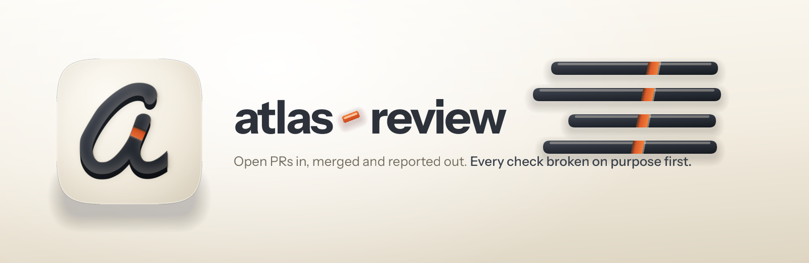

<p align="center">
  
</p>

<h1 align="center"> atlas-review</h1>

Takes the open pull requests on the Atlas monorepo from arrival to merged, pushed and
reported.

The product owner writes the interface and hands it over. The review, the fixes, the
backend wiring, the tests for the new screens and the report all sit on the other side of
that handover, and this skill does them in the order they get asked for.

## What it does

```
1 review the open PRs          6 update the tests for what the PRs added
2 resolve what it found        7 do the backend work, plus the owner's notes
3 commit and push              8 test and iterate until green, unit and on a device
4 rebase onto main             9 commit and push
5 pull
```

Stages 2, 6 and 7 are the ones nobody files a ticket for. The review skill it calls is
read-only, so fixing is this skill's own job. A stack that adds four screens adds no tests
for them. And the owner says plainly that they left the backend alone, so it is waiting.

## The two things it does differently

**It does not trust a test until it has watched it fail.** Three quarters of compiling
machine-written tests are vacuous, and reading one is measured as poor at spotting the
shapes that matter, because a reader treats a mock as a valid fixture. So a test the change
touched gets a fault injected into the code it covers, and has to go red. Eighteen checks
that could not fail were found this way in a single session, and not one was found by
running the tests.

**It checks the tree after merging, not the branches before.** Between a fifth and a third
of merges that apply cleanly still carry a conflict of meaning, and no check that runs on a
branch alone can see one. Two of them turned up in the session this was built from, and both
were records that disagreed with their twin only once they sat in the same tree.

## What comes out

A comment on each pull request, in Luke's voice. A single-column HTML page the product owner
can read without knowing what any of it is called, with figures doing the work that long
sentences would otherwise do. And a status page that joins the portfolio dashboard.

## What it will not do

Cut a release; that is `atlas-publish`, which begins where this ends. Work the wider backlog;
that is `ship-fleet`. Weaken a check so it passes. Or report a verdict it did not measure:
"still passing" and "passed once, weeks ago" are different claims, and the record says which.

## Evidence

`skills/atlas-review/references/evidence.md` separates what the field has measured from what
was measured in this one repo. The research panel is in `docs/deep-research/`. `evals/EVALS.md`
says plainly that no comparison against not using the skill has been run, and names the three
tasks that would settle it.
