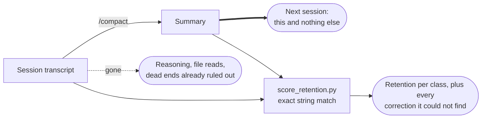

<p align="center">
  
</p>

<h1> compaction-quality</h1>

Write compaction summaries that survive being the only thing the next session has. Then score them, with a script rather than a feeling.

<p>
  
  
  
  
</p>

## Why this exists

When a Claude Code session compacts, the summary becomes the entire inheritance; the reasoning, the files read, and the dead ends already ruled out are gone. Most summaries are written like recaps for a human who watched the session. The actual reader is a stranger who has to *continue the work*, and who will confidently redo whatever the summary left out.

We measured what actually gets lost: **225 real compaction events**, each matched against the transcript it replaced, exact string match only.

| What | Median retention | Median items per event |
|---|---:|---:|
| File paths | 2.9% | 477 |
| Backtick identifiers | 17.2% | 924 |
| User messages | 11.1% | 58 |
| **User corrections** | **12.5%** | **5** |

Three of those numbers are fine; carrying 477 transient file paths forward would make a summary worse, not better. The fourth is the problem. A correction is you saying *no, not like that*; there are about five per session, and four of them die in compaction. Losing one means the next session repeats a mistake you already paid to fix. It is the most expensive class to lose and the cheapest to keep.

## What the skill does

One question decides every keep/drop call: **if this is missing, does the next session do something *wrong*, or merely something *slower*?** Wrong-class items (corrections with their reasons, one-shot constraints, unfinished work with its failure mode, exact identifiers) get kept verbatim. Slower-class bulk (exploration, passing reads, resolved errors) gets dropped without guilt. The skill carries the full rules, the summary shape, and the failure modes that make summaries quietly useless.



> [!TIP]
> Use it whenever you're about to run `/compact`, writing a handover note, or wondering why a session "forgot" something it was told.

## The scorer

`scripts/score_retention.py` measures a summary against the transcript it replaced. Exact string match, no model judgment, so the number is reproducible, free, and can't flatter the summary that produced it.

```bash
# score one summary
python3 scripts/score_retention.py --transcript session.jsonl --summary summary.md

# measure your own real /compact events
python3 scripts/score_retention.py --scan-history
```

> [!NOTE]
> The correction detector is a keyword heuristic; it misses politely-phrased corrections and flags some non-corrections. Treat its output as a candidate list to read, never a count to report. And don't chase 100% on the bulk numbers; pasting the transcript back in is the failure this whole exercise exists to avoid.

## What's in the box

```text
plugins/compaction-quality/
├── SKILL.md                     the rules, the shape, the failure modes
├── scripts/score_retention.py   the deterministic scorer (stdlib only)
└── evals/evals.json             test prompts with string-match assertions
```

The evals are deliberately judge-free: a summary can't be graded by the thing that wrote it, so every assertion is checkable by exact match against the source transcript.

## Installing

```text
/plugin marketplace add fledgeling-co/fledgeling-plugins
/plugin install compaction-quality@fledgeling-plugins
```
