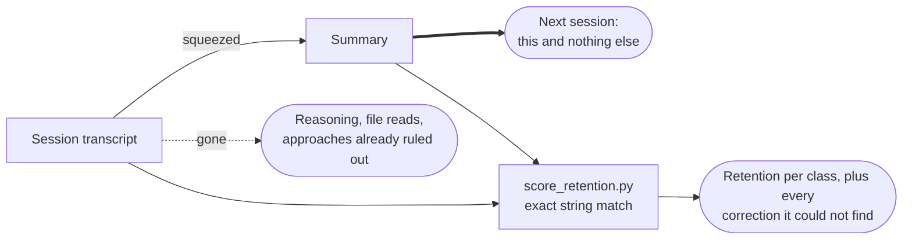

<p align="center">
  
</p>

<h1> braindump</h1>

Get everything load-bearing out of your head and onto the page while the session still has it. Then score what survived, with a script rather than a feeling.

<p>
  
  
  
  
</p>

> Previously published as `compaction-quality`. Same skill, clearer name.

## Why this exists

When a long session runs out of room, the tool squeezes it: everything that happened gets replaced by a summary, and the summary is all the next session gets. The reasoning is gone. So are the files you read, and every approach you already tried and ruled out.

A summary reads naturally as a recap for someone who watched it happen. The actual reader is a stranger who has to carry on, and who will confidently redo whatever you left out.

We measured what actually goes missing. **121 real compaction events**, each scored against the transcript it replaced, exact string match only.

| What was in the session | Survived into the summary |
|---|---:|
| **Rejected approaches** | **0.3%** |
| Standing constraints | 33.8% |
| User corrections | 63.1% |
| Exact identifiers | 48.6% |
| File paths | 16.4% |

Read the bottom row first, because it isn't a failure. Most file paths in a session are things you glanced at once; a summary that dragged all of them forward would be worse, not better. Low recall on bulk is correct.

Now read the top row. **Everything you ruled out is gone.** Not compressed, gone. Two thirds of your standing rules go with it, and those are the ones you only ever said once.

That matters more than it sounds. Constraint violations run at **0%** when the rule survives into the summary and **38%** when it doesn't. Whether the next session follows your rules is almost entirely a question of whether your rules are still written down.

## What the skill does

It writes the summary in **two tiers**, and that single decision carries most of the value.

**Tier 1 is pinned.** Your standing constraints, your corrections, the approaches you ruled out with the reason why, and the exact strings nobody can guess again: paths, error text, ports, version pins. Reproduced word for word, placed first, never summarised.

**Tier 2 is the narrative.** What was built and why, what's left. Ordinary summarising is fine here.

One question decides which tier anything goes in: *if this is missing, does the next session do something **wrong**, or merely something **slower**?* Re-reading a file costs seconds. Repeating a mistake you already corrected costs your trust in the thing.



> [!TIP]
> Reach for it before you run `/compact`, when you're writing a handover note, or when a session has clearly forgotten something you told it.

## What changed in v2

The addendum shipped as v1 and then met a real session rather than a benchmark, which is where it earned its second version.

It worked, and by the mechanism it was meant to. The summary opened with a pinned block carrying seven ruled-out approaches with their reasons, against an untouched summary earlier in the same session that kept one buried fragment out of fifteen.

It also failed one specific way, and the failure is worth knowing: **the sweep stopped at recency.** Every dead end it kept came from the last two hours of a fourteen-hour session. Eight older ones went missing, all of them product and architecture decisions rather than method lessons, with a fully formed pinned block holding every one of them sitting in the same window, written eleven minutes earlier.

Note: the items were never unreachable. The sweep just stopped where the material was densest. v2 says where to look (the whole conversation, from its oldest turn), that ruled-out approaches come in two kinds that live in different places, that a correction from another agent still counts, and that an earlier pinned block gets carried forward.

## The scorer

`scripts/score_retention.py` measures a summary against the transcript it replaced. Exact string match, no model judgment, so the number is reproducible, free, and can't flatter the summary that produced it.

```bash
# score one summary
python3 scripts/score_retention.py --transcript session.jsonl --summary summary.md

# measure your own real compaction events
python3 scripts/score_retention.py --scan-history
```

`scripts/benchmark_vs_compact.py` runs it head to head against the built-in prompt. The baseline arm costs nothing, because it reads summaries already sitting on your disk.

> [!NOTE]
> The correction detector is a keyword heuristic; it misses politely phrased corrections and flags some things that aren't corrections. Treat its output as a list to read, not a number to quote. And don't chase 100% on the bulk rows; pasting the transcript back in is the exact failure this whole thing exists to avoid.

## What's in the box

```text
plugins/braindump/
├── SKILL.md                        the rules, the shape, the failure modes
├── references/compact-addendum.md  the byte-stable literal a proxy can splice
├── scripts/score_retention.py      the deterministic scorer (stdlib only)
├── scripts/benchmark_vs_compact.py head to head, free baseline arm
└── evals/evals.json                test prompts with string-match assertions
```

The evals are deliberately judge-free. A summary can't be graded by the thing that wrote it, so every assertion is checkable by exact match against the source transcript.

## Installing

```text
/plugin marketplace add fledgeling-co/fledgeling-plugins
/plugin install braindump@fledgeling-plugins
```

If you installed it under the old name, remove `compaction-quality` first; the rename doesn't migrate.
