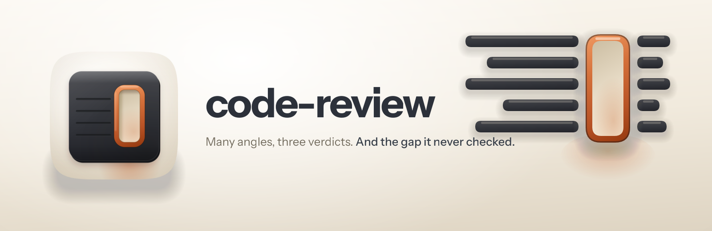

<p align="center">
  
</p>

<h1 align="center"> code-review</h1>

<p align="center"><strong>Every angle, three verdicts, and an honest account of what it never checked.</strong><br />
A diff review that learns your repository at runtime instead of carrying somebody else's project map.</p>

<p align="center">
  
  
  
  
</p>

---

## Why it exists

A review that lists three findings and stops has told you almost nothing. You cannot tell whether it
looked at the auth code and found it clean, or never opened the file. Both come out as silence, and
silence reads as a pass.

That is the thing this is built around. Every run ends with a **coverage ledger**: what it checked,
what it could not, and why. A shard that came back empty, a checklist that never loaded, a gate that
could not run, a contract boundary with no guard test on either side. When there is nothing in that
column it says so explicitly, because an empty section and a missing section look identical on a
screen.

The other half is what happens to a finding that is probably real and cannot be proven. Most reviews
throw it out with the noise, which is exactly how a genuine bug leaves a review looking clean.

## What it does

**It picks up your repo before it reviews it.** Gate commands come out of the package scripts and
the CI config, not out of an assumption: `tsgo --noEmit` and `tsc --noEmit` are different compilers,
`oxlint` and `eslint` catch different things, and a review that runs the wrong one has gated on
something CI does not. Frameworks come from the installed dependency versions. Global controls and
cross-package boundaries come from grep. This is the part its predecessor hard-coded, and a
hard-coded map goes stale silently and only ever fits one repository.

**Finding and judging are separate jobs.** Fourteen named angles surface candidates, and they are
explicitly forbidden from suppressing each other, so if two of them flag the same line for different
reasons both survive to be judged. Deduplication happens afterwards, on evidence, rather than in
whichever finder happened to look first. A finder that quietly drops a half-believed candidate
bypasses the judging step entirely, and that is the single largest cause of missed bugs.

**Verification returns three verdicts.** CONFIRMED, PLAUSIBLE, REFUTED. Only REFUTED drops.
Reachable state does not get refuted for being speculative: a concurrency race, a falsy zero read as
missing, an off-by-one on a boundary nothing excludes, a regex that lost its anchor. Refuting takes
something you can construct from the code, and a PLAUSIBLE finding names the step that would settle
it.

**Each depth prints its own budget at the top of the report.** Something like `quick → 4 angles × ≤4
candidates → inline 3-state verify → ≤6 findings`. You can see what ran rather than inferring it
from how long the output is.

Large diffs shard across parallel agents, and the fan-out is reconciled against the bucket list it
dispatched, because a harness that loses an agent to a rate limit returns nothing for it, filters
that out, and reports the wave complete.

Checklists ship for TypeScript, Next.js, NestJS, React Native, frontend and web, security, and logic
bugs, and only the ones your paths and your chosen lenses match get loaded. Ten focus lenses compose
with areas, so "frontend dead-code" is exactly what it sounds like. There is a token-light prepush
mode that answers one question about the outgoing diff: is it safe to push this?

## Three decisions that are deliberately unfashionable

**No judge panel.** The obvious upgrade is several verifiers voting on each finding. The measurement
says don't: nine frontier judges across seven model families behaved as roughly two effective
independent votes, and the best single judge matched or beat the whole panel in every condition.
Correlation is worse here, because a second verifier would get the same candidate, the same file and
the same controls map. So one verifier runs six gates properly instead of nine agreeing with each
other.

**No typed findings call.** Some harnesses expose a `ReportFindings` tool and it is tempting. This
does not use it: it is absent on several install paths, its schema carries no severity and no
coverage, and its contract says not to also print the findings as text, which would delete the
ledger.

**No fix mode.** It is read-only on source and reports findings. A review and an edit are two
decisions, and collapsing them into one means nobody ever chose the second.

## Install

```
/plugin marketplace add fledgeling-co/fledgeling-plugins
/plugin install code-review@fledgeling-plugins
```

## Using it

Ask in plain language ("review my changes", "review this PR", "security pass on the API changes",
"can I push this?"), or invoke it directly:

```
/code-review
/code-review deep security
/code-review quick frontend dead-code
```

Depths are `quick`, `standard` (the default) and `deep`. Areas are `frontend`, `backend`, `next`,
`nest`, `mobile`, or explicit paths. Lenses are `bugs`, `security`, `perf`, `tests`, `components`,
`a11y`, `dead-code`, `debt`, `deps` and `dx`. They all compose.

Three helper scripts do the mechanical parts deterministically rather than by hand: `diff-range.sh`
resolves and measures the range, `repo-facts.sh` drafts the repo profile, and `prepush-scan.sh`
handles the pattern-decidable half of the prepush gate.

## What it will not do

- Edit your code. It reports; you fix.
- Report a check it could not run as one that passed.
- Report a fan-out as complete when a shard never came back.
- Drop a realistic finding for being unproven.
- Flag a guard that a global control already covers, once it has found that control.
- Decide whether to merge. `BLOCK` means a CRITICAL finding exists, not that anyone has decided.

## What it's built on

The pipeline architecture is adapted from the `code-review:code-review` skill built into the Claude Code CLI:
the per-depth budget lines, the named orthogonal angles, the three-verdict verify, the gap sweep and
the finding floor all come from there.

The sharding architecture, the verifier fan-out, the suppressions file, the mitigating-controls map,
the severity taxonomy and the six framework checklists come from the `code-review:code-review` skill in
`diolog-plugins`, which this supersedes. Two things that repo's project-specific fork had dropped
are restored: the NestJS checklist, which a general reviewer cannot assume away, and the
multi-tenancy section of the logic-bugs checklist.

The rest came out of research. The coverage ledger and the three-state gate are
[vacuous](https://dossier.fledgeling.app/vacuous), on a suite that passed a guarantee it never ran.
The one-verifier decision is [deputy](https://dossier.fledgeling.app/deputy), on how far a verdict
can be delegated before more opinions stop buying anything. The fan-out reconciliation is
[workflows](https://dossier.fledgeling.app/workflows), where a third of the agents never came back.
The read-back rule behind Gate 6 is [silent](https://dossier.fledgeling.app/silent), on a driver
that returned ok and did nothing.

Every source is exported into [`docs/deep-research/`](../../docs/deep-research/) at the root of this
marketplace, and [`skills/code-review/references/evidence.md`](skills/code-review/references/evidence.md)
maps each rule to the one it came from, marking which are measurements and which are design taste.

## Licence

MIT.
