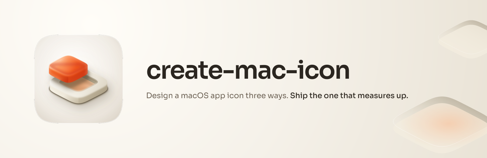
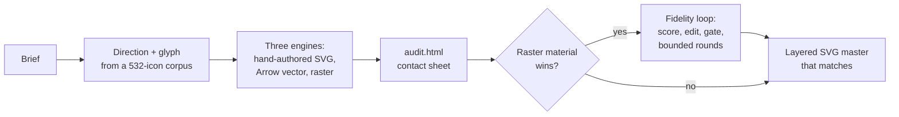

<p align="center">
  
</p>

<p align="center"><strong>macOS app icons, measured against the reference instead of eyeballed.</strong></p>

<p align="center">
  
  
</p>

---

## The problem this exists for

Ask an AI to draw a macOS app icon as an SVG and you'll get something clean, well composed, and flat. Ask an image model for the same icon and you'll get gorgeous material (soft shadows, glassy depth, real lighting) baked into pixels you can never edit again.

Across every icon shipped in the [Fledgeling marketplace](../../README.md), the same pattern held: at equal audit scores, the raster's material beat the vector's, while the vector won composition and legibility. We kept closing that gap by hand, icon after icon. This skill is that manual loop turned into a pipeline with a number on it.

The research behind it is real: three deep-research reports (verified, zero fabricated citations) all landed on the same conclusion. SVG can express everything the rasters show. Models fail because they author flat paths, and "look at a screenshot and try again" measurably makes output worse. The fix is a structured loop with a score. The full evidence base lives in [the fidelity plan](../../docs/svg-icon-fidelity-plan.md).

## What it actually does



1. **Direction first.** The style catalogue was distilled from 532 real macOS icons, including all 32 of Apple's own macOS 26 ground-truth captures. It knows the current era's grammar (and the ten ways shipping icons fail; 76% of them die on the same one).
2. **Three takes, not one.** A hand-authored layered SVG (the master that ships), an independent vector take from Arrow, and raster takes steered by real Apple exemplars. Every take gets scored on a 12-point rubric in a written audit sheet, losers included.
3. **Then the measurement.** When a raster wins the material read, `fidelity.py` scores the SVG master against it at five sizes, from 1024px down to the 16px menu-bar squint. A bounded loop edits one thing per round, and a gate rejects any round that trades small-size legibility for large-size gloss. The trap where a model games the score by embedding the raster inside the SVG? Statically rejected before a single render.
4. **The skill learns.** Every construction that closes a gap gets written into the recipe library with the fixture it came from. The next commission starts where the last one finished.

## Does it work?

The scorer was calibrated against the marketplace's own history before anything trusted it. On the first fixture (a well-composed but flat master versus its raster reference), it scored 0.83 at 16px and 0.45 at 1024px: composition converged, material hadn't. That's precisely the judgment a human had already made about those two files, which is what you want from an instrument.

The skill ships with three process evals (full commission, iterate-against-a-reference, and an honest-degradation run with no image model available), each asserting the artifacts exist on disk rather than trusting the run's own account of itself.

## Install

```text
/plugin marketplace add fledgeling-co/fledgeling-plugins
/plugin install create-mac-icon@fledgeling-plugins
```

Needs `numpy`, `Pillow`, and `rsvg-convert` for the scoring harness. Install `torch` + `lpips` and the material metric upgrades itself; without them it runs a lighter stack and says so in the score file rather than pretending.

## Where it came from

The icon pipeline (the direction catalogue, the three-engine discipline, the audit sheet, the Tahoe grammar) was extracted from [mac-design-studio](https://github.com/Diolog26/diolog-plugins), which covers full macOS app design and taught this marketplace everything it knows about icons. This skill is the icon half of that pipeline plus the measurement layer it never had. The corpus analysis is theirs; the fidelity loop is new.

Deep material, if you want it:

- [The SVG icon fidelity plan](../../docs/svg-icon-fidelity-plan.md), with the full research corpus committed beside it
- [The fidelity loop protocol](skills/create-mac-icon/references/fidelity-loop.md)
- [The material recipe library](skills/create-mac-icon/references/material-recipes.md)
- [The direction catalogue and rubric](skills/create-mac-icon/references/icon-directions.md)
