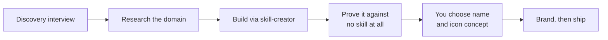

<p align="center">
  
</p>

<p align="center"><strong>Build a new skill properly, from the interview outward.</strong></p>

<p align="center">
  
  
</p>

---

## Why this exists

Most new skills miss for the same reason: nobody pinned down what they were for. The request arrives as "a skill that helps with our release process", which sounds like a brief and determines nothing. It names no trigger, no output, and no way to tell whether a run worked. Build against that and you get a skill that fires at the wrong moment and delivers the wrong thing, built well.

So this pipeline front-loads the interview and treats a vague answer as a defect to fix rather than a constraint to work around.

It's the sibling of [improve-skill](../improve-skill/README.md). That one starts from a skill that exists and the ways it fails, which is a gift: a failure names the thing to engineer away. This one starts from an intention, which is harder.

## How it works



**Discovery comes first, and it earns its place.** Before asking anything, it answers what it can from the conversation, the repo, sibling skills and any earlier work in the session, because a question whose answer is already on disk wastes your attention. Then it asks with recommendations rather than open questions, multi-choice where the options are genuinely discrete, and notes welcome on every answer. It covers eight axes a skill actually turns on: trigger, output, audience, definition of done, hard constraints, whether the output is objectively checkable, what existing tools it should route to instead of reimplementing, and whether a run spends real money.

**Then research, scoped to the domain rather than the skill.** A paid and free panel, read end to end, citations verified. The highest-value part is usually the documented failure modes of doing the job by hand, because each one becomes a rule and an eval.

**Then the build, through [skill-creator](https://github.com/anthropics/claude-code), with one addition:** every structural choice traces to a research finding, a measured failure, or an explicit answer from the interview. A rule nobody can source is a rule nobody should follow.

**Then proof against the honest baseline.** There's no predecessor, so the comparison is the same prompts with no skill at all. That answers the only question that matters for something new: does this earn the context window it costs? If it doesn't, the pipeline says so plainly, because a skill that changes nothing still costs context on every session and implies a guarantee it doesn't keep.

## What you actually do

Two decisions, both put to you before anything is generated: the name, from candidates with rationales, and the icon concept, described in words. Everything else runs on its own and reports back.

## Install

```text
/plugin marketplace add fledgeling-co/fledgeling-plugins
/plugin install create-skill@fledgeling-plugins
```

Then just say what you want built.

## The honest limits

The evals here are **process** evals: they check the pipeline's phases happen in order and its checkpoints get asked, not that the skills it produces are good. Output quality is proven by the evals this pipeline builds for each new skill, which is where it belongs.

The no-skill baseline is a fair comparison but a blunt one. Where a skill's value is consistency rather than peak quality, a single-run comparison will understate it, and the right measurement is variance across repeated runs. The pipeline says which claim it's making.

Deep material: [the discovery protocol](skills/create-skill/references/discovery.md) · [evals and judging](skills/create-skill/references/evals-and-judging.md) · [prompting the agents it spawns](skills/create-skill/references/opus-5-prompting.md)
