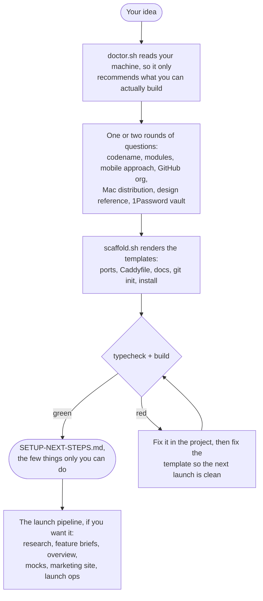

<p align="center">
  
</p>

<h1 align="center"> create-swe-project</h1>

<p align="center"><strong>You describe the idea; a tested script builds the project.</strong><br />
An SWE skill for Claude Code that turns a project idea into a complete, working project in <code>~/Dev</code>, with the typecheck and build gate already run green.</p>

<p align="center">
  
  
  
  
</p>

---

> [!NOTE]
> **This used to be called slipway.** Same skill, same templates, new name. The old one came from shipbuilding, where a slipway is the ramp a vessel is built on and launched from, and the icon still comes from there. One honest leftover: every generated project still records its provenance in a `.slipway/` folder. That's a rough edge from the rename, not a second tool.

## The problem, in one minute

Starting a project is the part where you spend two days on things that have nothing to do with your idea. Ports, a local domain, auth, email templates, a test harness, a CI gate, the Xcode project file, a `.env` that reads from your password manager. You do it, it works, and then six weeks later you start the next project and do all of it again slightly differently.

The obvious fix is to have an AI write it for you. That's slower, more expensive, and different every time, because the model is composing a hundred and twenty files from memory on each run.

So this skill splits the job. **The model makes the decisions; a script makes the files.** You get asked a handful of questions, and then `scaffold.sh` renders the whole project from templates that were already tested this week.

## How it works



Every question is asked **before anything is created**. Claude Code allows at most four questions per prompt, so it's one or two rounds, and then the writing starts.

## What it asks you

You don't need to know any commands. In Claude Code, say what you want:

> "I have an idea for an app that tracks my houseplants. Set up a new project for it."

Before it asks anything, it runs `doctor.sh`, a read-only check of your machine, so it won't offer you a Mac app without XcodeGen or 1Password seeding without the `op` CLI. Then:

- **A codename.** Three single-word options, lowercase and evocative rather than descriptive, in the style of the existing portfolio: zephyr, perch, anvil, loupe, tare, sift. It reads `~/Dev` first and won't propose a name that already exists. You'll see what each one implies: `~/Dev/<codename>` and `<codename>.local`.
- **Which modules you need.** Thirteen of them, and most are inferred rather than asked. A product with accounts implies **auth**, which implies **data**. A SaaS gets web, tokens, data and auth by default. A marketing site gets web and tokens only. An unvalidated idea adds a **waitlist**. The inferred set arrives pre-selected and you adjust it.
- **Native or React Native**, only when the idea implies a mobile app. Swift when it's Apple-only or needs deep platform integration; Expo when Android matters.
- **Mac window style**, only when you picked a Mac app: a **window** with a sidebar and search, or a **menubar** agent with no Dock icon.
- **A bundle-id prefix**, so sibling apps have distinct identities from day one.
- **Which GitHub account** it belongs to, inferred from the idea.
- **How a Mac app gets sold.** Direct download with a notarized DMG, or the Mac App Store. This one gets asked up front because it picks the entitlements file, and the App Store needs the sandbox on. Retrofitting it later is genuinely annoying.
- **A design reference**, a site whose look you'd like to start from, or skip it and design later.
- **Your 1Password account and vault.** It runs `op account list` and shows you the real ones.

> [!IMPORTANT]
> The 1Password step records **identifiers only**. The vault name lands in `.env.local`; the actual secrets are resolved later by `scripts/env-pull.sh` through the `op` CLI, straight into the file, and never pass through Claude's context.

Everything else has a good default in the script. Ports, hostnames, versions, gate type: none of those are worth a question.

## What you get

A project that already works, in `~/Dev/<codename>`:

- A **pnpm and Turborepo monorepo**, with shared dependency ranges in one workspace catalog so you bump a version in one place.
- A **Next.js web app** with security headers, a `/api/health` route, AI SDK wiring, and a Sydney-region Vercel config.
- **Mac, iPhone, or cross-platform apps**, whichever you chose. XcodeGen owns the project file, and the fastlane TestFlight lanes plus the sign, notarize and DMG scripts are already written.
- **Sign-in, emails and an admin console** if you asked for them. Email-code sign-in, rotating refresh tokens, React Email templates, and the admin console on its **own trust domain** with its own secret and audience.
- **Tests and quality checks** from the first commit: Playwright for web, jest for the API, Maestro for React Native, XCTest for Swift, and a husky pre-push gate.
- **Documentation that was assembled from the modules you chose**, not a stub. Architecture, testing, deployment, and an AI model registry when the web or API modules are present.
- A **`SETUP-NEXT-STEPS.md`** listing the few manual steps left, each with the exact command to copy.

Then it runs `pnpm install` and the **typecheck and build gate**, and tells you the result. Green is the intended outcome.

<details>
<summary><strong>The full module inventory</strong> (click to expand)</summary>

| Module | What it adds |
|---|---|
| base (always) | Root workspace config, consolidated `.gitignore`, `.claude/settings.json` with build and test commands pre-allowed so agents work promptless from day one, prettier, husky pre-push gate (`SKIP_GATE=1` bypasses it), Caddyfile, `CLAUDE.md` plus `AGENTS.md`, README, `SETUP-NEXT-STEPS.md`, and generated docs: `ARCHITECTURE.md`, `TESTING.md`, `DEPLOYMENT.md`, `AI-MODEL-USAGE.md` |
| `web` | Next.js App Router, `/api/health`, `vercel.json` with a warm cron, security headers, `output: 'standalone'`, flat ESLint, `lib/ai.ts` with models in one config, react-hook-form, Vercel Analytics and Blob, date-fns, Dockerfile |
| `api` | NestJS on SWC for both dev boot and prod build, so dev and prod behave the same. AI SDK at `src/ai.ts`, global config, rate limiting, in-process cron, helmet, validation pipe, OpenAPI at `/docs`, jest with `@swc/jest` |
| `macos` | XcodeGen `project.yml` as the source of truth with the `.xcodeproj` gitignored, an SPM `AppCore` package with tests, distribution-aware entitlements, and two shells: a NavigationSplitView window or a MenuBarExtra agent |
| `ios` | XcodeGen `project.yml`, simulator-first with no signing, generated Info.plist, a unit-test target |
| `rn` | Expo app in `apps/mobile` with its own bundle id and URL scheme, monorepo-aware Metro config, hoisted node linker, a Maestro smoke flow. Expo modules only, never the Expo cloud: release builds are local prebuild plus fastlane |
| `tokens` | `packages/design-tokens`, one source file generating `tokens.css`, with a drift check wired into the gate |
| `data` | Cached Mongoose connection, models, types, a fail-closed Redis client, and the matching compose services |
| `auth` | Email-code sign-in, 15-minute access tokens with rotating hashed refresh tokens in Redis, rate limits, constant-time comparison, no account-existence leak, a `/login` page, and a dev login route gated server-side to non-production |
| `admin` | `apps/admin` on its own subdomain and port, with a separate JWT secret and audience, an email allowlist, 12-hour sessions and a server-guarded shell |
| `push` | APNs over HTTP/2 with ES256 token auth and JWT caching, device-token registration, dead-token detection |
| `waitlist` | A pre-launch waitlist with share codes and queue-jumping by referral count, ready to drop into the marketing page |
| `observability` | Sentry wiring that stays inert until you add a DSN |
| `rust` | A Cargo workspace with a cross-OS core crate, so shared logic is bound into Swift and Node rather than written twice |

Across every relevant module: typechecking is **`tsgo`** everywhere, never `tsc` and never `ts-node`; secrets come from 1Password; and the release path (fastlane lanes, notarization scripts) ships with the native modules rather than being added later.

</details>

## Installing

```text
/plugin marketplace add fledgeling-co/fledgeling-plugins
/plugin install create-swe-project@fledgeling-plugins
```

## Using it

Just describe what you want to build. Claude recognises the request and runs the interview.

> [!TIP]
> If you're not sure it will do what you expect, ask for the plan first. `scaffold.sh --plan` prints every file it would write, the ports it picked and the modules it resolved, without writing anything. `--dry-run` gives you the same thing as a readable summary.

The script refuses to overwrite an existing directory, and it never runs `sudo`. Nothing is pushed anywhere: if you chose a GitHub org, it sets the remote and prints the `gh repo create --push` command for you to run yourself.

Once the scaffold is green, there's a second act you can opt into: the **launch pipeline**. Deep research running in the background, seeded feature briefs, an overview with a pricing recommendation, mocks for every surface and state, a marketing site, and a launch-operations pack covering domains, legal drafts, the App Store kit and an analytics schema. If you only wanted the scaffold, say so and you'll get the scaffold.

> [!IMPORTANT]
> The pipeline prepares everything and runs nothing that costs you. Anything that spends money, publishes, or creates an account is left for you, and paid research backends are opt-in rather than default.

## The honest bits

A few steps stay manual on purpose. Anything needing your admin password (the local web address), your Apple developer account, or your 1Password sign-in is left for you with the exact command. That's a deliberate line, not a gap.

New projects use the newest version of everything, fetched at creation time, so the lockfile pins something fresh. Occasionally the world moves and a new project needs a small fix. When that happens Claude fixes it in the project **and** fixes the template, so the next launch is clean. `scripts/canary.sh` scaffolds four representative module combinations and gates each one, weekly, which is what usually catches this before you do.

One pin worth knowing about: **TypeScript is held at `^6`** in the web, API and React Native apps. TypeScript 7.0 ships only the `tsc` executable, and both the Nest CLI and typescript-eslint need the programmatic compiler API, which is expected back in 7.1. It stays installed as a library the tooling needs, while `tsgo` does the actual typechecking. It gets unpinned when the ecosystem catches up.

And template rot is the classic way scaffolding tools die, so there are two commands for it:

- `scripts/drift.sh <project>` tells you which generated files you've modified and which you've left alone.
- `scripts/upgrade.sh <project>` brings an existing project up to the current templates. Untouched files are replaced. Where you edited a file **and** the template moved, it three-way merges against the templates your project was actually born from; clean merges are applied, and conflicts are written beside the file for you to merge by hand. Files you deleted stay deleted. It's a dry run until you pass `--apply`.

## What it isn't for

Adding an app to a project that already exists: edit that project directly, following its own conventions. Feature work after setup: drop a brief in `docs/features-to-triage/` and use `ship-feature`, which is what the generated `CLAUDE.md` will tell you anyway.

## What's in the box

```text
plugins/create-swe-project/
├── skills/create-swe-project/
│   ├── SKILL.md              the interview and the decisions
│   ├── scripts/              scaffold, doctor, drift, upgrade, canary
│   ├── templates/            every file a new project is made of
│   └── references/           the launch pipeline, Apple commercialization,
│                             and the research this design came from
└── assets/                   icon, banner, and the icon audit
```

Found a launch that went sideways? The generated `.slipway/manifest.json` records the version and every answer you gave, which makes it reproducible. Open an issue with it attached.
