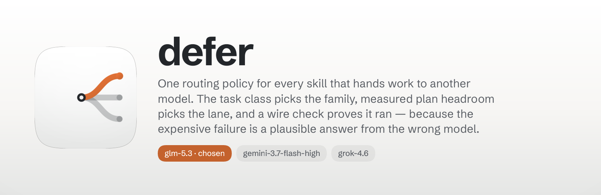

<p align="center">
  
</p>

<h1 align="center"> defer</h1>
Handing work to another model is three decisions, and skills that make them
inline get them subtly wrong: **which model**, **at what effort**, and **how you
know it really ran**. `defer:defer` holds all three in one place, so every skill routes
the same way and changing the policy is one edit rather than fourteen.

Current role preferences resolve first. Within the compatibility registry, work
class controls eligibility and measured plan headroom chooses among comparable lanes.

Current roles resolve before the registry: Opus 5 for intake, triage and plan;
Gemini 3.8 for implementation once those artifacts exist; GPT-6 Astra, Grok 4.6
or GLM 5.3 for orchestration. [Runtime preference
resolution](skills/defer/references/runtime-preferences.md) discovers the exact
supported selector and captures the execution receipt.

**The thinking level is part of the decision, not a dial on top of it.** Since
2026-09-09 the registry is built around `gpt-6-astra` at three levels: **low** is
the workhorse tier, level with `gpt-5.6-sol` at high, `claude-fable-5` at medium
and `grok-4.6` at high; **medium** and **high** are frontier capacity, filtered
out of every ordinary route and reachable only with `--hard`.

## Install

```
/plugin install defer@fledgeling-plugins
```

## Route

```bash
python3 skills/defer/scripts/lane_pick.py --task completeness
```

```
task     completeness — Completeness critic
lane     codex-astra-low (gpt-6-astra, openai family, effort low)
why      within 20% on headroom (codex-astra-low/glm/grok); no sourced price for
         codex-astra-low, so cost could not rank them and preference order decided
         — 0.1409/day vs glm 0.1429, grok 0.1289, gemini 0.0000
price    $14.00/Mtok is a PLACEHOLDER, not a published rate — any cost tie-break
         involving this lane is a guess
run      codex exec -m gpt-6-astra -c model_reasoning_effort="low" -s read-only \
           --skip-git-repo-check -o /tmp/lane-out.md {PROMPT}
verify   codex-header (see references/wire-verify.md)
```

`--json` returns the same answer with argv and env ready to spawn. `--report`
prints every lane's meter without choosing, and `--matrix` prints the measured
capability table without choosing either. `lane_run.sh <task> "<prompt>"` does
the compatibility dispatch: picks, runs, falls through if output is empty, and
records available usage in `~/.claude/defer-usage.jsonl`. It does not validate the
serving-model receipt; apply `references/wire-verify.md` before claiming the
model or independence of the result.

## The matrix

Nine task classes, eleven lanes, five model families. A cell holds the effort
that lane runs at for that class — pinned, because a lane that inherits its
config default is not the lane anyone chose.

| Task class | gemini | grok | glm | astra | sol | opus | fable |
|---|---|---|---|---|---|---|---|
| **implementation** — writing code | baked | high | high | low | high | xhigh | — |
| **hard** — what the workhorse tier could not hold | — | — | — | **medium · high** | — | xhigh | — |
| **orchestration** — running work and deciding what is next | — | high | high | low | — | — | — |
| **completeness** — what was promised and not delivered | baked | high | high | low | — | — | — |
| **general** — neither referred nor a verdict | baked | high | high | low | — | — | — |
| **referral** — a fork put to another model | — | high | — | low | high | — | medium |
| **verification** — grading delivered work; same-family validation | — | — | — | — | — | xhigh | — |
| **design** — authoring a design | — | — | — | — | — | medium | medium |
| **design-review** — judging rendered UI | — | — | — | — | — | xhigh | high |

Two flags change what a class can see, and both are the caller asserting
something the router cannot observe: `--hard` (this is one of the hardest
problems) and `--has-plan` (a spec or plan already exists).

Four rules sit above the table. They are the ones habit gets wrong, so they are
stated rather than left to be read off the grid.

1. **Astra at `medium` and `high` is reserved.** Both lanes carry
   `frontier: True` and are filtered out of every class; `--hard` or
   `--task hard` is the only way to them. A lane a router can reach is a lane a
   router reaches when it runs out of cheaper options.
2. **`--hard` cannot leave Anthropic's family.** It is refused on `design`,
   `design-review` and `verification` — a harder design question is still a
   design question, and the answer to it is not another family.
3. **Fable judges; it does not verify.** Forks, design calls and referred
   decisions, yes. Grading code or a ticket against its acceptance criteria, no —
   that is `claude-opus-5` at `xhigh`.
4. **Design authors at medium and reviews at the higher efforts.** Medium is the
   effort design gets *given a rough plan already exists*, which `--has-plan`
   declares. Judging rendered UI is a different job, and a cheapened judgement is
   banked as a fact.

### What is asserted, and what was measured

Three things are marked rather than smoothed over, because the gap between them
is where a routing policy turns into a ranking somebody made up.

- **Astra has no bench row at any effort.** `codex-astra-low` borrows
  `codex/gpt-5.6-sol@high`'s under `evidence: "peer"` — what "level with" means
  made checkable. It clamps like a proxy row (never drop-in, never a hard block)
  and carries no cost claim.
- **Neither astra nor Gemini 3.8 has a published price here.** Both are
  `price_evidence: "placeholder"`, and a band containing one **skips the cost
  tie-break** and breaks on preference order instead, saying so in the reason.
- **The Gemini delivery penalty is inert, not transferred.** It was measured on
  3.7 Flash; the lane runs 3.8. The entry names `applies_to_model` and the code
  checks it, so the 12 points stop applying — and snap back if the lane returns.
  The finding survives as that lane's `route_guard`.

Four GPT-5.6 lanes retired on 2026-09-09 (`codex-terra` at high, max and medium,
and `codex-luna-max`, plus `codex-sol` at medium) and are recorded in `DECLINED`
rather than deleted. `codex-sol-high` is the one still routed, because the
directive names sol@high as a peer of astra@low.

## Why the policy leans the way it does

Opus is the primary model, so Claude is the subscription that got bought deep and
everything else is bought singly. Measured on 2026-08-21, Relay's pool held
**nine Claude accounts carrying a live seven-day meter** — the emptiest at 41%,
two at 100% — against exactly one account each for xAI, Z.AI, Google (the
Antigravity sign-in that `agy` and Relay share) and OpenAI. Grok sat at 98.8%
that day and Codex at 100%, with nothing behind either of them.

That asymmetry is the shape of the table above, and it cuts in two directions.

**Claude lanes are not balanced against anything, because they do not need to
be.** Verification and design review name a Claude model outright rather than
ranking a set, since the depth is there and correctness is what those classes buy.
Fable is metered at half the weekly pool of the same accounts, so the referral
class can afford a Claude judge alongside the OpenAI one.

**Everything else is rationed, which is why balancing exists at all.** The two
classes that fan out — `implementation` and `completeness` — balance across
grok, GLM and Gemini precisely because each of those is one subscription with no
second account to fall back on, and running the nominal best every time empties
it inside a week. Ranking headroom per remaining day is what stops a single lane
absorbing a class.

The deeper reason for spending the scarce lanes at all is the one thing the extra
Claude capacity cannot buy: **Claude checking Claude is not an independent
check.** A completeness critic and an out-of-family second opinion are worth a
scarce subscription in a way that another Opus call is not, which is why
`completeness` excludes Claude entirely even though Claude has the most room.

## What the work is, not just what class it is

Headroom decides which of several adequate lanes runs a job. It says nothing
about whether they are adequate. That second question is answered by a capability
matrix measured over 106 tasks in a private benchmark, with `claude-opus-5` at
`xhigh` as the reference, and it is what `--shape` reads:

```bash
lane_pick.py --task implementation --shape regression-sensitive
```

Eleven work shapes are graded. The headline of what the measurement found:

- **Opus earns its price on one shape above all.** Editing existing multi-file
  code under several acceptance criteria at once — the largest shape in the
  corpus — is where every cheap lane collapses. Gemini loses 30 points there.
- **Four shapes have a substitute at a tenth of the cost.** With a stated
  complexity bound, every lane ties opus. On a contract that must not break,
  `sol@high` beats it by 16 points. On a from-scratch page, the OpenAI lanes beat
  it. On a new self-contained module, Gemini is level.
- **The bench measures building, not judging.** So only `implementation` and
  `general` are shape-gated; `verification`, `referral`, `completeness` and
  `design-review` route on policy alone, because a score for writing code is not
  evidence about grading someone else's.

When a shape routes to a cheaper lane the router prints that shape's **guard** —
the condition under which the lane's known weakness stops mattering, such as
naming every acceptance criterion separately rather than describing the outcome.
`--require-dropin` refuses the guarded band and falls back to opus.

Inside whichever band it lands in, **score leads and usage follows.** The best
measured lane on that shape wins unless another is within 5 points of it, and
only inside that margin does plan headroom choose. The margin is 5 points because
that is already what a drop-in grade means, so "close enough to opus to
substitute" and "close enough to each other to swap" are one claim at one size.
Running headroom first would trade real output quality for load-spreading — it
once sent greenfield work to a lane 13 points behind because the better one was
near its budget. A lane at its cap drops out before the comparison, so a spent
top scorer never stalls a route.

Two properties keep the gate honest. The reference lane is the **fail-back, never
a competitor**: opus grades `REF` on every shape by construction, and counting
that as a pass would hand it every route on the strength of being the yardstick.
And a lane measured through a **different harness or a different model version**
is clamped into the guarded band in both directions — it can never clear to
drop-in on a number that is not its own, and it can never be refused on one
either. The Gemini rows were measured under a bash-only container scaffold rather
than under `agy` — and on 3.7 rather than the 3.8 the lane now runs, so they were
dropped altogether rather than read down: a predecessor's grade is not a
successor's. `codex-astra-low`'s borrowed row is clamped the same way, for the
same reason.

`skills/defer/references/capability.md` carries the full table, the gate
thresholds, the two models that were measured and deliberately have no lane, and
the command that regenerates the whole thing.

## The lanes

What `lane_pick.py` prints and `lane_run.sh` runs. Each lane carries the check
that proves it ran as routed, because the expensive failure in a multi-model
system is a plausible answer from the wrong model.

| Lane | Model | Family | Effort | Blended $/Mtok | Verify |
|---|---|---|---|---|---|
| `gemini` | gemini-3.8-flash-high | google | baked into the id | 4.50 · **placeholder** | output non-empty |
| `glm` | glm-5.3 | zai | high | 5.80 | Relay ledger |
| `grok` | grok-4.6 | xai | high | 8.00 | grok session store |
| `codex-astra-low` | gpt-6-astra | openai | low | 14.00 · **placeholder** | codex header + `-o` file |
| `codex-astra-medium` | gpt-6-astra | openai | medium · *frontier* | 14.00 · **placeholder** | codex header + `-o` file |
| `codex-astra-high` | gpt-6-astra | openai | high · *frontier* | 14.00 · **placeholder** | codex header + `-o` file |
| `opus-design` | claude-opus-5 | anthropic | medium | 30.00 | Relay ledger |
| `opus` | claude-opus-5 | anthropic | xhigh | 30.00 | Relay ledger |
| `codex-sol-high` | gpt-5.6-sol | openai | high | 35.00 | codex header + `-o` file |
| `fable` | claude-fable-5 | anthropic | medium | 60.00 | Relay ledger |
| `fable-high` | claude-fable-5 | anthropic | high | 60.00 | Relay ledger |

A **placeholder** price is a predecessor's rate standing in for one nobody
published. It is never ranked against a measured figure: a band containing one
skips the cost tie-break entirely.

```bash
# gemini — --output-format json is the only place a token count for this lane
# exists anywhere; agy records no model id, no tokens and no cost on disk.
# Effort travels in the model id; there is no --effort flag on this lane.
agy --model gemini-3.8-flash-high --output-format json -p "<prompt>"

# grok — exhaustion arrives as a 402 in the transport, not on stdout.
grok -m grok-4.6 --effort high -p "<prompt>"
cursor-agent -p --force --model grok-4.6 "<prompt>"     # harness fallback

# glm — the header is the entire mechanism. Without it this same command runs
# Claude, succeeds, and returns something plausible.
ANTHROPIC_BASE_URL=http://127.0.0.1:8858 \
ANTHROPIC_API_KEY=local-proxy-supplies-the-real-credential \
ANTHROPIC_CUSTOM_HEADERS="X-Perch-Binding: glm" \
  claude --effort high -p "<prompt>"

# astra / sol — on a run that produced nothing at all, the header still prints
# the requested model and effort. The empty -o file is the failure signal.
# --skip-git-repo-check is required outside a trusted directory, or codex exits
# 1 before reaching a model.
codex exec -m gpt-6-astra -c model_reasoning_effort="low" \
  -s read-only --skip-git-repo-check -o /tmp/lane.md "<prompt>" < /dev/null

# opus / fable — strip a leading marker glyph before matching a verdict; a
# headless call inherits the session's start hooks.
claude --model claude-opus-5  --effort xhigh  -p "<prompt>"   # verify, design review
claude --model claude-opus-5  --effort medium -p "<prompt>"   # design authoring
claude --model claude-fable-5 --effort medium -p "<prompt>"   # referral, design authoring
```

Neither `lane_run.sh` nor `lane_probe.sh` carries a copy of these commands any
more — both build every argv from the registry. The case statement they replaced
held its own copy of five models and drifted the first time a lane moved.

## How the choice is made

Everything runs on a subscription, so the scarce thing is plan headroom in the
current window, not money. Raw usage is the wrong comparison — a lane holding 60%
with six days to run is tighter than one holding 80% that resets tonight — so
what gets ranked is headroom per remaining day, `(1 - used_pct) / days_left`.
Largest wins. Where two lanes sit within 20% of each other the meters cannot
honestly separate them, so the tie breaks on the price column above — **unless a
lane in the band has a placeholder price**, in which case the cost stage abstains
and preference order decides, and the reason says so. Ranking a measured $0.25
against a stand-in $14.00 is not a cost comparison.

Meters come in two tiers and the report always says which. **Claude and Codex
report a utilization percentage the vendor computed**, already on disk in Relay's
`usage.json` and codex's own `rate_limits` payload. **Grok, GLM and Gemini expose
no quota to any CLI**, so those are counted locally and divided by a budget,
which makes them an estimate wearing a number. Calibrate one from a percentage
you can actually see rather than from someone's estimate of the plan:

```bash
lane_pick.py --calibrate gemini=62 grok=99
```

It reads the consumption it already counts, divides by your observed percentage,
and writes the budget back. A lane whose usage cannot be measured never wins on a
zero it did not earn.

## What it refuses to do

- **Guess a quota endpoint.** `lane_budgets.json` has an `api` hook and it is
  deliberately unwired, because pointing it at a plausible URL would turn "we
  cannot measure this" into a confident wrong number.
- **Report a Gemini figure in dollars.** `agy` records no tokens and no cost
  anywhere on disk, so that lane is counted in model calls and says so.
- **Treat a lane's silence as agreement.** An absent or empty output file is a
  lane failure, never a quiet pass.
- **Write the prompt, or judge the answer.** The calling skill owns both.

## Files

| Path | What it is |
|---|---|
| `skills/defer/SKILL.md` | the routing decision and the three standing rules |
| `skills/defer/references/lanes.md` | the full matrix, every command template, substitution rules |
| `skills/defer/references/usage-sources.md` | per lane: the source, the unit, the trust level, the citation |
| `skills/defer/references/wire-verify.md` | how to prove each lane ran as routed |
| `skills/defer/scripts/lane_registry.py` | the machine-readable policy — models, efforts, argv, prices |
| `skills/defer/scripts/lane_pick.py` | the meters, the ranking, `--report` and `--calibrate` |
| `skills/defer/scripts/lane_run.sh` | compatibility pick, run and usage record; serving-model verification is separate |
| `skills/defer/scripts/lane_probe.sh` | cheap liveness probe per lane |
| `skills/defer/scripts/selftest.sh` | 13 policy invariants, runs no model, costs nothing |

`selftest.sh` is the guard against the policy drifting away from the prose: it
checks that sol is never `max`, that grok is `xhigh`, that Fable is absent from
verification, that design review is Anthropic-only, that completeness is not,
that no `grok-4.5` survives anywhere, that the GLM header is present, that the
price order is gemini < glm < grok, and that every model named in the registry
also appears in `lanes.md`.
