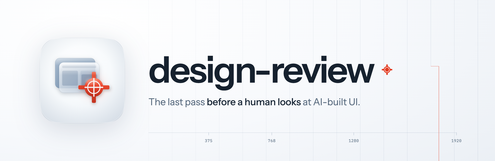
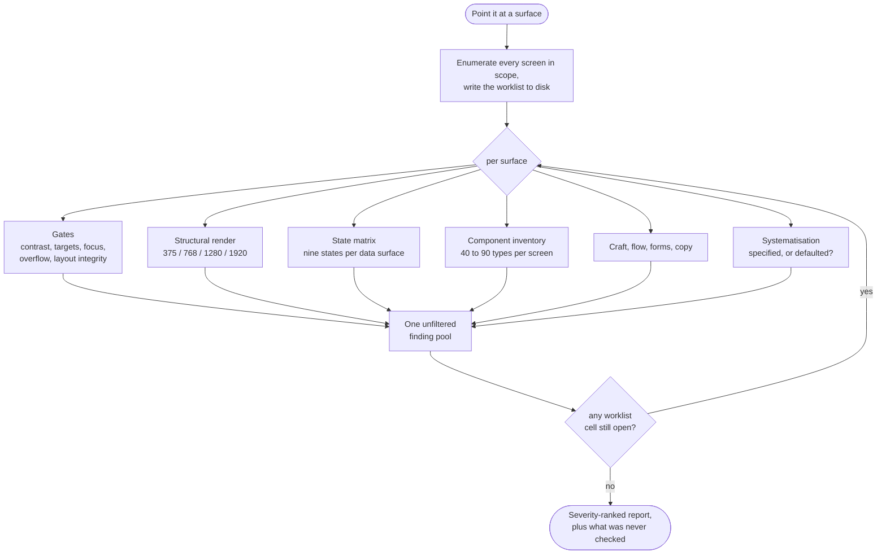

<p align="center">
  
</p>

<h1 align="center"> design-review</h1>

<p align="center"><strong>The last pass before a human looks at AI-built UI.</strong><br />
An SWE skill for Claude Code that renders the surface, runs the checks that are deterministic, judges the ones that aren't, and tells you plainly which is which.</p>

<p align="center">
  
  
  
  
  
</p>

---

## What it's for

You ask an AI for a pricing page and it gives you one. It renders, the markup validates, the accessibility check comes back green, so you hand it over.

Then a person opens it. The plan cards aren't sitting on the rail they're meant to share, and they're 250px out. Two settings rows look like controls and hold nothing you can focus. The company's own name, set at 72px, is at 2.14:1 against its background, because a colour token was declared, emitted into the DOM, and read by no rule at all.

Every one of those was computable. None of them got probed, because the checks that ran were the WCAG ones and layout integrity wasn't in the set.

design-review runs the rest of them, judges what's left over, and separates the two. It's built around one habit: **a green result proves nothing until you can say what it examined.**

## Install

```text
/plugin marketplace add fledgeling-co/fledgeling-plugins
/plugin install design-review@fledgeling-plugins
```

## Using it

Ask in whatever words you'd normally use. It triggers on the ask rather than on a command:

```text
Review the design of this landing page before I hand it to a human.
Does this dashboard look AI-generated?
I changed the pricing hero and the plan cards. Design pass before I show my team.
```

It handles a scoped diff, a whole surface, or a source-only review when there's no browser available.

> [!NOTE]
> With no browser driver it runs the static checks and says so in the summary. It won't imply a page was seen when it wasn't. "The lint passed" and "I opened these captures and looked for these things" are two different claims, and they stay two separate sentences in the report.

## How it works



Twelve stages, and the shape that matters is that the middle seven run **per surface**, not once. Finishing the last of them on the first screen is one row done, not the review done.

The stages don't collapse into one pass because each catches a defect class the others are structurally blind to. Static checks can't see motion, for instance: at rest an entrance has finished and a transient overlay is invisible, so anything that moves needs a mid-flight frame or it goes unreviewed.

## Three tiers, and what each one is allowed to do

The tier decides what a finding can do to you. Without it, a review either blocks on taste or buries real defects under style opinions.

| Tier | What's in it | What it can do |
|---|---|---|
| **1. Gates** | WCAG 2.2 AA, Core Web Vitals, contrast against measured backgrounds, target size, focus, motion, plus layout integrity: column alignment, shared rails, section gaps, text overlap, dead space, affordance, token overloading | Blocks. Deterministic, so no judgement is involved |
| **2. Calibrated findings** | Hierarchy, typography, spacing systems, state coverage, form and flow behaviour, copy honesty | Advises, with evidence attached. Escalates to blocking only when two independent lenses land on the same element |
| **3. Prompts** | Aesthetic direction, distinctiveness, the "does this look AI-generated" question | Nothing. No severity, no gate. They come back as open questions |

Tier 3 is toothless on purpose. There's no systematic evidence behind the slop tell-list, and there's a live disagreement about whether it describes a property of the artifact or of the person looking at it.

The version of that intuition that survives either position is the systematisation check: measure whether decisions were **specified** rather than defaulted. Count the distinct type sizes, spacing values, radii and durations; check whether repeated values got tokenised or repeated inline; measure the drift across pages. That question holds whichever side of the taste argument you land on.

## Coverage is a number, not a feeling

Two failure modes this skill has actually shipped. One review covered three of fourteen screens. Another ran the gates and the render, then wrote the report with no state matrix, no component inventory and no flow walkthrough.

Both produced something that looked finished, and that's the danger; **a partial review is formally indistinguishable from a complete one.** Same headings, same verdict line, and the reader has no way to tell.

So the surface list is fixed before stage 1 and written to disk as a grid, one row per surface and one column per stage. Every cell ends as `done`, `n/a` with a reason, or `open`.

```bash
python scripts/worklist.py init  <workdir> --surfaces /dashboard,/settings,/billing
python scripts/worklist.py set   <workdir> --surface /settings --stage states --value done
python scripts/worklist.py check <workdir>      # exits 1 while any cell is open
```

> [!TIP]
> `check` is the gate, and it's the reason "the review is finished" is an exit code here rather than a feeling. Sampling is still fine on a 200-page site; it just gets declared up front with its basis. A declared sample of six is a finished review of six. An undeclared six out of forty is an unfinished review of forty.

## What it will not tell you

This is the part I'd read first.

Automated tooling finds somewhere between a fifth and under two-thirds of what an expert manual audit finds, and about **2.5%** of keyboard failures. So a clean gate run means no *known, computable* defect is present. It does not mean accessible, and those two sentences aren't interchangeable.

Every review closes with what wasn't checked: screen-reader output, whether focus order suits the task, whether alt text is contextually adequate, real assistive-technology behaviour, field Core Web Vitals. That section isn't boilerplate and it's never empty. If you think it's empty, you've confused the scope of the checks with the scope of the thing being checked.

Note: a gate can also be confidently wrong while looking completely right. A contrast probe sampled 400ms into a 700ms entrance read an `#E85A2A` accent as `#6a2d18`, and reported a surface going from 13 failures to 28 after a fix that provably removed them. The runners now scroll the whole document, drain `document.getAnimations()`, and record what was still moving when they measured. A gate that samples mid-animation is worse than no gate, because its output is indistinguishable from a real measurement.

<details>
<summary><strong>The engine</strong> (one driver, three ways in)</summary>

<br />

Everything runs on **Obscura**, a single static binary on PATH as `obscura`.

| Path | Entry point |
|---|---|
| `obscura serve` + CDP | `scripts/run_review.py`: the viewport matrix and the probe sweep |
| `obscura fetch` | One page, one capture: `--screenshot`, `--eval`, `--dump` |
| `obscura mcp` | Driving a surface interactively: click, fill, scroll, tabs, auth state |

Playwright, Puppeteer, `chrome-headless-shell`, `chrome-devtools-mcp`, Playwright MCP, `browser-use` and `claude-in-chrome` are not used and are not fallbacks. A review that says "install Puppeteer for the rest" is wrong advice here.

That single engine is also why the skill measures what it can read rather than assuming it. `references/browser-drivers.md` carries the measurements: which computed properties answer, which come back empty whatever the CSS says, which recover from the stylesheet instead, and the three false positives the engine produces on its own.

</details>

<details>
<summary><strong>What's in the box</strong></summary>

<br />

```text
plugins/design-review/
├── skills/design-review/SKILL.md   the twelve stages
│   ├── references/                 14 files: the evidence base, the reliability
│   │                               envelope, the gates, layout integrity, severity
│   ├── scripts/                    probes, runners, analysis, the coverage ledger
│   ├── assets/report-template.md   the report skeleton
│   └── evals/                      thirteen task evals plus a trigger set
└── assets/                         icon, banner, icon audit
```

The scripts, in the order a review reaches for them:

- `probes.js` runs in the page: engine capability and the declared-style fallback, contrast with its four populations, overflow, image crop, target size, semantics, focus rules, computed styles tagged with where each value came from, column and band voids, implicit grid tracks, divider proximity, declared-but-unread tokens, and the settling proof every other number depends on
- `run_review.py` captures across the viewport matrix with staged interaction states, measures what the engine can actually read before it reads anything, and isolates each probe so one failure costs its own number instead of the whole run
- `analyze_styles.py` produces the systematisation metrics: distinct-value counts, implicit scales, near-misses, token adherence, and a measurability state per metric so a channel the engine cannot read reports as unmeasurable rather than as zero
- `audit_run.py` is the pair of gates over the review's own honesty: `capability` refuses to let an unmeasurable metric be quoted as a count, and `claims` checks every number in the written report against what the run actually recorded
- `scan_source.py` applies 28 tiered source rules
- `annotate.py` crops, slices and overlays coordinate grids for visual evidence
- `worklist.py` is the coverage ledger and its gate

</details>

<details>
<summary><strong>Evals</strong></summary>

<br />

`skills/design-review/evals/` holds thirteen task evals plus a 32-query trigger set for tuning the description.

They cover the awkward cases rather than the easy one: a seeded landing page, a repo with no browser available at all, a scoped diff, an 11-screen coverage contract, and a run told up front that there's only time for part of the job.

Three of them ship a deliberately clean control beside the seeded fixture, and the control is the more interesting half. A review that pads it with invented nits has failed the eval. Finding nothing on a surface with nothing wrong is the correct answer, and it's the one a review under pressure to look thorough gets wrong.

</details>

## Licence

MIT
