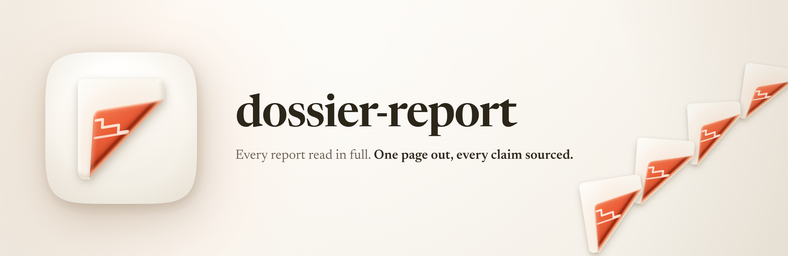

<p align="center">
  
</p>

<p align="center">
  <strong>Ask a question. Get a published page that can prove what it says.</strong>
</p>

<p align="center">
  
  
  
  
</p>

---

You run deep research on something. Five backends come back with a few
hundred thousand words between them. You skim the merged summary, write
the thing up, and ship it.

That's the failure this skill exists to stop, and it isn't hypothetical.
It happened twice on pages in this account. The research tool printed
**"5 never opened"** in bold at the top of its own output, and the page
got written from the summary underneath it anyway.

A merged summary isn't a summary. It's a list of what the backends
*didn't* have in common. Write from it and you've described the gaps
between five reports rather than what any of them found.

## What it does

You give it a question. It gives you a finished page at
`~/Dev/dossier/<slug>/index.html`, live at `<slug>.fledgeling.app`.

In between it runs a research panel across paid and free backends, reads
**every report end to end**, turns the corpus into a list of claims with
sources attached, then designs the page from scratch around its own
subject. Every claim carries a citation you can open. Every source appears
in a list at the bottom. Nothing ships that the research didn't support.

**Every page opens with a TLDR.** The finding in a sentence, the three to
five claims holding it up, and the one thing that would change it. Most
people stop around the middle of a page, so a conclusion sitting at the
bottom was written for readers who never arrive. The TLDR is generated from the
same claim list as the rest of the page, so the two can't drift apart and
start disagreeing about what was found.

**Each page looks like a different page.** That's deliberate, and it's the
part most likely to go wrong quietly. Design homogenisation has been
measured: across a decade of the web, layout similarity fell 44%, and the
strongest cause was everyone reaching for the same handful of libraries.
The giveaway isn't the colours. It's the **skeleton and the motion**. So
the skill reuses the plumbing (citations, accessibility, the audit) and
throws away the layout every time, checking each new page against the ones
already published to make sure it isn't the last one recoloured.

To keep that honest it looks at real shipped pages before it designs
anything, through the Mobbin MCP, and writes down what it took and what it
deliberately left alone. Then it diverges from there. Designing from memory
is how you get the shape every model ships for the category.

## If the question is which one to buy

A page that surveys eight vacuum cleaners and stops hasn't answered
anything. So product research gets a verdict layer.

It works out the categories buyers actually split on (not price bands, and
not a spec sheet's headings), then gives you three ranked picks in each,
and one overall winner with the reasons written out. Each pick says what it
costs, what it's best at, what would change it, and the genuine thing the
runner-up does better. The winner says what it loses on. "No overall
winner" is a valid answer where the field really does split.

Two things make it trustworthy rather than confident. **A ranking is
reasoning, not a measurement**, so it renders as reasoning: it names the
claims it rests on, and the audit fails a pick that's dressed up as a
finding. And **paywalled testing counts**. Which?, RTINGS, Choice and
Consumer Reports run the tests nobody else runs, and locking the raw
numbers away doesn't make their verdict weak evidence. The skill cites the
published verdict as a verdict, names the protocol, says in a clause that
the measurements aren't public, and stamps the test year. Refusing those
sources would leave the page arguing from affiliate listicles, which is
worse evidence and not more rigorous.

## Pictures, charts and motion

Three things the older version left as suggestions and now treats as
requirements.

**Images come from the research.** If the subject has a visible form, the
page shows it, and the picture comes from the sources rather than from an
image search. Press assets first, then anything a source published for
reuse, then a generated illustration, then an honest placeholder. Every
image carries a caption saying what it is and where it came from, and a row
in the same registry the text cites; an uncaptioned photo on an evidence
page is the one thing asserting something with nothing behind it. Generated
artwork says it's generated.

**Charts go through `dataviz`**, and there are three ways to build one:
plain CSS and DOM for a handful of rows, hand-authored SVG where the
drawing is the argument, or TanStack Charts compiled to static SVG at build
time. That last one is new and worth a note: TanStack Charts is pre-alpha,
so it never ships to the reader. It runs in Node, emits an SVG string, and
that string goes in the page. You get a real chart grammar with no library
on the page, and a page published today keeps rendering even if the API
moves next month.

**GSAP is compulsory now.** Not for atmosphere; the rule that motion has to
earn its place by showing you a change you couldn't otherwise track still
stands for anything inside a chart. But a reading toggle that acknowledges
a press with nothing reads as broken however good the argument is, so
interface
feedback gets its own budget and that one is mandatory. A page with no
motion layer now fails the audit, and so does one whose controls have no
hover, focus or active state.

## How a run goes

1. **Sharpen the question** before spending anything, because the research
   prompt is frozen the moment the panel starts and $5 to $20 rides on it.
2. **Widen the angles** so the brief isn't the first three subtopics any
   model would list.
3. **Run the panel**, then read all of it. Not the outline. Not the merge.
4. **Build the claim list**, so citations come from the evidence rather
   than getting bolted on afterwards. Where the question is a choice, the
   categories and the ranked picks get settled here too.
5. **Pick the name and the look**, with you in the loop.
6. **Look at real pages, then find a visual direction** from the subject
   rather than from a template.
7. **Build it**, with the words in Luke's voice and the design held to a
   research-backed standard.
8. **Make an icon** for the page.
9. **Audit it**, then stop and ask before anything goes public.

## Install

```text
/plugin marketplace add fledgeling-co/fledgeling-plugins
/plugin install dossier-report@fledgeling-plugins
```

Then just ask:

```
research whether home batteries actually pay for themselves in
Australia and make a page for it
```

## Does it actually work

Six tests, each run twice: once with the skill, once with **no skill at
all**. That's the honest comparison for something new, because it asks
whether the thing earns its place.

**On the checkable stuff: 31 out of 31, against 25 out of 31 without.**

**On a blind quality panel, where judges saw both versions with no idea
which was which: seven to four.** Two judge families, eleven comparisons.

Both numbers are true and the shape underneath matters more than either.
The skill wins on things a model can't guess, because somebody decided
them: the marketing bar on every page, the share tags, the test a 3D scene
has to pass. It's much closer where the job is just good judgment, the two
judge families disagreed with each other on the aggregate, and on the
biggest test of all (build the whole page) the version with no skill won.

So it's worth having for consistency, not for brilliance. It makes the
compulsory boring things happen every time.

Note: those numbers were measured on version 2.1. The TLDR band, the
verdict layer, the imagery rules and the compulsory motion layer landed
after that run and haven't been through the panel yet.

The full report card is in **[EVALS.md](EVALS.md)**, including the three
places the no-skill version beat it and the fix for each, and the two
tests that turned out to measure nothing.

**Note:** the tests also found a wrong claim in the skill's own research
notes, a broken check in its own audit script, and a citation bug that
would have quietly killed every source link on a page when JavaScript was
off. All fixed, all written up.

## What's underneath

Five research backends, $20.00, 225 sources, every report read in full and
every citation dereferenced. The reports are committed in
`docs/deep-research/` so anything the skill claims can be traced from
inside the repo.

The rules come from that research rather than from taste. Pages lead with
the finding because half of readers never reach halfway down. Animation is
allowed when it lets you see a change you'd otherwise have to hold in your
head, and cut when it's atmosphere. 3D has to pass six tests before it's
allowed near a page. Truncating a chart axis inflates what people think
they're seeing by 58% to 130%, and telling them doesn't fix it, so the
axes get checked before the page is drawn.

`references/evidence.md` has all of it with the sources attached,
including the places the five backends flatly contradicted each other.

## Credit where it's due

The research panel runs on [Dossier](https://github.com/fledgeling-co/dossier-research-mcp),
and the pages carry a quiet mark for it and for [Margin](https://margin.fledgeling.app/).
