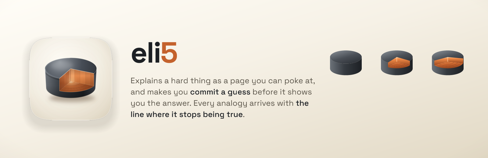

<p align="center">
  
</p>

# eli5

Ask it to explain something hard, and you get back a page you can poke at: a diagram
that moves when you change something, a question that makes you commit a guess before it
shows you the answer, and a plain statement of where its own comparison stops being true.

```
/eli5 how Raft consensus works
/eli5 what happens when I type a URL and press enter
/eli5 why Diffie-Hellman lets two people agree on a secret in public
```

It writes a single self-contained HTML file. Nothing loads from the internet, so it works
offline and keeps working.

## What it does differently

Most explainers simplify by removing things. That's how you end up understanding less than
you think you do, which is worse than knowing you're lost.

**It makes you guess first.** Before a simulation runs, it asks you to pick an answer.
There's evidence behind this: dragging a slider without a hypothesis is worth about half
the learning of committing to one first. It's one sentence of copy, and it roughly doubles
the effect.

**Every analogy comes with the line where it stops.** Water pressure explains voltage well
until you cut the pipe; water sprays out and current just stops. The page says so, in the
first screen or the second, never buried at the bottom. Analogies that skip this are how a
confident wrong idea gets installed, and those are hard to shift later.

**It doesn't talk down to you.** No "grown-up word", no magic, no cartoon monsters living
in your RAM. The register is a clever colleague from a different field explaining their
work.

**Three depths, and you can skip.** A first screen you can stop after, the mechanism
underneath it, then what real systems actually do. There's a skip control, because
scaffolding that helps a beginner actively slows down someone who already knows.

**A gate that fails the build.** Twenty checks run before it's finished: no broken external
images, diagrams that scale instead of clipping, drags that survive a touchscreen,
animations that don't leak, and the pedagogy rules above. It exits non-zero and it means it.

## Does it actually work

Both versions were run on the same six hard topics: Raft, TCP and DNS, Diffie-Hellman,
virtual memory, transformer attention, quantum superposition. Then three AI judges from
three different companies scored them blind, without knowing which page came from which
version, or that a comparison was happening at all.

**They picked this one 17 times out of 18.**

On "does it tell you where it's simplifying" and "does it respect you", it was unanimous.

| | before | eli5 |
|---|---|---|
| Pages you can interact with | 0 of 6 | 5 of 6 |
| Says where the analogy breaks | 0 of 6 | 6 of 6 |
| Makes you guess first | 0 of 6 | 6 of 6 |
| Layered so you can go deeper | 1 of 6 | 6 of 6 |
| Works in dark mode | 0 of 6 | 6 of 6 |

**Where the older one wins.** It's shorter: about 350 words against 2,670, and its whole
point was "few words". It also draws slightly more shapes per page. Depth costs length, and
that's a real trade rather than a rounding error. The full scorecard, including the eval
this version lost and why, is in [EVALS.md](EVALS.md).

## Install

```
/plugin install eli5@fledgeling-plugins
```

Then `/eli5 <anything>`.

## Credit

This is a rebuild of **eli5** by **Thariq Shihipar**, published in Anthropic's
`claude-plugins-community` marketplace under MIT. That skill named the thing worth wanting,
a picture explainer with few words, and its framing is the reason this one exists. What's
added is the teaching research underneath it and a gate that fails.

## Under the hood

- [SKILL.md](skills/eli5/SKILL.md), the five phases the skill runs
- [evidence.md](skills/eli5/references/evidence.md), every rule traced to a source, plus
  the four places the research disagreed with itself and the gaps nobody could fill
- [pedagogy.md](skills/eli5/references/pedagogy.md), finding the idea a topic turns on
- [artifact-engineering.md](skills/eli5/references/artifact-engineering.md), the drawing
  and interaction rules
- [docs/deep-research/](docs/deep-research/), the four full research reports
