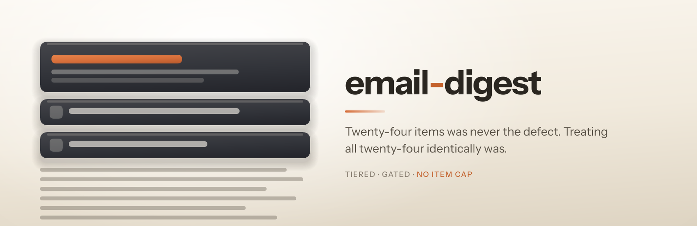

<p align="center">
  
</p>

<h1 align="center"> email-digest</h1>

<p align="center"><strong>Tiers the list instead of trimming it, then proves the email survives the inbox.</strong><br />
A digest builder that refuses to cap your item count, because the measured evidence says the count was never the problem.</p>

<p align="center">
  
  
  
  
</p>

---

## Install

```
/plugin marketplace add fledgeling-co/fledgeling-plugins
/plugin install email-digest@fledgeling-plugins
```

## The thing everyone gets wrong

A digest goes out with twenty-four items and somebody calls it unreadable. The obvious fix is fewer items. That fix is wrong, and there is a lot of evidence saying so.

MailerLite looked at 317,000 campaigns and 2.9 billion emails. The bucket with twenty-one or more links had the **highest** click-to-open rate in the whole dataset. Campaign Monitor ran the same test expecting the opposite and found click rate rising with link count. The academic backstop people reach for, choice overload, pools across 63 conditions and 50 experiments to a mean effect size of virtually zero.

The defect is not how many items there are. It is that every item costs the reader the same effort to evaluate, inside a budget of about fifty-one seconds, with nothing on the page telling them where to stop.

So this skill tiers the list instead of trimming it. A few items get real space, a handful get a row each, and the rest get one line. The item count stays whatever it is.

## What you get

Three tiers, a render that survives Outlook, and a gate with sixteen checks that each trace back to a source.

The gate is the useful part. It catches the things that break an email silently:

- **Anchor links**, which do not work on iPhones. Apple is 62% of opens, so a clickable contents list is decoration for most of your list, and untrackable where it does work.
- **Missing table roles**, which make a screen reader read your layout out loud as a spreadsheet. 86% of a 443,585-email audit failed this one.
- **Centred body text**, which is easy to introduce by accident because the markup that centres the card cascades into everything inside it.
- **SVG**, which Gmail deletes outright rather than degrading, so a vector logo just vanishes.
- **Dark-mode meta tags without dark styles**, which is worse than no tags at all, because Apple Mail leaves you alone without them and partially inverts you with them.
- **Size**, against Gmail's clip at roughly 102KB, which truncates mid-markup and can take your unsubscribe link with it.

## Two things it refuses to do

**It will not cap your items.** The absence of a cap is itself asserted as a rule, because it is the first thing anybody reintroduces when they reason from instinct rather than reading the evidence.

**It will not gate a text-to-image ratio.** The famous sixty-forty rule has nothing behind it. Email on Acid tested against twenty-three spam filters and found that above 500 characters the ratio makes no difference to deliverability. Badsender files it under deliverability myths. The real constraint is image blocking, so the gate checks that your email still works with every image stripped, which is the thing that actually matters.

## Where it came from

Four independent research backends were given one brief and came back with 182 cited sources between them. They disagreed about the central question, which is what made the exercise worth running: three recommended cutting the item count and the two best-sourced showed there is no evidence for a ceiling at all.

The argument, with every claim cited and every disagreement recorded, is at **[dossier.fledgeling.app/uniform](https://dossier.fledgeling.app/uniform)**. The rule-by-rule provenance lives in the skill's own `references/evidence.md`, including the eight widely-repeated email statistics that turned out to have no traceable source at all.

## What it does not claim

Nobody has ever published a test of a tiered digest against a flat one. All four backends went looking and none found it. The layout is an inference from four measured results rather than a measured result itself, and the skill says so rather than dressing it up. If you want to settle it, send half your list one and half the other, and measure clicks rather than opens, because Apple broke opens in 2021 and click-to-open along with them.

## Not for

Transactional mail, cold outreach, or a single-announcement campaign. It also does not send: it builds the message and gates it, and hands off to whatever you already use.
