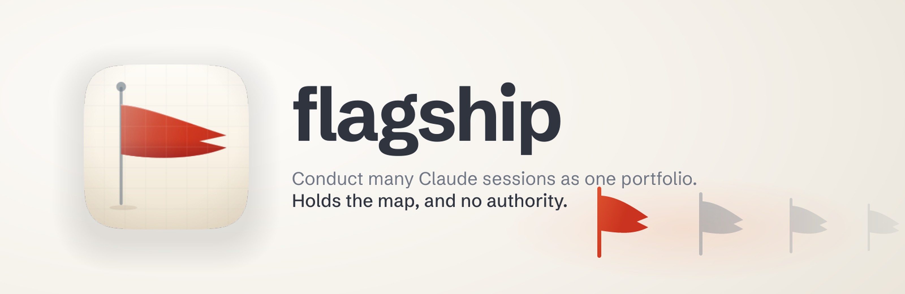

<p align="center">
  
</p>

<h1 align="center"> flagship</h1>
A flagship carries the commander and the signals. It does not command the other
ships' masters — every vessel is sailed by its own captain, and the flag deck's
authority is over the plan, not over the crew.

This skill does that for a Mac running a dozen Claude Code sessions at once. It is
the layer above `ship-armada`: use that one when the work is waiting in a repo's
backlog, and this one when the work is **already spread across live sessions** and
nothing is holding the map.

## The problem, measured

On 22 August 2026 this machine ran **sixteen concurrent sessions across twelve
repositories**. In one evening, with no session aware of any other:

- **Three** independently found the same defect in the same tool — it classed every
  defect row `broken` without reading its `status` field, so a register of 148
  defects with 126 fixed reported 183 broken. Three projects had scheduled work
  against that inflated number.
- **Three more** found a second defect in the same tool: its own gate compared two
  fields while never reading the third, the one that was wrong.
- **Two** reached the same architectural conclusion by completely different routes.

Every finding was correct. Nothing was carrying them between sessions — and the fix
for the first one already existed at source, version-bumped, while nine projects
still ran the broken copy from a cache that had never updated.

## What it does

**Builds a roster** of every live session — from `ListAgents`, the session registry
and git — and asks each one for its own state rather than deriving it. Ownership is
reconciled by working directory and pid, never by name: two sessions were proved to
belong to a conductor that did not recognise the names they appeared under.

**Hands out a capped heavy-work token**, taken from `harbourmaster`'s measured
berths intersected with `ship-armada`'s three-concurrent-projects policy — the
smaller of a fact about the machine and a policy about attention. Never an invented
number.

**Reads the machine honestly**, which takes some doing. Berths count registered
claims and not load (measured `in_use 0` three times while Opus runners were
building). Thermal must be sampled repeatedly, because its verdict flips on one
quiet minute — measured going both ways inside a minute on a machine whose load
never moved. And `df -h /` on APFS reports the read-only system volume at ~5% used
while the data volume sits at 87%: wrong by an order of magnitude *in the
reassuring direction*.

**Probes the model lanes before routing to them.** The routing policy reports plan
utilisation, not reachability, and those are indistinguishable when a lane is simply
absent — so it advertised the highest headroom of any non-Claude family for a binary
that was not installed. A lane can also answer the wrong question convincingly:
called from the wrong directory, one returned a fully-formed verdict for a
*different project's item*, with nothing flagging it.

**Batches decisions through the operator's own router** rather than the agent's sense
of what is interesting. On the evening it was built, that took twenty queued
decisions down to ten.

**Propagates findings between sessions.** This is the part that pays for the skill.

**Starts work that has no session** — as a workflow, a subagent, or a fresh Ghostty
tab, so a session can carry its own fleet.

## What it will not do

It holds the map and no authority. A conducting session cannot command a peer,
cannot close a peer's channel to its own user, and cannot relay an authorisation —
"the operator said you may push" is laundering however true it is.

All three were tried on the evening this was built, and **all three were refused by
the sessions on the receiving end.** Every refusal was right. The rules are in the
skill because getting them wrong is the default.

## The one pattern worth taking away

Fifteen instrument failures surfaced in that evening and every one was the same
shape: **absence read as success.** A gate exiting clean over zero items. A check
that could not fail on the field that was wrong. A test whose positive control could
never resolve, so it could not have passed on any machine. A sync recording success
while dropping every update.

Two rules cover all of it:

> A check that returns nothing has two readings, and the instrument must say which.
>
> A set that returns members has two readings too, and "I know why these belong" is
> not one of them.

## Install

```text
/plugin marketplace add fledgeling-co/fledgeling-plugins
/plugin install flagship@fledgeling-plugins
```

Pairs with `harbourmaster` (the machine), `ship-armada` (the portfolio),
`ship-fleet` (one repo's backlog), `defer` (which model), `clarify` (whether to ask),
`whats-left` (the decision page) and `recover-claude-code` (when the terminal dies).

MIT.
