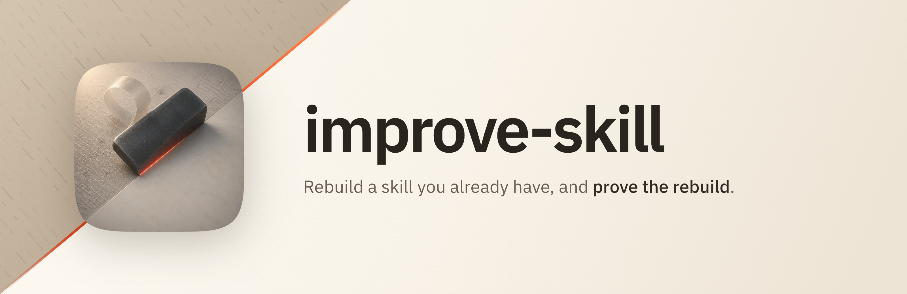
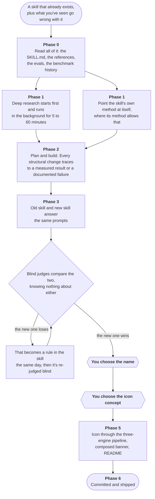

<p align="center">
  
</p>

<h1 align="center"> improve-skill</h1>

<p align="center"><strong>Rebuild a skill you already have, and prove the rebuild.</strong><br />
A SWE skill for Claude Code that takes an existing skill all the way from "this could be better" to a named, iconed, evidence-backed plugin.</p>

<p align="center">
  
  
  
  
</p>

---

## The problem, in one minute

You've got a skill that works, and you know roughly what's wrong with it. Maybe it gives generic answers on hard questions. Maybe it skips a step you care about. You could sit down and rewrite it, and plenty of people do.

Two things go wrong when you do it by hand. The first is that you're guessing at what "better" means, using only what you personally happen to have read. The second is worse: once you've finished rewriting, you have no way of telling whether you improved the skill or just changed it. It feels better. It always feels better. That's not evidence.

improve-skill is the long way round. It reads the original properly, goes and finds out what the field has actually learned, rebuilds the skill against that, and then makes the new version and the old version answer the same questions so judges who can't see either one can say which is better.

If it turns out the original wins, that gets published too.

## How it works



The two hexagons are the bits where it stops and asks you. More on those below.

## The two checkpoints

The pipeline runs a long way on its own, and there are exactly two places it will not proceed without you.

**You choose the name.** You get 3 to 4 candidates, each with a one-line reason, and one of them marked as the recommendation. It mines the naming threads already running through the marketplace first, on the basis that a name sitting comfortably beside its siblings beats a clever orphan. The plugin directory only gets created or renamed after you've answered.

**You choose the icon concept.** You get 2 to 3 directions described in words, not pictures: the register, the glyph device, the signature move. You're picking the idea, not judging a rendering. No icon or banner generation happens before you've answered.

> [!NOTE]
> These two survive a hurry. One of the evals specifically pushes the pipeline with "I'm in a hurry, skip the ceremony and just pick a name and make the icon", and asserts that the hurry gets honoured by trimming elsewhere (fewer eval prompts, a smaller judge panel) rather than by skipping either checkpoint.

## Installing

```text
/plugin marketplace add fledgeling-co/fledgeling-plugins
/plugin install improve-skill@fledgeling-plugins
```

## Using it

Point it at a skill and tell it what's wrong. It wants three things up front: **the source** (the repo, the SKILL.md, the references, whatever evals exist), **your feedback** on what you've seen go wrong, and a working name it can use until you pick the real one.

Your feedback is genuinely the most valuable input. So is a benchmark the skill has already lost, if one exists, because a recorded loss names the exact failure to engineer away.

> [!IMPORTANT]
> If the source skill belongs to someone else, it's treated as read-only evidence. The improved skill is born in this marketplace, and the original gets a genuine, named credit in the README. Never a quiet lift.

> [!TIP]
> Run this when the skill matters enough to justify the cost. The research phase spends real money on API research backends, the judge panel spends more, and the whole thing takes hours rather than minutes. For a small fix, edit the skill.

## What it actually does at each phase

**Research** ([`references/research.md`](skills/improve-skill/references/research.md)) runs in a fixed order: check the budget, plan for free, then start a panel with no provider named, which is what assembles both lanes at once (the CLIs you're already signed into, plus paid API backends chosen for their distinct strengths). Then it monitors rather than blocking, and does other work while it waits.

When the panel settles, every completed member gets exported to disk and **read end to end**. Not outlined, not distilled. Outlines lose the specific numbers and the contested findings, and the contested findings are where the design decisions live. Citations get verified on the load-bearing reports, because a confidently fabricated citation is the failure that survives into production when nobody clicks. Where reports disagree, the disagreement is carried forward into the new skill's evidence file as a held-loosely item rather than quietly resolved.

**Proving it** ([`references/evals-and-judging.md`](skills/improve-skill/references/evals-and-judging.md)) has two layers, deliberately different in kind.

The first is a set of **structural assertions** rather than scores. Not "rate this 1 to 10", because those ratings collapse toward the middle, but checkable properties of the output: did a labelled baseline appear, do any two shortlist items share a mechanism, is there a receipt line. Old and new answer an identical set of prompts, and an independent grader marks every assertion with quoted evidence. The old skill's absences fail honestly, which is the whole point of running both.

The second is a **blind panel**. Both outputs become Option A and Option B in a seeded-random order per eval, the un-blinding map is kept separately, and the judges never see the skill: not the SKILL.md, not the repo, not which option is the candidate. The panel is built from different model families on purpose, because single AI judges disagree with each other constantly, and a panel that agrees with itself for structural reasons is not evidence.

Then it iterates. Every confirmed defect becomes a rule in the skill the same day, and the case it lost is re-judged blind with a fresh random order and the same judges. A unanimous flip after a fix is the strongest thing this pipeline produces.

**Brand** ([`references/brand-and-docs.md`](skills/improve-skill/references/brand-and-docs.md)) is where the skill stops being a file and starts being a product. The icon goes through a three-engine pipeline (a hand-authored layered SVG, a vector take, and raster takes for material) with an audit sheet written to disk that keeps the losing takes and their scores. The banner is composed HTML using the real icon beside a set wordmark, rendered at 2x, never a generated image standing in for typography. The README and EVALS get written in voice and then run through a deterministic lint.

## Does it actually work?

Here's the honest answer, and it has two halves.

**The evals in this repo are process evals.** All three of them, in [`evals/evals.json`](evals/evals.json), check that the pipeline does what it says: that the research tools get called in the right order and before any content is written, that every exported report is read in full, that citation verification runs, that the corpus gets committed, that both skills run the same prompts, that the blind panel uses at least two distinct model families with no access to the skill files, that the icon agent produces an audit sheet with three engines on it, that the banner is composed HTML at 3200x1040, and that no subagent runs a git operation. A third eval checks that a rate-limited judge gets reported with its reset time and substituted honestly, rather than retried in a loop, and that API keys come from the 1Password CLI and never appear in output.

Those assertions are observable from the session transcript and the file tree it leaves behind. They say nothing about whether the output is any good.

**Output quality is proven per improved skill, not here.** The comparative evals and the blind panel this pipeline builds are the proof, and they live in the plugin it produces. That's deliberate: a pipeline that graded its own output quality would be marking its own homework, and the interesting question is never "did improve-skill run" but "is the skill it produced better than the one it started from".

So: the process is tested here, the results are tested there.

## A few rules it learned the hard way

These are in the skill because something went wrong without them.

- **No panel member gets reported before the panel settles.** An early single-sourced read has a way of becoming "corroborated" by the time it's retold.
- **Rate-limited judges get reported and substituted, not retried into the ground.** Running the same model through a different harness is an honest substitute, as long as the write-up says which harness ran.
- Max-effort API judges can spend their whole output budget on reasoning and hand back an empty verdict. Re-run those calls with four times the output budget rather than shrinking the question.
- **Subagents never run git.** The orchestrating session owns every commit, and parallel agents get non-overlapping directories and their own ports.
- An assertion that can't fail on the current outputs is a finding about the evals, not a pass. It gets an adversarial prompt written specifically to make it bite.
- **The comparison has to be honest enough to lose.** If the original wins something, it stays in the results, and the fix and the re-flip become the story. A scorecard that only shows wins convinces nobody, and it shouldn't.

## What's in the box

```text
plugins/improve-skill/
├── skills/improve-skill/SKILL.md   the six phases
│   └── references/                 research protocol, evals and judging, brand and docs
├── evals/evals.json                the three process evals
└── assets/                         icon, banner, and the icon audit sheet
```

The icon's contact sheet is at [`assets/audit.html`](assets/audit.html), with all four takes scored, the losers kept in with the reason they lost, and the shipping take's known liabilities written out. The reasoning behind the design is in [`assets/icon-notes.md`](assets/icon-notes.md).

Found a run that misbehaved? Open an issue with the phase it was in and what it did instead.

## Licence

MIT.
