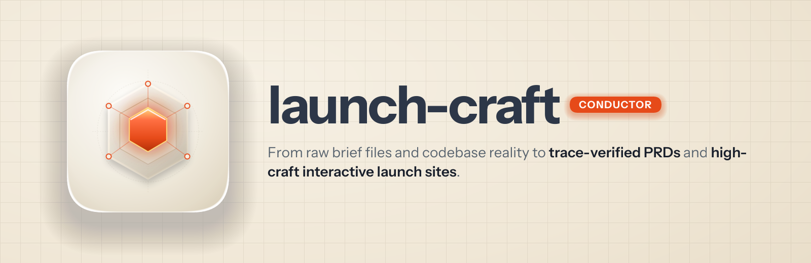
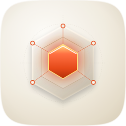

<p align="center">
  
</p>

<h1 align="center"> launch-craft</h1>

<p align="center"><strong>From raw project intelligence to PRDs and interactive launch sites.</strong><br />
The end-to-end conductor for Claude Code: brief files and codebase in, updated OVERVIEW.md and PRD.md plus a high-craft GSAP and Three.js marketing website out.</p>

<p align="center">
  
  
  
  
</p>

---

## Why it exists

Building a great product is only half the work. Connecting what exists in your codebase to clear product specs and an extraordinary, high-converting launch website usually requires hopping across disjointed tools: guessing architecture details, writing generic SaaS landing pages, and wrestling with template cliches.

launch-craft orchestrates the complete launch journey:

1. **Synthesizes true product reality**: Scans your `docs/features-to-triage/*.md` briefs, implementation plans, mock HTML, and application code. Uses Gemini 3.7 Flash High via `agy` to generate structured `OVERVIEW.md` and `PRD.md` documents where every single triaged feature is tracked.
2. **Sharp product positioning**: Grounds messaging directly for home network admins and gamers. Draws flow patterns from Mobbin MCP, divergent hooks via `/trawl`, and writes authentic copy in Luke Rhodes' voice via `/create-luke-content`.
3. **Dual pricing architecture**: Implements a transparent pricing structure ($9.99 perpetual for self-hosted VPS / BYOK vs $4.99 per month for managed cloud SaaS).
4. **Bespoke, interactive marketing site**: Crafts an engaging website using `/design-craft` and `/ux-craft` featuring an interactive Three.js 3D hero canvas, GSAP scroll reveals, live interactive mock UI slices (latency sliders, packet filters), and badges highlighting native support on Windows, Mac, iPad, iPhone, and Linux.
5. **Deterministic validation**: Every produced artifact is audited with `validate_site.py` for WCAG AA/AAA contrast, zero em-dash copy compliance, and multi-platform coverage.

---

## How it works

```
[Raw Briefs / Code / Mocks]
           │
           ▼
┌─────────────────────────────────────────────────────────────┐
│ Phase 1: Gemini Document Synthesis (agy / Perch)            │
│   • Scans docs/features-to-triage/*.md, app code, mocks     │
│   • Runs gemini-3.7-flash-high via agy from /tmp            │
│   • Emits updated, trace-verified OVERVIEW.md & PRD.md      │
└──────────────────────────┬──────────────────────────────────┘
                           │
                           ▼
┌─────────────────────────────────────────────────────────────┐
│ Phase 2: Positioning, Ideation & Authentic Copywriting      │
│   • Target: Home network admins & Gamers                    │
│   • Dual pricing: $9.99 BYOK/self-hosted · $4.99/mo SaaS    │
│   • Patterns via Mobbin MCP · Ideation via /trawl           │
│   • Copy drafted via /create-luke-content (Luke voice)      │
└──────────────────────────┬──────────────────────────────────┘
                           │
                           ▼
┌─────────────────────────────────────────────────────────────┐
│ Phase 3: Interactive Marketing Site Crafting                │
│   • Design & UX via /design-craft & /ux-craft               │
│   • GSAP scroll timelines & micro-interactions              │
│   • Three.js 3D telemetry/topology hero canvas              │
│   • Interactive mock UI slices (network & latency toggles)  │
│   • 5-Platform badges (Windows, Mac, iPad, iPhone, Linux)   │
└──────────────────────────┬──────────────────────────────────┘
                           │
                           ▼
┌─────────────────────────────────────────────────────────────┐
│ Phase 4: Deterministic Validation & Conformance Gates       │
│   • Structural trace & markdown schema checks               │
│   • Contrast (WCAG AA/AAA), layout bounds, asset checks     │
│   • Exit 0 verification & artifact export                   │
└─────────────────────────────────────────────────────────────┘
```

---

## Quick start

Run the skill directly in any project repository:

```bash
/launch-craft:launch-craft
```

Or invoke it conversationally:
> "Run launch-craft on this project: update OVERVIEW.md and PRD.md from our briefs and build an interactive marketing site with GSAP and Three.js."

---

## Deterministic Quality Gates

Every run executes automated validation scripts:

```bash
# Scan and synthesize requirements
python3 plugins/launch-craft/skills/launch-craft/scripts/run_synthesis.py

# Validate generated marketing site
python3 plugins/launch-craft/skills/launch-craft/scripts/validate_site.py <site-path>
```

---

## Install

Add the fledgeling marketplace and install `launch-craft`:

```bash
/plugin add fledgeling-co/fledgeling-plugins
/plugin install launch-craft@fledgeling-plugins
```
