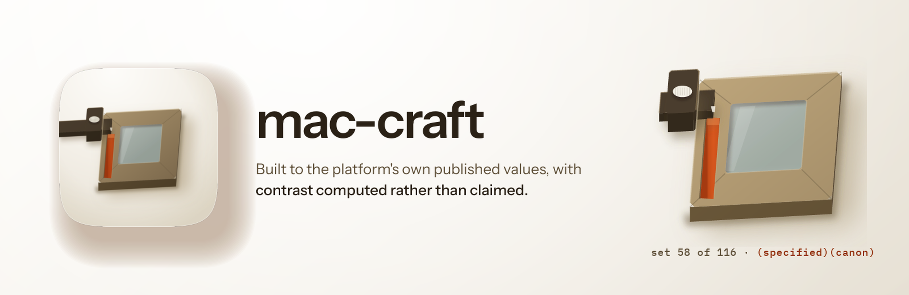
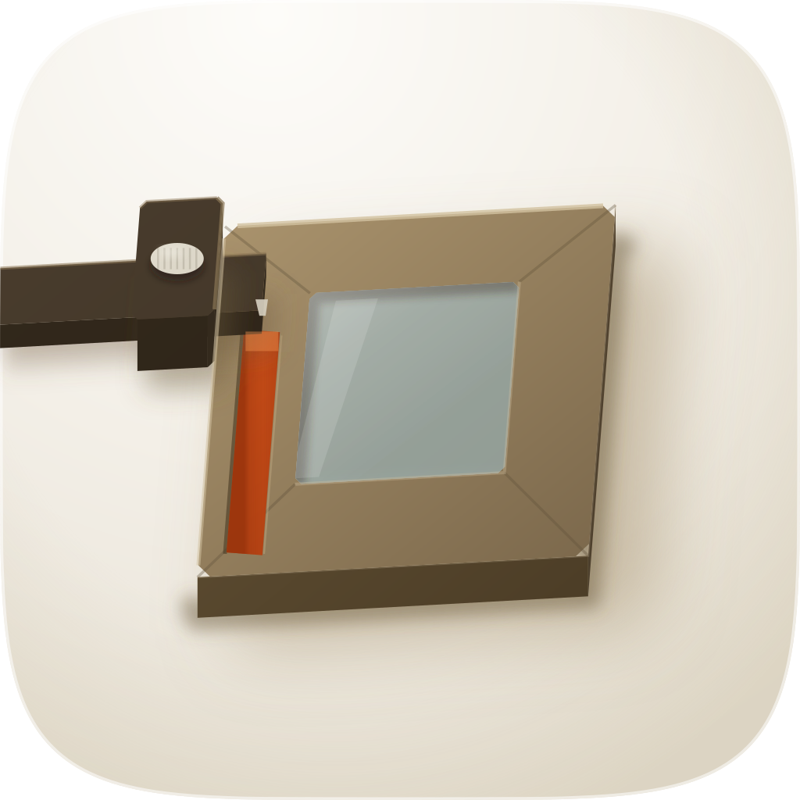

<p align="center">
  
</p>

<h1 align="center"> mac-craft</h1>
<p align="center">
  
  
  
  
</p>

Design and review macOS application interfaces (windows, sidebars, toolbars, settings panes, menu-bar extras, empty states, onboarding) against the platform's own published values rather than a web habit that happens to run on a Mac. Chrome stays native; when the aesthetic axis is free, variety is mined in the content area rather than by restyling the titlebar.

## The problem

A prose audit grades itself. The version this replaces carried seven of them, and a recorded run reported "100% pass rate on contrast" while the artifact it had just built put one `+` glyph at **1.00:1**, the same colour on the same colour, invisible. Every button on that screen measured 3.65:1. Nothing in the audit was wrong about its method; there was no computation behind the claim, and a claim with no computation reads exactly like a measurement.

The second problem is subtler and this skill was on the wrong side of it. Its own reference told runners to apply the kit's secondary label tier (black at 50% on white) as a body-text colour. Measured, that is **3.98:1**, below the 4.5:1 floor the same file asserts. It was, in other words, instructing the defect it was written to catch.

## What it does instead

**Computes contrast from the declared cascade, across four appearance contexts.** `scripts/mock_check.py` resolves colour through the cascade with alpha compositing and checks light, dark, and both at increased contrast. Its exit codes carry a third state: **2 means unmeasurable**, and `examined=0` is never a pass. A checker whose "clean" and "could not read this" look identical is not a checker.

**Cross-checks the declared metrics against the kit and the stylesheet.** The predecessor's own worked example claimed a 48px titlebar against a published 33pt value and carried an accent, `#00F0FF`, that appears in no vendor palette. The metric block now has a closed tier set, and `direction` is refused on chrome geometry: an app may choose its own content, not its own window furniture.

**Corrects three things the platform documentation actually says.** White 13pt on the kit's own Blue `#0088FF` measures **3.52:1**, so Apple's accent button is itself sub-AA and cannot be cited as a floor. The HIG specifies **title case for menu items**, confirmed against two independent first-party sources, where the predecessor asserted sentence case everywhere. And macOS 27 is beta; it was written as shipped.

**Proves the gate can fail.** `scripts/gate_tests.sh` runs 19 adversarial cases, all 19 of which bite: a control passes at zero findings, a 1.00:1 pair returns 1, and a fixture with no text returns 2 rather than a pass.

## Does it actually work

Three evals, fourteen assertions. The baseline column is measured against the predecessor's **own recorded output** rather than a fresh run, because that is what actually shipped.

| assertion | predecessor | this |
| --- | --- | --- |
| contrast computed and quoted | FAIL: "100% pass rate" asserted, real 1.00:1 | PASS: `examined=116 failures=0` |
| contrast clean across ≥2 appearance contexts | FAIL: 3.65:1 ×2, 1.00:1 ×1, one context | PASS: four contexts clean |
| keyboard reachability | FAIL: `:focus-visible` 0, `:focus` 0, 12 `<div onclick>` | PASS: 3 / 0 |
| token discipline | FAIL: 11 properties, 45 literals | PASS: 21 tokens, 1 literal outside |
| metric block against the kit | FAIL: 48px against a 33pt published value, untagged | PASS: 11 rows, 0 failures |

A blind panel of three model families chose this version unanimously, and all three independently named the low-contrast invisible-text defect as the worst thing in either take, the same defect the predecessor reported as a pass. A fourth family was usage-limited and is recorded as failed rather than dropped.

**The panel also found against this version.** One judge's identity axis called its own worked example *"a competent but anonymous stock-Mac ledger"*, the corpus's own named failure mode, quoted back at the skill. That is correct: the fixture is gate-clean, not memorable. The gate enforces correctness and structurally cannot enforce distinctiveness, which is why the signature check and the essence test remain human-read rows.

**One thing the predecessor did better, kept unchanged.** Its supersede table in `references/mac-essence.md` overrides eight design-craft and ux-craft rules under one governing sentence (native wins inside app chrome), and then names what is *not* overridden. That second half is the part most override sections omit.

**Where this version's column comes from, and what has not run.** This version's column is its worked example, `assets/fixtures/ledgerline-accounts.html`, measured by its own gate, and all five rows were reproduced from scratch on 18 August 2026. So the table is a pair of records rather than a head-to-head. The one eval that would put both versions on the same brief, a two-surface personal-finance app built twice, was launched and never produced artifacts: both runs were still reading references at 27 minutes with nothing on disk, and nothing has been produced since. Its grader is not committed either, so on any other machine that eval currently has none.

The panel carries the matching limit. It compared two fixtures rather than two runs, one reproducing the predecessor's recorded failure and one this skill's worked example. That is a fair test of whether three families can see the defect in a render, and it is not a test of what either skill produces on a fresh brief. Judges saw renders only and never source, so the metric block, the token layer and the exit-code contract earn nothing on the panel by design; the 19-case gate suite is what covers those. One judgement per family and one run per gate case, so nothing here is a rate. Distinctiveness stays unmeasured, and by the skill's own reasoning a script cannot gate it.

The gate suite, the panel verdicts, the counters reproduced line by line and the three tasks that would settle the rest are in [EVALS.md](EVALS.md).

## Honest limits

Obscura is the only sanctioned browser here, and its gaps bound the gate. CSS animations and transitions never execute. `Emulation.setEmulatedMedia` is accepted and inert. Web fonts never load. Shorthand computed styles return `0px` or empty while longhands are correct. **Native form controls do not render at all**: a real radio input renders as nothing, which looks exactly like a missing affordance, and matters more here than anywhere because macOS mockups are full of them.

So motion, print, reduced-motion and type fidelity are declared unchecked, and eight further limits are named in the skill's own `## Known limits` section.

One research finding is worth carrying: a deep-research backend returned a type ramp that is **iOS values** (a 34pt Large Title) contradicted by two first-party sources and by the kit. That the iOS ramp is what gets imported by mistake is now a diagnostic in the skill rather than a footnote.

## What it doesn't do

**It does not make icons.** An icon request routes to `create-mac-icon:create-mac-icon`, which owns the corpus, the three generation engines and the fidelity loop. If that plugin is absent, this one says so and stops rather than running a weaker second pipeline: one honest gap beats two near-identical references drifting apart.

It does not review a rendered page for general design quality (`design-review:design-review`), and it does not own flows, forms or UX (`ux-craft:ux-craft`). It reads a live corpus written by `mac-design-digest` when one is present, preferring it to the bundled snapshot, and consumes that skill's two provenance mark families unchanged.

## Install

```text
/plugin marketplace add fledgeling-co/fledgeling-plugins
/plugin install mac-craft@fledgeling-plugins
```

## Deeper

Nine references in `skills/mac-craft/references/`. `mac-essence.md` for the supersede table and what it deliberately leaves alone, `native-foundation.md` for the kit values with a provenance mark on every one, `design-directions.md` for the corpus clusters, `content-area-ideation.md` for content variety inside native chrome, `model-calibration.md` for the per-family dials, and `evidence.md` for every claim traced to its source, including the three conflicts left recorded rather than resolved.
