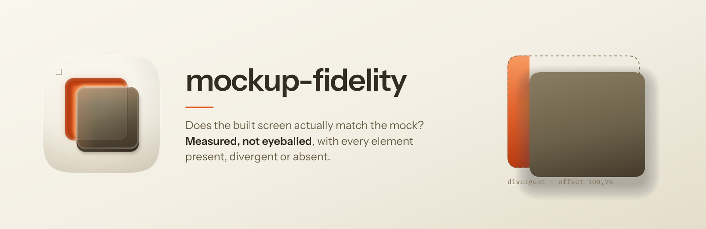

<p align="center">
  
</p>

<h1 align="center"> mockup-fidelity</h1>

<p align="center">
  
  
  
  
</p>

Checks whether a built interface actually matches the design it was built from, fixes what doesn't, and is
honest about what it could not check.

It works by measuring. Not by looking at two screenshots side by side, and not by reading the component
source; both of those feel like verification and neither is. It renders both the mock and the app, pulls
the resolved style of every element out of each, and compares them with a script. What you read is the
report; you never re-derive the comparison by eye, because attention is not a `for` loop.

## The thing it does that the previous version did not

A measuring tool has two ways to be wrong. It can report a difference that isn't there, which you notice.
Or it can report agreement it never measured, which you don't.

Both sides of this comparison render in the same browser engine. So when the engine cannot compute a
property, it returns the same empty value for the mock and for the app, the comparison finds them equal,
and the report says nothing. That is not a missed defect you could spot in the output. It is a **pass you
cannot spot**, and it is indistinguishable from good news.

On the sanctioned engine, measured on 18 August 2026, that happened to **nine** classes of check,
including box-shadow and placeholder colour, the two properties this skill's own documentation named as
the ones most often silently wrong. A shadow present in the design and absent in the build read as a
match.

So every run now starts with a preflight. It sets each declaration through a real stylesheet rule on a
live element, reads the value back, and does it twice with two different values, because a reader that
returns the same thing for every input would sail through a single check. Anything that fails is switched
off and reported as **inconclusive**, carrying the engine's own explanation of what it returned. Not a
pass. Not a failure. An unasked question, named as one.

The exit code carries that third state, so a script can tell the difference:

| | |
|---|---|
| `0` | clean **and** complete |
| `1` | real differences found |
| `2` | usage or fatal error |
| `3` | **inconclusive**: something the verdict depended on could not be measured |

On a test page carrying ten deliberately planted defects, the previous version found five, mislabelled a
sixth, and exited `0`. This one finds seven, declares three inconclusive with reasons, and exits `3`. The
number that moved is not five to seven. It is four silent false passes to zero.

## Install

```text
/plugin marketplace add fledgeling-co/fledgeling-plugins
/plugin install mockup-fidelity@fledgeling-plugins
```

## How to use it

Point it at a design and at the thing built from it, in a sentence:

```
does the settings page actually match the prototype at http://localhost:6007? it's supposed to
use the same design system but looks off, verify and fix
```

```
align our React Native app's Discover, Company and Profile screens to
docs/ui-mockups/redesign.html, it's the source of truth; ask me before removing anything
```

It will settle the scope with you once, up front: is this design the authority for everything or only the
screens you name, and should it change code to match or hand you a list to triage. Then it won't ask
again. That answer is written to a file, so a fresh session picks up where the last one stopped rather than
re-interviewing you.

The comparison itself runs as a bundled harness:

```bash
node assets/diff/capture.mjs --ref <design-url> --target <app-url> \
  --out .mockup-fidelity/<screen> --chrome-selector __none__ --assert
```

One install first, for the pixel layer: `npm install` inside `assets/diff/`. The dependency is a single
image-comparison binary; the analyzer itself has none.

## What it looks for

Breadth before depth, because measuring one element's padding exhaustively feels thorough while telling
you nothing about the card that was never built. So it fills in a present / divergent / **absent** row for
every affordance in the design first (every button, card, section, badge, chip, search field, meaningful
icon and call to action) and only then measures pixels on the things that exist.

It counts a modal as a screen. A drawer, a sheet, a picker, an empty state, a dark variant and a
drill-in are all their own surfaces, and "minor sub-state" is not an accepted reason to skip one. A run
that audited 22 of a 66-frame design as "the primary frames" is why that rule is written down.

It diffs the skeleton before the styling: who contains whom, which way a container lays out, where things
sit relative to their parent. A card that stacks its icon above the label where the design puts it beside
is invisible to any per-element style comparison, and it is one of the most common real defects.

And it flags what it adds. Any interface you bring up to match a design is, by default, visual only; the
wiring behind it probably doesn't exist yet. So it writes a second document listing what each new element
now implies: the endpoints, the queries, the navigation targets, the empty and error states. A
pixel-perfect screen wired to nothing reads as finished and fails the first time somebody taps it.

## When the engine is the limit, not the build

A report with zero findings and nine inconclusive classes was always honest here, and it was also a dead
end: the classes it couldn't measure (shadows, gradients, corner radius through the shorthand, text
transforms, anything animating) stayed unmeasured, and the reader was left holding a screen nobody could
close. That's the browser engine's ceiling rather than a fact about the build, and treating the two as the
same thing is exactly the confusion this skill exists to prevent, arriving one level up.

So there's a second engine now. Where the target is a native Mac app, an Electron app, or a web build
whose divergence sits in a class the browser engine returns nothing for, the measurement goes through
[proctor](../proctor/README.md), which reads the accessibility tree and the compositor's own layer values.
A shadow the browser reports as an empty string is a shadow radius, offset and opacity on a layer, and
those are readable.

Three things that lane can answer and the browser lane can't. Whether a screenshot is even current: a
stale frame is pixel-identical to a correct one, and only one of the two engines attaches a frame status
saying which you're holding. Whether something is mid-animation: the browser reports zero running
animations while one runs, where the layer's model and presentation values differ exactly while it's in
flight. And whether there's a control on screen the app's own accessibility tree doesn't know about,
which is a present-in-the-mock, absent-in-the-build finding that neither a tree dump nor a screenshot
review can reach, because each of those is one observer agreeing with itself.

It comes with its own ceiling, measured rather than assumed. Resolved colours and fonts need the app to
embed a debug reflector; without one the honest answer is the tree plus pixels, every style class stays
inconclusive, and an eyedropped colour is not a declared value. The run establishes which of those two
it's in before it claims anything, and the ledger says which.

The other thing the second engine brings is a fourth answer. Until now a measurement was available or it
wasn't; a value that won't hold still is a third way to be unmeasurable, and a 2026 study of 262 visual
flakiness cases found the split 60/40 between structure and style. So instability gets measured as a
number before anyone argues about whether a difference is a defect, which is also where the geometry
tolerance now comes from, instead of a default nobody calibrated.

## What it refuses to do

It won't certify a match from a commit message, a code comment, or a screenshot you both agreed looked
fine. A verdict needs two measured surfaces on disk.

It won't accept a reason it made up itself. When it finds a real difference and the answer is "that's
deliberate", the evidence has to be a ticket, a spec line, a code comment that predates the audit, or a
product decision someone actually recorded. A justification written during the audit to retire an
awkward row is the single most common way drift ships, and it is named and banned.

It won't quietly downgrade a difference because it needs backend work. Missing wiring is a reason to
document one behaviour, never a reason to leave the element unbuilt.

And it won't guess when honouring the design would delete something that works. It stops and asks.

## Where it came from

This is a rebuild of the `mockup-fidelity` skill from Luke's `diolog-plugins` marketplace, which is where
the method, the field log of real misses, and the detector set all originate. That original is genuinely
good: the catalogue of self-deceptions a reviewer falls into, the standard that a citation must be
external and pre-existing, and the critic that is kept blind to the interface so it cannot be talked into
"it obviously matches" are all its ideas, and they are carried forward here more or less intact.

What this rebuild adds is the preflight, the third exit state, and the discipline of writing capability
facts down once with a date on them instead of six times in six files. That last one is not a tidiness
point: six copies of one capability paragraph is precisely why that paragraph was the only capability
anybody ever re-checked.

## Reading further

- `references/engine-capability-matrix.md`: what the engine can and cannot answer, dated and versioned,
  plus the three traps that make the obvious probe wrong.
- `references/evidence.md`: the research behind each rule, the citation-verification result, and the
  places where this skill deliberately departs from the published advice.
- `references/issue-to-check-map.md`: every real difference a human caught after the tool said
  "matching", mapped to the check that now catches its class. Read it before weakening a check.
- `references/measurement-enforcement.md`: the seeded-defect eval, including the control that stubs a
  working reader to prove the tool notices its own blinding.
- `docs/deep-research/`: the four research reports in full, with their source registries.
