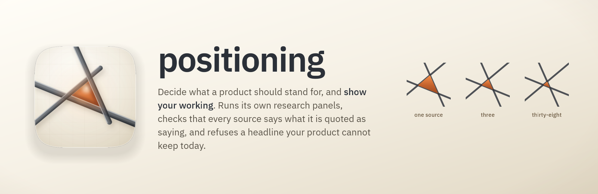

# positioning

**Work out what your product should stand for, and be able to show your working.**

Positioning is the sentence you lead with; the word you want to own; the enemy
you name; the one customer you're for before you're for everyone. Getting it
wrong is expensive and slow to notice, because a bad position doesn't fail
loudly. It just quietly makes every ad, every demo and every sales call about
20% harder, for years.

Most AI positioning help gives you a confident answer with nothing underneath
it. This one runs the research itself, checks the sources, and refuses to put a
promise in your headline that your product can't keep today.

```
/plugin install positioning@fledgeling-plugins
```

Then: `/positioning` with a product to position.

## What's different from the skill it replaces

This is a rebuild of **positioning-pipeline** by DiologIR. That skill's grounding
in four positioning books, and the shape of its territory template, were good
enough to keep; they're carried forward here with credit. What changed is where
the quality controls live.

| | positioning-pipeline | positioning |
|---|---|---|
| **The research** | Writes you two prompts and a page with copy buttons. You paste them into Gemini, wait half an hour each, and come back with the output | Runs the research itself across several AI research providers at once, then merges them |
| **Checking the sources** | Nothing checks them | Every link is resolved; anything going into a headline gets a model to read the page and confirm it actually says that |
| **Counting agreement** | Not counted | Counted in **independent sources**, not in how many AI tools agreed. Four tools quoting one Reddit thread is one source |
| **Claiming things you haven't built** | A written rule saying don't | A table of what actually ships, and a command that **fails** if a headline rests on something that doesn't |
| **How you choose** | A slider scorer that multiplies and sums | Deal-breakers first, then a plain table in real units, then which option wins across *every* reasonable weighting, not just the default one |
| **How many options** | Always exactly three | Generated wide, shortlisted, and your current position is always carried as one of the options to beat |
| **The write-up** | Three markdown files and one HTML page | Nine templated documents plus one designed, interactive decision page |
| **Before you see it** | No check | The page goes through a full design and accessibility review first |

### Why the slider scorer had to go

This is the part worth reading even if you never install this.

The old skill's centrepiece was a lovely interactive thing: seven sliders for
what matters to you, move them around, watch the three options re-rank live. It
feels rigorous. It's the most common way strategy tools are built.

We commissioned two research panels across seven different AI research providers
to check it. All four members of the first panel independently came back with
the same answer, from the academic literature: **that family of tool is
documented as unsafe for exactly this job.** Four separate problems, each
measured:

- **Adding a bad option can change which good option wins.** Proved in 1983, and
  re-derived for slider-style scoring as recently as 2023. It gets *more* likely
  when you have few options with close scores, which is every positioning
  shortlist ever made.
- **Whoever writes the list of criteria picks the winner.** Split one criterion
  into three sub-criteria and its total weight jumps from about 0.25 to between
  0.40 and 0.48. Nobody has to move a slider for this to happen.
- **The sliders start somewhere, and people don't move far from it.** An
  experiment across five different weighting methods found all five pulled
  towards an even split, which flattens exactly the differences you built the
  tool to see.
- **A high score somewhere trivial can outvote a fatal problem.** "Founder
  excitement: 5" should never rescue an option the company physically cannot
  deliver.

So the scorer is gone. In its place: deal-breakers that eliminate rather than
deduct, a table in real units (conversion, dollars, days, months) instead of
scores out of ten, a check for options that are simply beaten on everything, a
direct "what would you trade for what" question, and then, instead of a ranking,
**how often each option wins across every weighting you'd be willing to
defend.** An option that wins only at the default slider positions is an
artifact of the sliders, and the page says so in those words.

It can also answer **"no decision"**, and name the one experiment that would
break the tie. A tool that always produces a winner produces winners from noise.

## How it works

Seven phases. The first two happen before any money is spent, and that ordering
is the whole trick: a research panel asked "what should our positioning be"
gives you a survey, and one asked "here are four candidates, find what separates
them" gives you a decision.

```
0  Product truth      what actually ships, as a table with ids
1  Candidates         generate wide under different personas, shortlist on distinctness
2  Research           decide what to buy, buy it once, verify it
3  Territories        one file each, every claim bound to an id
4  Reports            nine templated markdown documents
5  Decision page      one designed HTML surface, design-reviewed before you see it
6  Decision           the recommendation, what it costs you, and what to test
```

**Phase 0 reads your product, not your pitch.** Running code and passing tests
first, the live site second, the plans third, the founder's ambition fourth.
Every capability lands as `shipped`, `designed` or `aspirational`, with the file
or URL that proves it.

**Phase 1 generates candidates before the research runs**, using `/trawl` with
five positioning-shaped personas: the founder who repeats the pitch forty times
a week, the buyer with no budget line for your category, your strongest
competitor's head of product briefed to take your position first, a mechanism
borrowed from outside software, and one deliberately odd seat.

**Phase 2 decides whether to buy research at all.** Four gates: is it already in
your repo, would the answer change the decision, is the free lane enough, and
only then is a paid panel worth it. If it commissions one, it tells you the
worst-case cost before spending it.

**Phase 5 builds the decision page** through `/design-craft` and `/ux-craft`,
using your project's `DESIGN.md` if you have one and writing you one if you
don't. GSAP where scrolling actually carries the argument. Three.js only where a
strategy canvas genuinely needs a real volume, and it says so when it didn't.
Diagrams are mermaid, never generated images, because an image of a chart is a
chart nobody can fix. Then `/design-review` runs on the rendered page before it
reaches you.

## The two commands that make the honesty real

Everything above is prose, and prose is what the old skill already had. These
are the difference:

```bash
python3 scripts/claim_ledger.py check docs/positioning/work --require-move hero ...
python3 scripts/positioning_lint.py docs/positioning --html .../positioning-report.html
```

`claim_ledger.py check` **fails** when a headline rests on capability that isn't
shipped, when a claim's sources were never verified, or when you've called
something high-confidence on fewer independent sources than that deserves.

`positioning_lint.py` **fails** on all-in-one framing anywhere in the
deliverables, on a number with no source, on two "different" territories that
share the same word or enemy or category or beachhead, on an owned word that's
an abstraction nobody could contest, on a Blue Ocean "Eliminate" row that
eliminates nothing, and on a page whose motion has no reduced-motion fallback.

Both gates were checked in both directions before shipping: **41 failures on a
deliberately broken example, zero on a clean one.** A gate you've only ever seen
pass is a gate you haven't tested.

## What it won't do

Worth knowing before you install it.

- **It will not tell you a position is right.** The four books make a position
  *coherent*. None of them predicts which one works, and the research is blunt
  about that: no named positioning framework has shown a repeatable, causal
  ability to pick winners. A desk-research run of this skill produces
  "**promising hypothesis**" at best, and it labels itself that way rather than
  saying "recommended".
- **It won't hide a disagreement.** Where two research providers contradicted
  each other, both positions stay in the evidence file. There's one in this very
  build: on how badly surveys overstate what people will pay, one meta-analysis
  says 21% and another says nearer three times. The direction is certain and the
  size isn't, so any pricing number carries that caveat.
- **Paid research costs money.** Roughly $4 to $9 per provider per panel. It
  always tells you first, and the free lane is genuinely useful on its own.
- **It can't fix bad inputs.** Better decision structure makes your dependence on
  guesses *visible*; it doesn't remove them.

Note: the old Gemini workflow is still in here as a lane, not the default. If
you'd rather run Deep Research yourself and prune the plan as it goes, the
prompts and the launcher page are still generated. The README for that lane
lists exactly what you give up by taking it.

## Does it actually work

See **[EVALS.md](EVALS.md)** for the report card: what was tested, what the old
skill scored on the same prompts, what's still untested, and the eval this one
didn't win.

## Credit

`positioning-pipeline` by **DiologIR** is the predecessor. Its distillation of
Ries & Trout, April Dunford, Blue Ocean and David C. Baker, its territory
template, and its product-research persona are carried forward here largely
intact. The research behind this rebuild is committed in
[`docs/deep-research/`](docs/deep-research/), so every claim above stays
checkable.
