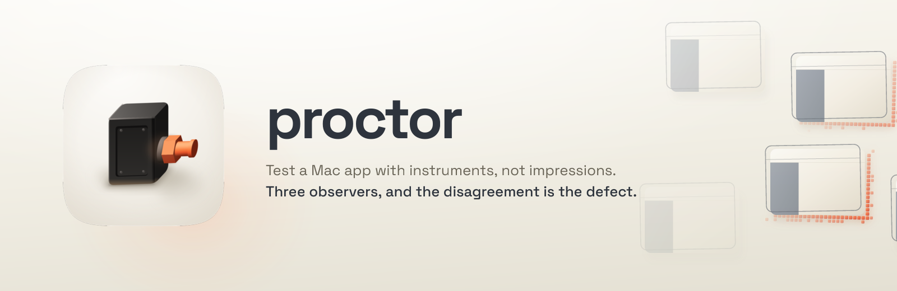

<p align="center">
  
</p>

<h1 align="center"> proctor</h1>

<p align="center"><strong>Instruments rather than impressions.</strong><br />
A SWE skill for Claude Code that runs a real test campaign against a native macOS app, and the MCP server that gives it the instruments.</p>

<p align="center">
  
  
  
  
</p>

---

## What it's for

A screenshot you looked at is an impression. A screenshot carrying a frame status, a dirty-rect summary and a `trustworthy` verdict is an instrument reading. Only one of the two can be wrong in a way you'd notice.

That's the whole argument. Point a model at a Mac app today and it takes a picture, looks at it, and tells you what it saw; when the picture is stale it tells you that with exactly the same confidence, because a stale frame is byte-for-byte indistinguishable from a correct one. Same for a control that isn't in the accessibility tree, a step that "worked" after a settle that actually timed out, and a flow that failed on a race it only sometimes hits.

Proctor runs the campaign against readings instead. Seven stages: an exploratory sweep to build the control inventory, acceptance criteria turned into recorded flows, a state matrix crossed with dark mode and larger text, an accessibility audit, visual and fidelity capture, a determinism measurement, then a report that separates what was proven from what was assumed and names the matrix cells nobody ran.

## Install

```text
/plugin marketplace add fledgeling-co/fledgeling-plugins
/plugin install proctor@fledgeling-plugins
```

The skill drives the **Proctor MCP server**, which is a separate install: an unsandboxed launchd agent plus a permissionless stdio shim. That shape isn't optional, and the server's own README in the `proctor-mcp` repository explains why (macOS attributes a TCC grant to the responsible process, so a helper spawned by your editor grants accessibility to your editor).

Two grants, and they go to Proctor itself; not to your terminal, and not to your MCP host. **Accessibility**, and **Screen Recording** for capture and for the pixel signal in settling. Screen Recording can never be granted silently on any macOS version; a person has to click the switch, and any tool claiming otherwise is describing a version of macOS that doesn't exist.

## Using it

Ask in whatever words you'd normally use; it triggers on the ask.

```text
Test the login flow in Ledger.app.
Is this Mac app ready to ship?
Why is this UI test flaky?
What breaks in dark mode at a larger text size?
```

The first thing it does is call `proctor_doctor`, because a missing Accessibility grant returns an empty tree rather than an error, which reads exactly like a selector bug and which a model will paper over by retrying forever.

## The tools

Nineteen ship; the installer's `claude mcp add` line advertises `--profile core`, the ten that actually drive a Mac, at roughly 6.8k tokens against 11.3k for all of them. The catalogue is re-sent every turn and survives compaction, so that is a standing cost paid before any work happens. Widen with `--profile scripting` or `--profile full` for flows, determinism runs, policy, `kill` and the CUA adapters.

| Tool | What it does |
|---|---|
| `proctor_apps` | Enumerate apps and windows, and attach. Attaching warms the tree, starts observers, and retains element references that keep resolving across Spaces. |
| `proctor_snapshot` | The pruned semantic accessibility tree with a stable id per node. Pass `sinceRevision` for a diff instead of a full tree. |
| `proctor_find` | Only the nodes matching a predicate, so locating one button doesn't cost a whole tree. |
| `proctor_act` | Run a step sequence, settling after each, returning per-step outcome, actuation plane, post-state hash and tree diff. A six-step login is one call. |
| `proctor_capture` | Window-scoped ScreenCaptureKit screenshot with frame status, dirty-rect coverage, frames waited, and a verdict on whether the frame can be believed. Normalises to the vision ceiling by default and reports the exact scale factor, so a coordinate maps back rather than being quietly offset. Can burn numbered marks over interactable elements and hand back the mark→node map. |
| `proctor_zoom` | A native-resolution crop of a region or a resolved element, for reading the small text a normalised capture loses. Iterative crop-and-zoom lifts GUI grounding accuracy on high-resolution desktop software from roughly 19% to 48-73%. |
| `proctor_menu` | The whole menu bar in one accessibility read, reaching a background or other-Space app: every item's path, enabled state, and its keyboard shortcut reconstructed from the accessibility attributes. |
| `proctor_wait` | Block until a nameable condition holds: an element appearing, a value reaching a target, a region going quiet. Bounded by a timeout. |
| `proctor_assert` | Assertions over tree, geometry, pixels and accessibility auditing, returning the observed value beside the expected one. |
| `proctor_flow` | Record, list, show, replay and delete named step sequences, with per-step hashes so a divergent replay says where. |
| `proctor_stability` | Replay a flow N times and report `firstDivergence` plus per-step instability. |
| `proctor_inspect` | Resolved styles and layer geometry from an app embedding `ProctorReflector`: colours, fonts, radii, constraints, CALayer model versus presentation. |
| `proctor_doctor` | Agent liveness, TCC grants with the exact fix for the running OS, attachments, observer health, Secure Event Input. |
| `proctor_policy` · `proctor_kill` | The policy gate and process control, in the `scripting` and `full` profiles. |
| `proctor_dictionary` · `proctor_unlock` | Scripting-dictionary introspection and the unlock path. |
| `proctor_computer` · `proctor_openai_computer` | CUA schema façades, so a model trained on Anthropic's or OpenAI's computer-use schema drives Proctor without translation. |

## Five things it does differently

**It reaches background windows without stealing focus.** Actions travel through the process-directed plane by default (`AXUIElementPerformAction`, attribute writes, Apple Events), which addresses a specific element in a specific process. Non-frontmost, occluded and other-Space windows are all reachable, and Secure Event Input doesn't block any of it. A campaign can run while you're using the machine, and proving a flow works in the background is worth more than proving it works with the window raised.

**Three observers, and the disagreement is the finding.** The accessibility tree, the layer geometry and the captured pixels each describe the same instant. Where they disagree, the delta has a name: an unexposed control, a ghost node, an invisible-but-focusable element, a stale frame, a wrong hit target. Neither a screenshot review nor a tree dump finds those alone, because each of them looks *at* one source; this check looks *between* two.

**Settling is a conjunction, never a sleep.** Quiet frames, quiet accessibility notifications, and the app's own idle signal where one exists, with a timeout as the backstop. Each settle reports which signals it actually had, and they don't weigh the same: `reflectorIdle` is the app saying it's done, `allSignalsQuiet` is strong inference, one signal is adequate, and `timeout` means nothing went quiet at all. A failure that lands after a timeout settle gets filed as unproven.

**Determinism is measured.** `proctor_stability` replays a flow five times by default and returns `firstDivergence` with a per-step instability score. A step above zero is nondeterministic before anyone argues about whether it's correct, and flaky stays in its own section of the report, because conflating it with broken sends somebody hunting a bug that's a race.

**It draws the cause of what it's doing.** The property that makes Proctor useful also makes it illegible: an accessibility press actuates a button with nothing moving on screen, so somebody watching sees menus open and text appear for no reason. A pointer travels to each step's target before the step fires, leans into the direction it's travelling, and pulses where it acts. It belongs to the agent's own process and every capture is window-scoped to the app under test, so it can't move a state hash or change a pixel assertion; `PROCTOR_CURSOR=0` turns it off for an unattended run.

## ProctorReflector

`ProctorReflector` is a Swift package you embed in an app you own, behind `#if DEBUG`. Once it's in, `proctor_inspect` reads resolved colours, fonts, corner radii, opacity, constraints and both CALayer model and presentation values, so fidelity checking becomes measurement rather than eyeballing: you assert that a colour is the token you intended, not that a screenshot looks about right. It also gives settling its one honest signal, since the app reports its own idle state; quiet no longer has to be inferred from outside.

## What it will not tell you

This is the part I'd read first.

**Synthetic-event actions are a different mode, and are reported as one.** `click`, `hover`, `dragPath` and `key` post into the single WindowServer stream, so they need the app in the foreground, they interfere with whoever's at the keyboard, and Secure Event Input blocks them outright. They come back tagged `plane: "syntheticEvent"` so the narrower guarantee is visible: that result proves the app works when it's in front.

**For an app you don't own there's no computed-style source.** macOS has no cross-process equivalent of `getComputedStyle`, and that ceiling is permanent; it isn't a gap waiting on a release. `proctor_inspect` returns `reflectorUnavailable` instead of approximating, because a plausible guess about a corner radius is worse than an absence.

**Observing an Electron app changes it.** Chromium-based apps expose no tree until `AXManualAccessibility` is set, so attaching sets it. The flag is detectable by the target app and it changes that app's performance, which means you're observing it in a mode real users never see. That's a genuine validity threat, not a footnote, and the skill requires it be disclosed in the report's methods note.

**Parallelism is bounded by hardware.** Apple silicon hard-caps concurrent macOS guests at two, so a VM fleet isn't the answer. Scaling happens across windows inside one session, and past that, more real parallelism means buying another machine.

**Nothing arbitrates between two clients yet.** The agent is one process behind one socket and any number of MCP clients can connect to it. Reads are safe, because they observe without mutating. Actuation isn't: two campaigns running at once interleave their steps, and the second one's synthetic click lands in whatever window the first just raised. A scheduler is designed and not yet built, so for now treat "is anything else driving this Mac" as a precondition rather than an invariant.

Note: the development build is ad-hoc signed, which ties the TCC grants to the exact bytes of that build. Every rebuild revokes them, and the symptom is "elements not found", which doesn't look like a permission error at all.

## Where 0.1.0 actually is

Worth being straight about, since the version number is doing real work here.

What's there, and verified running: all four Swift targets build, 23 unit tests pass, and the full stack has been driven end to end against TextEdit and Finder on macOS 26.6 — attach, a snapshot of a window that was neither frontmost nor in front of its siblings, a ScreenCaptureKit capture of an occluded window with no overlap from the two windows stacked on it, and accessibility-plane actuation that never took the foreground. The reflector was verified separately against a live `NSWindow`, returning resolved colours with their semantic names intact and a layer whose model value read 14 while its presentation value read 18.55 mid-animation.

Running it found four defects that reading it did not. A step whose accessibility route the element refused fell back to a synthetic event and activated the app, reporting success — it now fails and names both ways forward. Settle timed out on every step, because ScreenCaptureKit stops delivering frames for a static window and the poll kept re-reading the last frame's dirty area; a poll with no new frame is now the quiet signal, and an app with a blinking caret concludes on the signals it has rather than waiting for one that will never arrive. A tree walk read one attribute per round trip, and the documented default of 2000 nodes never returned on a large Finder window; attributes are batched now and every walk has a wall-clock deadline, so it always returns and always says what it truncated.

What isn't: the agent runs from a development build rather than an installed, Developer ID-signed bundle, so `scripts/install.sh` and the launchd path are written but not exercised end to end. `dragPath` is unimplemented. `wait`'s `region` argument is accepted and reported as unhonoured, because the quiet watch reports whole-frame dirty area only. Nothing has been tested against an Electron app, so the manual-accessibility warm-up is built to the research and not to an observation.

The ten behavioural evals have been run against a no-skill baseline; the results and the honest caveats are in [EVALS.md](EVALS.md).

## What it hands off

| To | For |
|---|---|
| [`design-review`](../design-review/README.md) | Judging whether a rendered UI is any good. Proctor supplies the captures and the accessibility data; the judgement belongs there. |
| `acceptance-e2e` | Web features and Playwright suites. Proctor is the native counterpart, not a replacement. |
| `mac-design-studio` | The native-conformance rubric when there's no mockup — the macOS 27 control ladder, type ramp and native-tells audit are the oracle for "is this a correct, native Mac UI". Proctor measures; that skill says what native is. |
| `mockup-fidelity` | React and React Native measured against a mockup. Its present/divergent/absent ledger is the right method for native fidelity too, so this skill reuses it. |
| `macosify` | Fixing native-idiom problems. Proctor finds them; that skill refits them. |

A web view inside a Mac app is still Proctor's, because reaching it means attaching to the host process. A pure web app in a browser isn't.

## Licence

MIT
