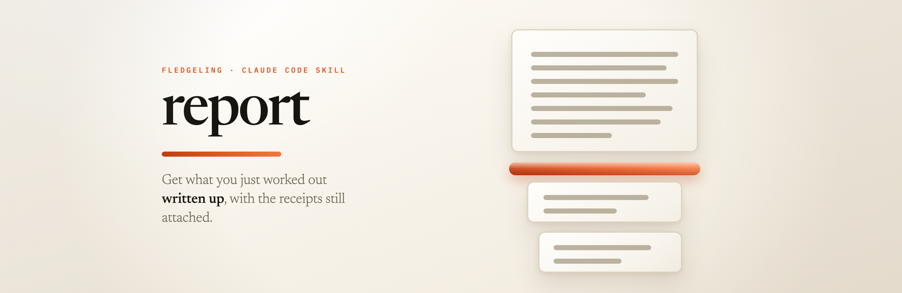

<p align="center">
  
</p>

<p align="center">
  <strong>Get what you just worked out written up, with the receipts still attached.</strong>
</p>

---

You spend two hours in a session getting to the bottom of something. You
ask for a write-up. What comes back reads well.

Then a week later someone asks where one of the numbers came from, and
you can't answer. Not because the work was sloppy; because three
completely different things came out of that session looking identical on
the page:

- **the queue drops 12% of events**, measured, from a command whose output
  is still sitting in the transcript
- **the queue drops 12% of events**, read off a single log sample and
  generalised
- **the queue drops 12% of events**, worked out from two other facts that
  were each established separately

Prose gives you no way to tell them apart. Neither does the person you
sent it to, and they've got less reason to trust it than you have.

## What it does

You type `/report`. Before it designs a single thing, it walks back
through what the session actually did (the files it opened, the commands
it ran, the tests, any research already sitting in the repo) and turns
that into a **claim ledger**: one row per claim, each carrying a locator
and a note on what it can't tell you.

The page is then generated from that ledger rather than written first and
cited afterwards. Which means the two can't quietly drift apart, and it
means anything the session reasoned its way to renders on the page
visibly marked as reasoning, not as a finding.

You get a folder in your own project:

```
docs/reports/<slug>/
  index.html     the full report, one self-contained file
  report.pdf     the same document, paginated to A4
  tldr.html      the one-pager
  tldr.pdf
  DESIGN.md      your project's, or one derived from the topic
  claims.json    the ledger everything was built from
```

`/report tldr` gives you just the one-pager: brand band, the finding in a
sentence, one chart that carries the argument, a handful of cited claims,
sources at the foot. Cover and back matter merged in, because a cover page
on a one-page document spends half the document on a title.

Note: the short version is *derived* from the same ledger as the long one,
never summarised from it. Two documents disagreeing about the finding is
the thing that arrangement exists to prevent.

## The bits that took the most work

**It reads on screen and prints properly.** Same source, two renderings.
On screen it's a continuous document with motion; the print stylesheet
paginates it onto A4 and strips the motion out, because a micro-interaction
frozen mid-tween is not something you want in ink. Anything that animates
ships an authored still frame for the printer to use instead.

**Citations still work with JavaScript off.** The markers are ordinary
anchors pointing at a real list at the bottom of the page. The hover
preview is a nicety layered on top. Build them as buttons, as is tempting,
and the claim-to-source link breaks in exactly the situation the file was
supposed to survive.

**Every report looks different.** Not a taste thing. Layout similarity
across the web fell 44% over a decade and the strongest cause was
everyone reaching for the same few libraries; the giveaway is the skeleton
and the motion, not the colours. So the plumbing gets reused and the
layout gets thrown away each time, checked against the other reports in
the same folder.

**It uses your project's design system** when there's a `DESIGN.md` sitting
there, so the report looks like it belongs to the thing it's about. When
there isn't one, it derives one from the subject and leaves it in the
folder for next time. Either way it looks at real shipped pages first,
through the Mobbin MCP, and writes down what it took and what it left
alone. Settling a layout from memory is how you get the shape every model
ships for the category.

**The TLDR is a named section, not a hope.** First block on the page, in
every register: what was found, said once, plus the ask, the three to five
claims holding it up, and the one thing that would change it. Most people
stop around the middle of a document, so a conclusion sitting at block nine
was written for readers who never get there. It's built from the same rows
the one-pager uses, so the two can't start disagreeing with each other.

## If the session was choosing between things

Six queue libraries in, and a write-up with six sections describing each
one hasn't answered the question. So comparison work gets a verdict layer.

You get the categories readers actually split on (already on Postgres, no
new infrastructure; highest throughput and willing to operate it; cheapest
that isn't a false economy), three ranked picks in each, and one overall
winner with the reasoning written out. Each pick carries its cost, what
it's best at, what would change it, and the genuine thing the runner-up
does better. The winner names what it loses on.

The winner is also the report's ask, so it arrives sized and owned: "one
afternoon to port the two producers, needs your yes on adding Redis to the
deploy". A reader who agrees with you and doesn't know what to do next has
been handed a diagnosis.

Two things keep it honest. **A ranking is reasoning, not a measurement**,
so it renders as reasoning: it names the ledger rows it rests on, and a
pick dressed up as a finding is an error. And **independent testing behind
a paywall still counts**. Which?, RTINGS, Choice and Consumer Reports run
the tests nobody else runs; locking the raw numbers away doesn't make their
verdict weak evidence. Cite the published ranking as a ranking, name the
protocol, say in a clause that the measurements aren't public, stamp the
test year, and don't redraw their tables. The alternative is arguing from
vendor benchmarks, which is worse evidence and not more rigorous.

## Charts, pictures and motion

**Charts go through `dataviz`**, and there are three ways to build one:
plain CSS and DOM for a handful of rows, hand-authored SVG where the
drawing is the argument, or TanStack Charts compiled to static SVG at build
time. That last one is worth a note, because TanStack Charts is pre-alpha
and never ships to the reader. It runs in Node, emits an SVG string, and
that string goes in the page. You get a real chart grammar, nothing
loading at runtime, and ink in the PDF; if the API moves next month the
documents you've already sent keep rendering, because what shipped was
markup.

**Pictures come from the evidence trail.** A screenshot the session took is
the strongest option, since it's the same class of thing as a command's
output. After that: the vendor's own press asset, a source's licensed
figure, a generated illustration, an honest placeholder. Every image
carries a caption saying what it is and where it came from, plus a row in
the same registry the text cites. And the working path never makes it into
a caption; a source line reading `./fixture/dashboard.png` tells the reader
you analysed a fixture, which is a good way to lose the strongest claim on
the page.

**GSAP is compulsory on screen.** Not for atmosphere; motion inside a
figure still has to earn its place by showing a change you couldn't
otherwise track. But a reading toggle that acknowledges a press with
nothing reads as broken however good the argument is, so interface feedback
gets its own budget and that one is mandatory. What makes it safe on a
document that prints is the still frame every moving block already ships:
one artifact covering print, reduced motion, and any browser that doesn't
run the animation. So none of it costs the PDF anything.

## How it differs from dossier-report

They look like siblings and they solve opposite problems.

`dossier-report` buys a research panel, reads every word of it, and
publishes one page to its own subdomain. It's for when the substance
doesn't exist yet and you're willing to spend on it.

This one spends nothing, researches nothing, and never publishes. Its
evidence is the session you've just had, and the output lands in your repo
next to the code it's about.

## What it won't do

- **Invent evidence.** "We didn't measure this" is a publishable sentence.
  A plausible-looking number isn't.
- **Publish or deploy anything.** Writing the files ends the run; putting
  it in front of anyone is your call, deliberately.
- **Let motion into the print.**
- **Touch your scrolling.** No hijacking the wheel, no momentum overrides.

## Running the checks yourself

```bash
node scripts/export_pdf.mjs docs/reports/<slug>/index.html --out .../report.pdf
python3 scripts/audit_report.py docs/reports/<slug>/
```

The exporter checks the PDF it just made rather than trusting that it
worked: real A4 geometry, a sensible page count, links that survived, and
no half-finished animation text baked into the ink. The auditor checks the
page against its own ledger in both directions, so a claim that never made
it onto the page and a citation with nothing behind it both come back as
errors.

Both are built to fail loudly. A gate that can't fail looks exactly like
one that passes.
