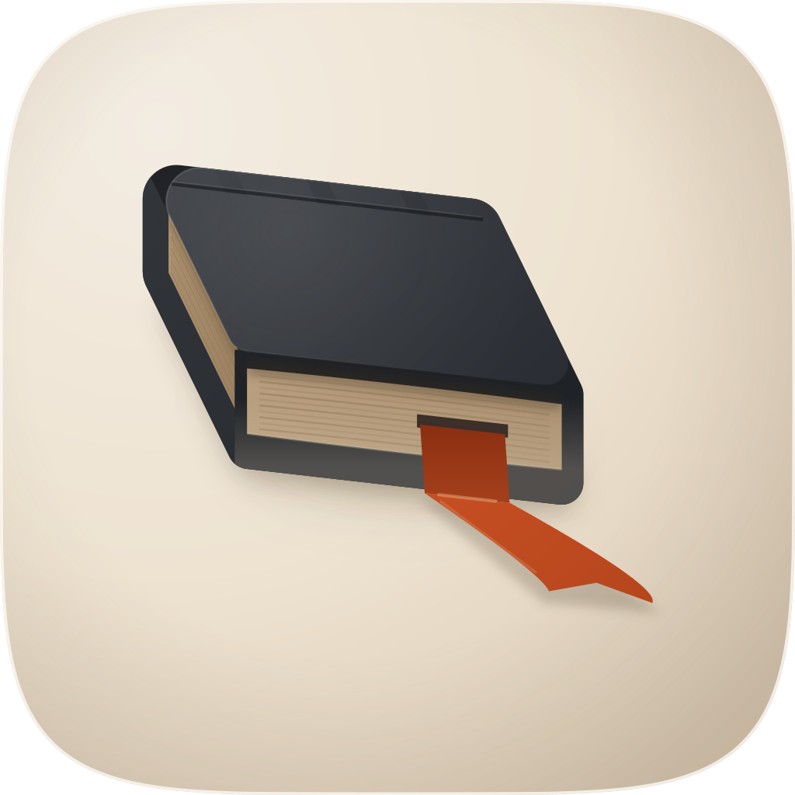
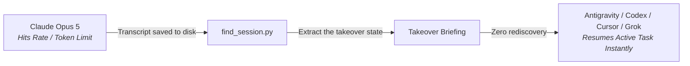

<p align="center">
  
</p>

<h1 align="center"> resume-session</h1>
<p align="center">
  
  
  
  
</p>

**The multi-model handover skill for agentic coding.**

When an AI model hits its usage limit (a 503 reserve cap, a 429 rate limit, token window exhaustion, or your weekly quota on Claude Opus 5), you should not have to wait hours or start from scratch. You switch to another model or CLI, such as Antigravity (AGY), Codex, Cursor, Grok, or Claude Sonnet, and keep building.

The problem is that the new model starts completely blind. It spends thousands of tokens re-reading files you already modified, re-asking questions you answered an hour ago, guessing at database configs, and re-writing plans from zero.

`resume-session` moves that rediscovery off the model and onto your own machine. It scans for sessions across the CLIs listed below, parses their transcripts on disk, extracts six things the incoming agent would otherwise have to work out for itself, and hands it a written briefing to start from.

---

## The cross-model takeover workflow



---

## What it recovers

Every resumed session is distilled into six concrete things:

1. **Session identity and provenance**: UUID, source CLI, model that hit limits, git branch, and exact active timestamps.
2. **Initial goal and intent**: The verbatim initial user prompt, target scope, and linked plan/goal docs.
3. **Terminal state and errors**: The exact reason the run stopped (429 rate limit, 503 reserve cap, compaction boundary, interrupted turn) plus the last assistant thought.
4. **Modified files and artifacts**: The full ledger of created, edited, and deleted files, avoiding duplicate work.
5. **Technical config and keys**: Apple Team IDs, Bundle IDs, OAuth client IDs, port numbers, and database connection settings found during the run.
6. **Immediate next steps**: A concrete, numbered checklist for the incoming agent to verify workspace status and continue active work immediately.

---

## Universal multi-CLI discovery

`resume-session` includes a standalone, pure Python 3 discovery engine (`find_session.py`) that indexes sessions across your entire environment:

| CLI platform | Transcripts discovered | Supported formats |
| :--- | :--- | :--- |
| **Claude Code** | `~/.claude/projects/<slug>/*.jsonl`<br>`~/.claude/sessions/`<br>`<repo>/.claude/` | JSONL turns, tool invocations, `aiTitle`, `cwd`, branch |
| **Antigravity (AGY)** | `~/.gemini/antigravity-cli/brain/<uuid>/` | Multi-agent step transcripts, tool calls, checkpoints, plans |
| **Cursor IDE** | `~/.cursor/chats/<hash>/<uuid>/`<br>`~/Library/Application Support/Cursor/...` | SQLite message blob stores, `meta.json`, workspace state |
| **Codex / OpenAI** | `~/.codex/sessions/YYYY/MM/DD/*.jsonl`<br>`~/.codex/session_index.jsonl` | Structured turn context, model specs, response items |
| **Grok / X.AI** | `~/.grok/sessions/<encoded_path>/<uuid>/`<br>`~/.xai/sessions/` | Chat history JSONL, `summary.json`, event streams |
| **Repo Workspaces** | `docs/goals/`, `docs/plans/`, `ORCHESTRATOR.md`, `handover_report.md` | Repository ledgers, markdown plans, feature specs |

---

## Install

```text
/plugin marketplace add fledgeling-co/fledgeling-plugins
/plugin install resume-session@fledgeling-plugins
```

---

## Does it actually work

Six structural evals across the five CLI platforms, run against a no-skill
baseline and against the predecessor skill, are written up in
[EVALS.md](EVALS.md). Read the caveat at the top of that file before quoting
any of its numbers: the timing and cost figures come from informal observation
during development rather than from a harness, and that file names the runs
that would settle them.

---

## Quick start

### 1. Find recent sessions across all CLIs

```bash
# Show the 5 most recent sessions across any CLI on your Mac
python3 plugins/resume-session/skills/resume-session/scripts/find_session.py --recent 5
```

Output:
```text
[1] [AGY] Continue Google Drive Session
    Session ID:  daaf6175-c6e2-4212-90dc-73e5a8b1997a
    Working Dir: /Users/lukerhodes/Dev/fledgeling-plugins (main)
    Last Active: 2026-08-15 16:45:42 | 1 turns | 153.4 KB | Antigravity / AGY
    Prompt:      "You are tasked with upgrading and rebranding resume-claude-session..."

[2] [CLAUDE] Task Validation
    Session ID:  a56bf3dd-acfb-4292-a152-9e7897a6ce42
    Working Dir: /Users/lukerhodes/Dev/dAIolog (staging)
    Last Active: 2026-08-06 03:43:22 | 11 turns | 147.5 MB | claude-opus-5
    Prompt:      "Determine whether the work from the Spreadsheet improvements..."
```

### 2. Search by project name or keyword

```bash
# Find sessions matching a keyword or project
python3 plugins/resume-session/skills/resume-session/scripts/find_session.py --name "earbuds"

# Filter by a specific agent platform
python3 plugins/resume-session/skills/resume-session/scripts/find_session.py --cli grok --recent 5
python3 plugins/resume-session/skills/resume-session/scripts/find_session.py --cli codex --recent 5
python3 plugins/resume-session/skills/resume-session/scripts/find_session.py --cli claude --path ~/Dev/my-app
```

### 3. Generate a complete takeover briefing

```bash
# Print the detailed handover report to the terminal
python3 plugins/resume-session/skills/resume-session/scripts/find_session.py --id daaf6175 --details

# Export to a markdown file for the next agent
python3 plugins/resume-session/skills/resume-session/scripts/find_session.py --id daaf6175 --export handover.md

# Output structured JSON for automation pipelines
python3 plugins/resume-session/skills/resume-session/scripts/find_session.py --id daaf6175 --json
```

---

## Anatomy of a takeover handover

Here is what the generated briefing looks like:

```markdown
# Takeover Briefing: Continue Google Drive Integration

**CLI Platform:** `Claude Code`
**Source Session ID:** `2db1e25f-5990-496b-9ade-4b8fd52ddd50`  
**Working Directory:** `/Users/lukerhodes/Dev/scrim`  
**Git Branch:** `feature/gdrive-sync`  
**Models Used:** `claude-opus-5`  
**Last Recorded Active:** `2026-08-15 15:46:11`  

---

## 1. Initial Goal & User Intent
> Connect Scrim to Google Drive via service account tokens and sync project exports.

## 2. Key Documentation & Artifact References
- **Plan Doc:** `docs/plans/plan-GDRIVE-01.md`
- **Spec Doc:** `docs/specs/spec-GDRIVE-01.md`

## 3. Work Completed & Modified Files
The session modified 4 files:
- `apps/web/lib/gdrive/client.ts`
- `apps/api/src/sync/drive.service.ts`
- `packages/config/env.ts`
- `apps/web/app/api/drive/callback/route.ts`

## 4. Technical Environment & Decisions
- **Config `OAUTH_CLIENT_ID`:** `9281749102-abc.apps.googleusercontent.com`
- **Config `PORT`:** `3000`
- DECISION: Use streaming chunk uploads to prevent memory spikes on large exports.

## 5. Terminal State & Last Context
> [!WARNING]
> **Session Halted on Error:**
> `API Error 429: Usage limit reached for current billing window.`

**Last Assistant Output:**
> "OAuth token exchange endpoint implemented and tested. Next task is the batch metadata poll."

## 6. Immediate Next Steps for Takeover Agent
1. **Verify Workspace State:** Run `git status` in `/Users/lukerhodes/Dev/scrim` to confirm uncommitted changes.
2. **Inspect Plan:** Read `docs/plans/plan-GDRIVE-01.md` to verify task 3 status.
3. **Resume Execution:** Implement batch metadata poll in `apps/api/src/sync/drive.service.ts`.
```

---

## Command-line reference

```text
usage: find_session.py [-h] [--name NAME] [--id ID] [--cli {all,claude,agy,cursor,codex,grok,repo}]
                       [--path PATH] [--recent [RECENT]] [--details] [--json] [--export EXPORT]
                       [--limit LIMIT] [--deep]

Universal Multi-CLI session discovery, parsing, and takeover engine.

options:
  -h, --help            show this help message and exit
  --name, -n NAME       Search by session title, custom name, or topic keyword
  --id, -i ID           Search by session UUID or UUID prefix
  --cli, -c {all,claude,agy,cursor,codex,grok,repo}
                        Filter by CLI engine (default: all)
  --path, -p, --cwd PATH
                        Filter by project directory or folder name
  --recent, -r [RECENT] Show N most recent sessions (default 10)
  --details, -d         Print detailed 6D takeover briefing for matched session
  --json, -j            Output results as structured JSON
  --export, -e EXPORT   Export takeover briefing Markdown report to target file path
  --limit, -l LIMIT     Maximum results to return (default 10)
  --deep                Deep scan: fully parse transcripts rather than fast header scan
```

---

## Licence

MIT. Built by [Fledgeling](https://www.fledgeling.app) for developers building with agentic coding tools.
