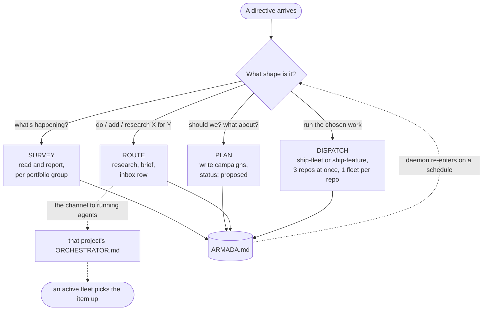

<p align="center">
  
</p>

<h1 align="center"> ship-armada</h1>

<p align="center"><strong>Every project in <code>~/Dev</code> as one portfolio. Three underway at a time.</strong><br />
A portfolio-orchestration SWE skill for Claude Code, sitting one layer above <code>ship-fleet</code>.</p>

<p align="center">
  
  
  
  
  
</p>

---

## Why this exists

`ship-fleet` conducts one repo's backlog. `ship-feature` takes one feature from idea to merged. Neither of them knows the other repos exist, and that's fine right up until the work stops being about one repo.

A model migration touches a dozen projects at once. A directive like *"research X and get that project to adopt it"* has to land in the right pipeline, not whichever one you happen to have open. And the state that answers "what's actually running right now" has to survive the session ending, because the session always ends.

ship-armada holds that layer. Its memory is a single file, **`~/Dev/ARMADA.md`**, and the rule it lives by is that a fresh session should be able to resume the whole armada from that file plus `~/Dev/CLAUDE.md`, with nothing else carried across.

```text
ship-armada   (the portfolio: ~/Dev)
  → ship-fleet     (one repo's whole backlog)
    → ship-feature (one feature: intake → triage → plan ∥ design → work → gap-fix → e2e → verify → merge)
      → the shipyard stage skills
  → armada-sync    (one manifest entry; also runs on its own, from any repo)
```

## How a directive gets handled

Every session starts the same way: read `~/Dev/CLAUDE.md`, then the `ARMADA.md` index, then run a **freshness check**, comparing each row's `updated` stamp against `git log -1 --format=%cs` for that repo. Anything with commits newer than its stamp is stale. Stale entries you're about to rely on get refreshed; the ones you won't touch stay stale and get named in the report instead.

Then it picks a mode from the shape of what you asked, and says which one it's in.



**Survey** answers "what needs attention", per portfolio group: what's in flight, what's stale or parked, what references are broken, what's top of the opportunities register. It reports and it doesn't dispatch.

**Plan** turns opportunities into **campaigns**. A campaign is a named batch of related work across one or more repos, and each one is written down with a goal, the affected projects, a per-project change sketch, the dependency order, and an estimated blast radius. Planning ends with you choosing what runs. It won't propose a campaign and start it in the same breath unless you asked for that.

**Route** lands one directive in the right project's pipeline rather than building it there and then. It resolves the target from the index, runs deep research when the directive asks for it or when triage would otherwise be guessing, writes the brief into that repo's untriaged-briefs directory, and appends an inbox row to the project's `ORCHESTRATOR.md`.

That last step is the load-bearing one. `ORCHESTRATOR.md` is the channel to agents that are already running: an active fleet re-reads it between events and picks the item up, and there's no other reliable way to reach a runner mid-flight.

**Dispatch** executes, choosing the smallest vehicle that covers the job. One feature goes to `ship-feature`; a repo with several items goes to `ship-fleet`; a mechanical change like a model-ID swap goes to a worktree edit behind a `code-review` gate, with no spec pipeline at all.

Three things changed in 2.0, each closing a gap the rebuild's audit named. Ticking a project off now runs `scripts/check_completion.sh`, which cross-checks the ledger against git reality (open rows, unmerged branches, leftover worktrees) instead of trusting prose; the completion rule was the armada's most safety-critical check and it was previously enforced by memory. The repo-ownership allow-list moved out of the skill text into your portfolio's own `CLAUDE.md`, so it's configuration rather than someone else's hardcoded org names. And open technical calls inside a campaign now go to a second model family before they reach you; what lands on your desk is taste, cost, scope and risk.

**Daemon** is the same survey-and-plan loop on a schedule, set up with `/loop` or a scheduled routine. Each tick does the freshness check, scans for tech worth adopting, and appends new opportunities as `proposed`.

> [!IMPORTANT]
> Run it from `~/Dev`, never from inside a project, and never more than one armada session at a time. The orchestration itself never goes to a subagent either; subagents review, build and report, and the session holds the map.

## Installing

```text
/plugin marketplace add fledgeling-co/fledgeling-plugins
/plugin install ship-armada@fledgeling-plugins
```

## Using it

Say what you want in plain language. Status questions land in Survey, "should we" questions land in Plan, and "do this for that project" lands in Route.

```text
what's happening across all my projects
which projects need updating
plan AI upgrades across the portfolio
roll <tech> out to every project that needs it
research feature X and incorporate it into <project>
queue this for <project>
```

> [!TIP]
> The daemon proposes; it only executes campaigns you've marked `approved` in `ARMADA.md`. So you can leave it running on a daily or weekly tick and treat the campaigns table as the thing you approve from, rather than being asked questions you weren't there to answer.

## What it depends on

Two things, and both are worth knowing before you install.

**The manifest.** ship-armada plans from `~/Dev/ARMADA.md` and can't do much without it. If it's missing or structurally broken it rebuilds it first, with a full survey: one reviewer per repo, fanned out, then synthesised into groups and a cross-project opportunities register. Entries are kept short on purpose (20 lines each) because the manifest is planning context, not documentation.

**Everything ships from this marketplace now.** Dispatch hands real work to [ship-fleet](../ship-fleet/README.md) and [ship-feature](../ship-feature/README.md), which as of 2.0 live here in `fledgeling-plugins` beside the [shipyard](../shipyard/README.md) stage skills; `armada-sync` maintains a single manifest entry after you've worked in a repo directly. Without those installed you still get Survey, Plan and Route; Dispatch is the mode that needs them.

## The rails

> [!NOTE]
> These hold whoever's driving, including a daemon with nobody watching.

- **One repo, one fleet.** Never two concurrent writers in the same repo. At most **three projects** dispatched at once, and merges inside a repo stay serialised by `ship-fleet`.
- **Third-party repos are out of scope.** The manifest tracks a directory only when it's yours: no git repo, no remote, or an origin owner on the allowed list. Anything with a third-party origin isn't listed and isn't modified.
- Routing, research, briefs and manifest updates are always safe to do on their own. Starting fleets, merging and deploying sit behind an **execution gate**: those need the directive to say so, or a standing `approved` mark.
- Anything touching deploys or published packages gets a **per-project confirmation** first, presented as a table of project, change and risk.
- State changes go into `ARMADA.md` the moment they happen. A directive that was routed but never recorded didn't happen, because that file is the memory and the transcript isn't.

<details>
<summary><strong>What lives in ARMADA.md</strong></summary>

The manifest is one file with a fixed shape, so any agent can repair it:

| Section | What it holds |
|---|---|
| Index | One table: project, group, category, status, `updated` stamp |
| Portfolio groups | The named clusters, and which projects belong to each |
| Cross-project opportunities | A numbered register; each one names its affected projects |
| Campaigns | A table: id, campaign, projects, status, notes |
| Projects | One entry per active project, 20 lines or fewer |
| Changelog | Append-only, one line per change |

The entry template and the per-entry update rules live in the **armada-sync** skill, in one place, so both skills follow the same format.

The **rebuild** runs when that file is absent, corrupt, or you ask for a fresh survey. Inclusion is ownership first, then activity: a directory qualifies when it's user-owned, and then when it was worked on inside the activity window (45 days by default, taken from the last commit for git repos and the newest file mtime otherwise). Worktree copies are skipped. Reviewers return repo-relative paths only, and a sample of those paths is verified before the file is written, because one hallucinated path poisons every plan made from it afterwards.

</details>

<details>
<summary><strong>Model routing, and why the runner prompts read the way they do</strong></summary>

Orchestration stays in-session on the session model. Runners are **Claude Opus** (`claude-opus-5`) at effort `high`, dropping to `low` or `medium` for mechanical or read-only passes.

The runner prompts follow the current Opus 5 platform guidance, which is why they look sparser than you might expect:

- Give the complete task specification up front and let the runner finish, rather than drip-feeding it.
- State scope plainly, because Opus 5 follows instructions literally and will otherwise widen it.
- Leave out verification scaffolding. Telling it to double-check causes over-verification; it self-verifies.
- Cap delegation explicitly, and ask for concise deliverables explicitly, since effort controls thinking rather than visible length.
- Use calm trigger language ("Use X when…"), because current models overtrigger on aggressive phrasing.

There's an upgrade radar too: before assuming the manifest's opportunities are still current, it checks the model migration guide, the prompting guidance, and the relevant changelogs, then maps each finding onto concrete projects. An opportunity that names no project gets dropped as noise.

</details>

## Running it as a standing agent

The skill is written to double as the system prompt of a master-orchestrator agent, so it also works with no human available mid-task. In that setting it classifies each directive into a mode and acts, never blocks on a question, records every assumption inside the artifact it writes, and surfaces genuinely open decisions as `proposed` rows in the campaigns table rather than as questions into the void.

The execution gate doesn't move; the same things that need your say-so interactively still need it there.

## What's in the box

```text
plugins/ship-armada/
├── skills/ship-armada/SKILL.md        the orchestrator itself
│   └── references/manifest.md         ARMADA.md format + the full-survey rebuild
└── assets/                            icon, banner, and the icon audit
```

Found a run that routed something to the wrong project, or a manifest entry that came back wrong after a rebuild? The changelog line and the mode it reported are what make that diagnosable, so open an issue with both included.
