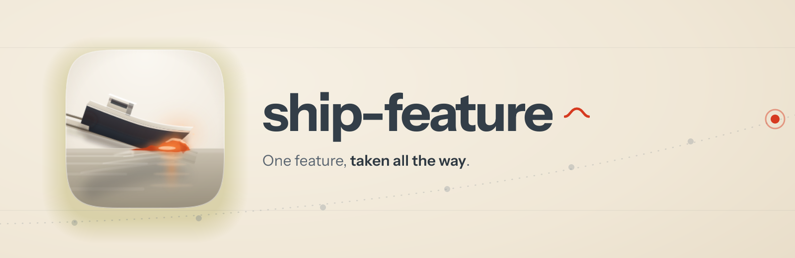

<p align="center">
  
</p>

<h1 align="center"> ship-feature</h1>

<p align="center"><strong>One feature, taken all the way.</strong><br />
The end-to-end conductor for Claude Code: rough idea in, merged and independently verified code out, with every stage's gate actually checked on the way.</p>

<p align="center">
  
  
  
  
</p>

---

## Why it exists

Running a feature through triage, planning, design, build, tests and review means invoking half a dozen skills in the right order, carrying the right context between them, and noticing when one of them quietly skipped its own gate. That last part is the job. An audit of the predecessor pipeline found features "completing" with review verdicts missing, plans never committed, and merges happening in the gap between skills where no gate lived.

ship-feature is the conductor. It holds the feature's intent from first read to final merge, runs each [shipyard](../shipyard/README.md) stage in turn, and treats a missing artifact as a stopped pipeline rather than a detail.

## How a feature moves

Say something like *"ship this feature end to end"* or hand it a brief file, and it runs: **intake** (for a rough idea) → **triage** → **plan and design in parallel** → **work** in an isolated worktree → the deferred-work loop → **gap-fix** → an **acceptance e2e suite** run against the branch, green twice → **verify**, spawned as a fresh agent from a different model family, the only stage that can say `Done` → a **fail-closed merge** where every box gets checked now, not recalled.

Three habits do most of the work:

- **Decisions defer before they escalate.** Forks get looked up, divergence-tested, or settled by a second model. What genuinely survives (taste, cost, scope, risk) reaches you as one batched question in an attended run, or parks with an easy-reply block in an unattended one. The pipeline doesn't stall on things a model could have settled.
- **The memory is on disk.** Every stage persists its artifact, so an interrupted run resumes at the first missing one instead of starting over.
- **A merge instruction changes the destination, never the bar.** If a gate is red, the run stops and names it. There's also a rollback procedure decided before it's ever needed, not improvised during an incident.

What's new in 2.2: the three gates inside verify that decide whether its evidence means anything. Every screenshot proves what it depicts rather than being trusted on its filename; a campaign once published 20 captures of three unrelated documents and passed every check pointed at it. Every suite cited as green is scanned first for assertions that cannot fail, because over half of more than 15,000 generated mutants once survived a passing unit, integration and system suite. And a critic reads only the evidence bundle, with the app and the diff closed, rejecting any row that cites nothing measurable. A `COMPLETE` verdict over a bundle that fails those is not a green gate, and the item doesn't advance.

What's new in 2.0: the design stage (all-platform mocks gated by design-review and be-my-witness), the cross-family verify stage, the `Needs More Work` loop back through gap-fix, four new pre-merge gate boxes (verifier verdict, post-rebase e2e re-run, keyboard/accessibility floor, compliance sign-off where triage flagged it), and decision deferral through the [clarify](../clarify/README.md) gate instead of mid-run questions.

## Install

```
/plugin marketplace add fledgeling-co/fledgeling-plugins
/plugin install ship-feature@fledgeling-plugins
```

It expects the [shipyard](../shipyard/README.md) stage skills alongside it. For a whole backlog, use [ship-fleet](../ship-fleet/README.md); for one stage on its own, invoke that stage's skill directly.

## Does it actually work?

The conductor was evaluated as part of the shipyard rebuild's blind panel: judges from three model families, shown anonymised outputs with no idea which came from the old conductor and which from this one, preferred this one on the design-gates eval 3-0. The predecessor's output named no review gates on its design phase and no verifier before merge; both now exist and both are load-bearing. The full comparison, including the evals the rebuild lost before fixes landed, is in [shipyard's EVALS.md](../shipyard/evals/EVALS.md).

## Credit

The conductor pattern and its hardest-won rules (the fail-closed gate, the worktree discipline, the deferred-work loop) come from the predecessor in [diolog-plugins](https://github.com/Diolog26/diolog-plugins), built and burned-in across real fleets. The verify stage's physical isolation borrows from [Vercel Labs' eve-software-factory-template](https://github.com/vercel-labs/eve-software-factory-template) (MIT).
