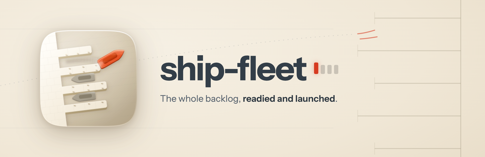

<p align="center">
  
</p>

<h1 align="center"> ship-fleet</h1>

<p align="center"><strong>The whole backlog, readied and launched.</strong><br />
The repo-wide orchestrator for Claude Code: it surveys everything left in a project's pipeline, writes one durable plan, then conducts ship-feature runs until the ledger says done.</p>

<p align="center">
  
  
  
  
</p>

---

## Why it exists

A backlog isn't one feature; it's a queue with dependencies, half-finished worktrees, briefs nobody triaged, and follow-ups buried in progress notes. Running it well is a scheduling job, and the failure mode is specific: fleets that report "completed" while runners died mid-flight. The workflow machinery returns `null` on a dead agent and the run still finishes clean, so a survey can report a backlog shipped that nothing touched.

ship-fleet's rule for that is blunt: **done means the ledger says so, never that the dispatch returned.** Everything else follows from it.

## How it runs

Say *"ship everything left in the backlog"* or *"run the fleet"*, and it works through: **preflight** (checks the repo's conventions with you before touching anything) → **survey** (classifies every remaining item, including the follow-ups mined out of old progress notes) → **worktree hygiene** (nothing unmerged is ever destroyed) → **the orchestrator artifacts**, written and committed before any execution: `ORCHESTRATOR.md` as the resumable ledger, plus a visual hierarchy of the waves → **serial pre-triage** (id allocation is a shared write; racing it corrupts the ledger) → **the fleet**: dependency-ordered [ship-feature](../ship-feature/README.md) runners, slots refilled as they free.

Runners stop twice on purpose. They stop **before verify**, because a runner can't verify its own build; the orchestrator spawns each item's verifier as a fresh agent from a different model family. And they stop **before merge**, because two simultaneous merges into one integration branch is how fleets corrupt repos; merges go one at a time, behind the fail-closed gate.

New in 2.0: the per-item cross-family verification step, a **Needs verification** survey class (an item sitting in review with no verdict is a gap, not a done), one global agent budget instead of two caps that multiplied into rate-limit storms, and a published low-cost runner shape, because the audit record shows what happens when operators hand-roll cheaper ones: the safeguards are the first thing stripped.

## Install

```
/plugin marketplace add fledgeling-co/fledgeling-plugins
/plugin install ship-fleet@fledgeling-plugins
```

Expects [shipyard](../shipyard/README.md) and [ship-feature](../ship-feature/README.md) alongside it. For the layer above (every repo in a portfolio), see [ship-armada](../ship-armada/README.md).

## Does it actually work?

The fleet's operating rules are the part with the longest evidence trail: nearly every line in its scheduling reference records a dated incident from real fleet runs (the `git add -A` that swept three runners' work onto main, the `pkill` that killed a sibling's test run, the model override that didn't stick, the seven runners lost to transport failures). Those rules survive here verbatim, and the rebuild's eval story for the stages underneath it is in [shipyard's EVALS.md](../shipyard/evals/EVALS.md).

## Credit

The predecessor in [diolog-plugins](https://github.com/Diolog26/diolog-plugins) built and paid for almost all of this; 2.0 is a restructuring of hard-won material, not a fresh invention. The verify-before-merge topology borrows from [Vercel Labs' eve-software-factory-template](https://github.com/vercel-labs/eve-software-factory-template) (MIT).
