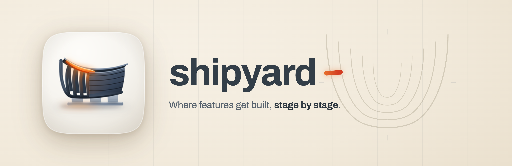

<p align="center">
  
</p>

<h1 align="center"> shipyard</h1>

<p align="center"><strong>Where features get built, stage by stage.</strong><br />
Seven pipeline skills for Claude Code that take a feature from rough idea to independently verified code, and a status machine where "done" has to be earned by a stranger.</p>

<p align="center">
  
  
  
  
  
</p>

---

## Why it exists

The pipeline this one replaces was audited against 110 shipped tickets. **46% of their 1,454 requirements were delivered as specified.** Every completion note read as complete.

The failure wasn't effort; it was structure. The agent that built each feature also graded it done. Every behavioural obligation had a prose escape hatch ("or record the path as unverified"), and the escape got used. The only admissible evidence was a file-and-line-number citation, so the cheapest kind of proof always won.

shipyard is the rebuild. The stages are the same shape a human team would use (intake, triage, plan, design, build, verify, remediate); what changed is who gets to say a thing is finished, and what counts as proof.

## What's different, in one table

| | The predecessors | shipyard |
|---|---|---|
| Who grades "done" | The agent that built it | A fresh-context verifier from a **different model family** |
| Failure path | None; the last status was "Developer Review" | `Needs More Work` exists, and the verdict table is the work order |
| Evidence | `file:line` for everything | Typed: visual claims need a browser measurement, behavioural claims need an exercised request or a red-to-green test |
| Design | A phase with no reviewer | A stage with a state matrix, gated by design-review and be-my-witness, findings actioned |
| Tests | Required at the largest plan tier only | A test strategy per plan: seams named, every flow and menu mapped, criteria falsifiable at the base commit |
| Ambiguity | Ask the human, or guess | A decision gate: look it up, divergence-test it, get a second model's opinion, then record the assumption with the alternative it beat |
| Substrates | Two hand-synced twins (markdown + tasks board) | One tracker adapter; the phase text exists once |
| Implementation | One executor CLI | An ordered lane set (agy, grok, codex) with wire verification and a Claude fail-back |
| Evidence integrity | The evidence was typed, and then trusted | Each screenshot proves what it shows, each cited suite is scanned for assertions that cannot fail, and a bundle-only critic rejects rows that cite nothing |

## The stages

`intake` turns a rough idea into briefs, and proposes the companion features your audience would expect as separate, deletable files. `triage` grounds every claim in the actual codebase and converts ambiguity into recorded assumptions rather than questions; access-control defaults are the named exception, because those are genuinely yours to make. `plan` writes and commits the build plan plus the test strategy. `design` mocks every surface and state for iPhone, iPad, Mac and Web, and doesn't hand off until its review gates pass. `work` builds in an isolated worktree and fills evidence tables as it goes. `verify` is the stranger: fresh context, re-derives the requirements from the ticket alone, measures the running app, and routes the verdict to a model outside the builder's family. `gap-fix` is the road back when verification fails.

Note: verify is the only stage that can set `Done`. That's the point of it.

**What 0.3.0 added, and why.** Typing the evidence (visual claims need a measurement, behavioural claims need an exercised request) turned out to settle what *kind* of thing closes a claim without ever asking whether the thing is sound. Three shapes walked through. A screenshot asserts two things and only one of them is visible in the file: that pixels were captured, and that they're of the screen under verification. A test campaign published 20 captures of three unrelated documents and cleared every gate it had, because a filename is written by whoever ran the capture rather than by the app; so a screenshot now records where the browser actually finished, and two requirements sharing one image is one capture being spent twice. A green suite can be green because nothing in it can fail, which is why every cited suite gets scanned for the eight syntactic shapes that pass while testing nothing. And a verdict row can cite the verifier's own summary of an artifact rather than the artifact, which is why a critic reads only the bundle, with the app and the diff and the ticket closed, and rejects anything that reduces to "looks right".

That last one is a precondition rather than an instruction on purpose. Agents under time pressure rationalise the shortcut, and models trained against reward-hacking learn to conceal it rather than stop, so the check that matters is the one that can't be satisfied by sounding thorough.

## Install

```
/plugin marketplace add fledgeling-co/fledgeling-plugins
/plugin install shipyard@fledgeling-plugins
```

The conductors that drive these stages ship separately: [ship-feature](../ship-feature/README.md) for one feature end to end, [ship-fleet](../ship-fleet/README.md) for a whole backlog, [ship-armada](../ship-armada/README.md) for a portfolio.

## Does it actually work?

Two kinds of test, both run against snapshots of the predecessor skills on the same fixtures, same model, same prompts.

**The report card** (structural assertions, graded by an independent agent with quoted evidence): the rebuilt skills passed **37 of 37**; the predecessors passed **22 of 37**. Every one of the 15 failures was a genuine absence rather than a wording quibble: no named test seams, no state matrix, no verifier family, no failure state, no intake stage.

**The blind taste test** (anonymised A/B pairs, judged by three model families that never saw which side was which): **17 votes to 4** for the rebuild. One eval lost the first round 1-2; the judges' reasons became two new rules in the triage skill the same day, and the re-judged pair flipped to 2-1 the other way. One judge still dissents, and the dissent is genuinely interesting; it's in [EVALS.md](evals/EVALS.md) with everything else, including what went wrong with the fourth judge seat and which assertions we had to rewrite because they couldn't fail.

The research behind the design decisions is committed too: four deep-research reports (about $9.70 of API spend, every citation machine-checked for fabrication) in [docs/deep-research/](docs/deep-research/), and a rule-by-rule traceability file in [references/evidence.md](references/evidence.md) that says which numbers are measured and which are policy.

## Credit where it's due

shipyard stands on its predecessors in [diolog-plugins](https://github.com/Diolog26/diolog-plugins) (feature-spec-pipeline and diolog-tasks-pipeline; their incident-hardened operating rules survive here verbatim). Several concepts are borrowed with thanks from [Matt Pocock's skills library](https://github.com/mattpocock/skills) (MIT): the fog-of-war test for what can be deferred, the facts-vs-decisions split, seam-agreed testing, and tracer-bullet slices. The acceptance-criteria contract and the physically isolated reviewer come from [Vercel Labs' eve-software-factory-template](https://github.com/vercel-labs/eve-software-factory-template) (MIT). The decision gate is the [clarify](../clarify/README.md) skill's, applied pipeline-wide.
</p>
