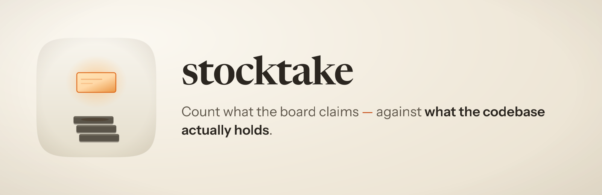
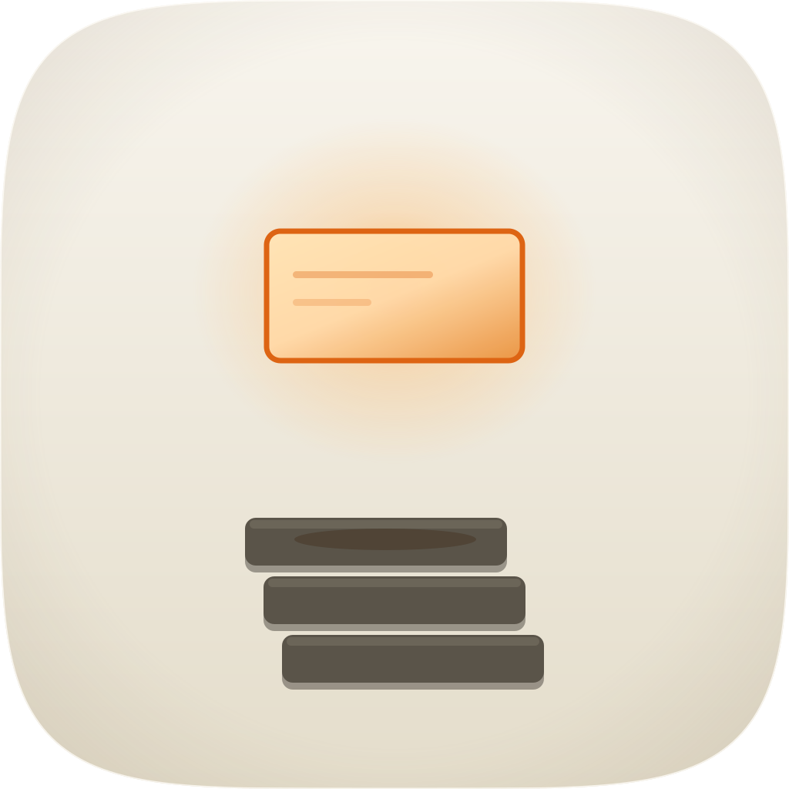

<p align="center">
  
</p>

<h1 align="center"> stocktake</h1>

<p align="center"><strong>Count what the board claims against what the code actually holds.</strong><br />
A SWE skill for Claude Code that goes through a tracker board card by card, checks each claim against the codebase, and moves every card to the column its evidence supports.</p>

<p align="center">
  
  
  
  
</p>

---

## Why it exists

A board is a set of claims about a codebase, and nobody checks them. Cards drift into
"in review" and stay there. Work gets finished on a branch nobody merged. A ticket
reads as done because somebody wrote a comment saying so.

The uncomfortable part is that checking looks like it already happened. The surface
renders. The schema validates. The test suite is green. And none of that is the same
as the value on the screen having been produced by code somebody wrote.

Three things go wrong, and each of them leaves a board that looks healthy:

**Nothing produces the data.** Roughly half of one 110-ticket corpus shipped
not-as-specified while reading as complete.

**The tests behind the card cannot fail.** An assertion comparing a value with itself.
A case satisfied by the wrong error because two code paths raise the same type. A test
fixture in a shape the real product never stores. All three were found in one
session's own work, after its author had checked each one and declared it sound.

**The evidence is written by whoever is being judged.** The same worker writes the
code, the tests, and the comment saying it is finished.

## What it does

Card by card, in this order, because the order is the point:

1. **Reads the whole card first.** The description, every comment oldest to newest,
   and every attached image, then writes a numbered list of what the card actually
   asks for. This happens *before* it opens the code. Read the code first and the code
   tells you what to look for, so you find it, and whatever the change quietly dropped
   never makes the list.
2. **Finds where the work is.** Merged, on a branch nobody merged, finished but never
   pushed, sitting in a worktree, or never started. Those are four different problems.
3. **Traces each requirement to the code that produces it**, not to the screen that
   shows it. An honest "no data yet" message is fine. A missing producer is the gap.
4. **Judges whether the tests could have failed.** The cheapest way to know is to
   break the thing on purpose and watch the test go red. A test nobody has ever seen
   fail is a test nobody has seen work.
5. **Gets an independent verdict from a different AI family** than the one that wrote
   the code. One judge, not several; see below.
6. **Moves the card**, and only ever with something you can point at: a commit, a
   file and line number, a named judge and its verdict, or a written question.

Cards that still need work get a brief written for `ship-fleet`, which runs them
through the pipeline and hands them back to these same checks. Cards with an open
question get it referred to another model or decided with a recommendation and a
reason, not left sitting on you.

## Three decisions that are deliberately unfashionable

**It does not ask a panel of models.** The obvious design is to poll several and take
the majority. Measured across nine frontier judges from seven families, they supply
about **two** genuinely independent votes, and the best single judge matches or beats
the whole panel in every condition tested. A panel costs several times as much and
buys agreement rather than independence.

**"I could not tell" is a real answer.** An inconclusive result blocks the card. It
never quietly rounds up to a pass. This is the same rule laboratories work under, and
it is the difference between a gate and a formality.

**Past Done, it asks the warrant rather than deciding.** An independent verdict gets a
card to *Done*. Whether it goes further is a question about authority rather than about
the card, so it is handed to the `warrant` plugin, where authority is written into a
signed policy, earned per class of defect, and taken away automatically when a model
version moves, an escape lands or the control chart drifts.

Three answers come back. **Verified**, where that class of work has earned the top tier
and nothing has been revoked. **Needs More Work**, where one of the warrant's own checks
failed on this card's evidence, quoted onto the card so it is actionable: a figure that
does not tie to its source arrives as the figure, both values and the tolerance, not as
"verification failed". Or **Done and no further**, with every reason named, which is
what happens by default.

Note: a grant says what it rests on, every time. A warrant tier is earned by nothing
having escaped over a declared window, which is not the same as anyone having measured
how good the machine is. No such measurement exists for code review. What a signed
warrant means is that a named person accepted that substitution in advance, and that
signature is the one piece of this nobody automated away.

Where `warrant` is not installed, the older gate applies: eight named preconditions, a
bundled check that refuses by default and tells you which are missing. Refusing is the
feature either way.

## Install

```
/plugin marketplace add fledgeling-co/fledgeling-plugins
/plugin install stocktake@fledgeling-plugins
```

The `warrant` plugin decides the column past Done and ships separately at
[warrant](../warrant/README.md). Without it, the older eight-precondition gate
applies and refuses by default.

## Using it

Ask in plain language ("go through the review column", "what's actually left on these
tickets", "triage the board"), or invoke it directly:

```
/stocktake
```

It works with any task tracker exposed over MCP. Map your column names onto its six
roles once, at the start, and it remembers.

**One thing worth knowing before a full board.** An independent verdict takes ten to
twenty-five minutes per card and the judge will not run several at once, so a
forty-card board is most of a working day. The state lives in a file, so it survives
being interrupted and picks up where it stopped; but if you only need one column, ask
for one column.

## What it will not do

- Edit the code it is judging. A review that changes the thing under review has
  stopped being a review.
- Show you its verdict before you have formed your own, if you are reviewing
  alongside it. Being shown the machine's answer first measurably made human readers
  worse across 429,345 real cases.
- Move a card on an impression.
- Report a partial sweep as a finished one.

## Licence

MIT.
