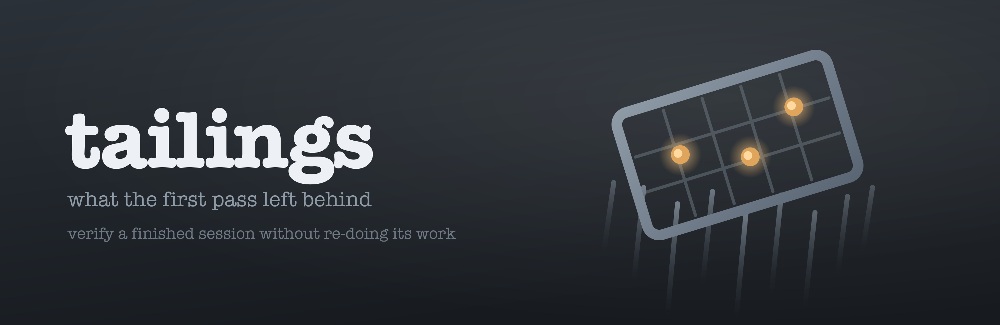

<p align="center">
  
</p>

<h1 align="center"> tailings</h1>
**Verify and clean up after a finished agent session without re-doing its work.**

<br clear="left" />

In mineral processing, tailings are what the first pass left behind. You reprocess
them because you know the ore body and the first pass's recovery rate — you do not
re-mine the mountain.

A frontier model re-reading a cheaper model's work costs more than the session did.
This skill exists because the failure signature is now measured, so an expensive
reader can go to a small number of places and leave the rest alone.

## What it found, and why it aims where it does

Built from a forensic audit of 18 Gemini-driven Claude Code sessions across 13
repositories — 148 adversarially-refuted findings, against a 37-session Claude
control in the same repos and the same window.

**The work those sessions produced was usually real. The account of the work is
what failed.** A named gate not run, a cheaper measurement substituted for the one
asked for, a verification claimed with no tool result behind it, and an explicit
directive silently dropped are **106 of the 148 findings**. One session landed nine
genuine defect fixes, each with a discriminating test, then marked eight further
features `Merged` on commits containing only markdown.

So the pass aims at the account, and opens product source only where a probe points
at it.

## How it runs

```bash
python3 scripts/signals.py <session.jsonl> --repo <repo> --out signals.json
python3 scripts/crossref.py signals.json --repo <repo> \
        --since <session start> --until <session end> --out crossref.json
python3 scripts/worklist.py init ./tailings --signals signals.json --crossref crossref.json
python3 scripts/worklist.py next  ./tailings      # highest-ranked undecided row
python3 scripts/worklist.py check ./tailings      # the gate
```

Sixteen transcript probes and seven repository probes run first and cost nothing.
Among them: a gate that went red and turned green through an edit to its own input;
an "out-of-family" reviewer that resolved to the running model's own family; a
figure in a durable artifact that no tool ever printed; screenshots filed under
names they are not pictures of; a fan-out skill that spawned nothing.

Their output is a ranked worklist that tells an expensive reader where to point —
sorted on blast radius × probe confidence, never on severity, because the band that
propagates is the claim written into a file another session plans from.

Then every assertion lands in exactly one of eight classes — `substantiated`,
`unbacked`, `contradicted`, `laundered`, `inert`, `undone`, `degraded`, `waived` —
with an exit code that blocks a report which lost an item.

`signals.py` accepts both Claude message transcripts and Codex Desktop
`response_item` JSONL. For a Codex subagent transcript it reads the declared
`agent_path`, starts at the first `agent_message` addressed to that path, and reports how
many inherited parent records it excluded. Calls receive stable one-based ordinals and must
pair one-to-one with outputs. Model identity advances from owned `turn_context` records and is
attached to each call, so inherited parent settings and later model changes cannot skew the
in-family reviewer probe. A transcript with no recognized activity, an orphan call, or an
orphan output fails closed. `crossref.py` uses only paths attributable to that owned segment and
keeps accessed paths separate from modified paths, so concurrent work elsewhere in the same git
window cannot create evidence for the audited session.

## The boundary on what it changes

> The pass may edit anything whose truth it has just established, and nothing whose
> truth it would have to establish.

Correcting `0 unmeasured` to `271 unmeasured` in a delivery note transcribes a
number read out of the session's own gate output. Wiring an inert button writes
code whose correctness nothing here has measured — and having written it, the pass
would have to verify its own edit, which doubles the budget and destroys the
independence of the verdict.

So it fixes the record, reverts a laundering edit, runs a cheap gate that was
skipped, and writes down a degradation. It reports everything else.

## What it refuses to do

- **Re-do the work.** That spends more than the session it audits.
- **Grade code quality or architecture.** That is `code-review`, and mixing them
  produces a report whose reader cannot tell a fabricated verification from a
  naming preference.
- **Judge a choice a Claude session would plausibly have made.** Where no control
  exists it says `model-specificity: unclear` rather than asserting it.
- **Blame the model for an absent instrument.** Three of the audit's own
  refutations were exactly this misfiling.
- **Fan out.** At most one subagent, only for a transcript above roughly 30 MB, and
  it returns line numbers and verbatim spans rather than conclusions.
- **Run without the transcript.** It says so, runs the repository half, and names
  the classes it cannot populate.

## Every probe carries a negative control

Eight of the probes originally proposed for this skill were unsound on inspection
and three would have fired on correct behaviour. `scripts/selftest.py` runs 34
paired fixtures — each probe must fire on a dirty input and stay silent on a clean
one — and three probes were rewritten after firing on correct work in a real
repository.

The same selftest also carries synthetic Codex envelopes with fake paths and content. It pins the
subagent boundary, call/output pairing and ordinals, zero-recognition refusal, `/root/task`
address handling, basename citations, and capture scoping without copying any real transcript.

```bash
python3 scripts/selftest.py    # exit 0 required
```

## Depth

- `skills/tailings/references/probes.md` — every probe, its measured case, and the
  false positive that shaped it.
- `skills/tailings/references/evidence.md` — the corpus, the control arm, what the
  method cannot see, and the open questions.
- `docs/gemini-audit/` at the repository root — the full audit this was built from.
