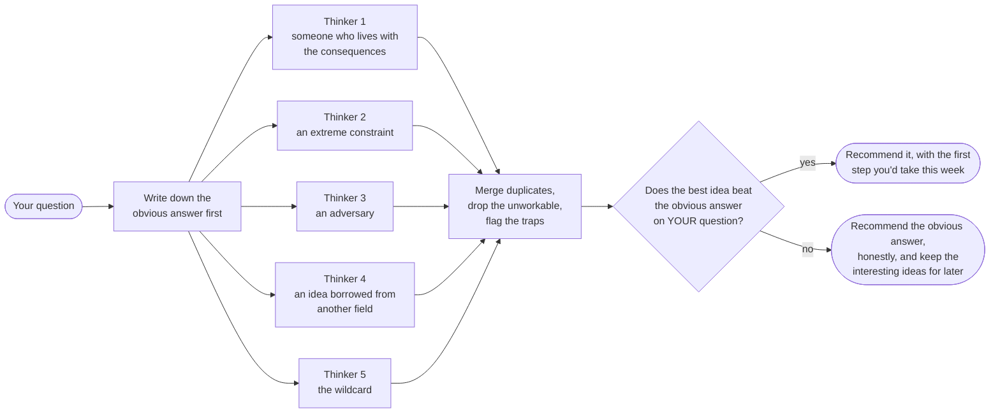

<p align="center">
  
</p>

<h1 align="center"> trawl</h1>

<p align="center"><strong>Cast a wide net over your options. Keep only what's worth shipping.</strong><br />
A brainstorming engine for Claude Code, and the evidence-grounded successor to <a href="https://github.com/uditakhourii/adhd">uditakhourii/adhd</a>.</p>

<p align="center">
  
  
  
  
</p>

---

## The problem, in one minute

Ask an AI an open-ended question ("how should we split this system?", "what do we name this product?") and you get the same safe answer everyone gets. That's not bad luck; it's measured. In one study, researchers asked a model for 4,000 ideas and about 95% were the same ideas reworded. In another, nine separate people asked for a product name and got the *identical* name.

Asking again doesn't help. Asking it to "be creative" doesn't help. What helps is structure: several separate thinkers who can't see each other, each looking at your problem from a genuinely different angle, then an honest sifting process that keeps only the ideas that beat the obvious answer.

That's what trawl does.

## How it works



The five thinkers work in isolation on purpose. Letting them see each other's ideas sounds collaborative; in controlled tests it makes every idea more samey. And the final gate is blind: the judge comparing the creative pick against the obvious answer doesn't know which is which.

> [!NOTE]
> The skill answers to `/trawl`. The old `/adhd` and "ADHD mode" still work as legacy aliases, so nothing breaks if your fingers remember the old name.

## Installing

```text
/plugin marketplace add fledgeling-co/fledgeling-plugins
/plugin install trawl
```

## Using it

Run `/trawl <your problem>` on anything with more than one defensible answer: architecture decisions, naming, product positioning, API design, or a mystery bug nobody can reproduce. If you phrase a question as "quick" or "standard", trawl stays out of the way and you get a direct answer.

> [!TIP]
> Three sizes: `--any` for a cheap quick sweep, the default for real decisions, `--100` for exhaustive. Every run ends with a one-line receipt saying exactly what ran, what got merged or dropped, and whether the recommendation beat the obvious answer.

> [!IMPORTANT]
> A standard run costs 5-10x a single answer and takes a few minutes. It's for decision points where the obvious answer being wrong is expensive, not for every question.

## Does it actually work?

We didn't want to eyeball transcripts and call it a day, so there are two layers of testing, both in [`evals/`](evals/):

**A report card.** Eight test problems, each with a checklist of things a correct run must produce (the obvious answer written down, one idea per approach on the shortlist, traps that say *why* something's a trap, the receipt). An independent grading agent marks each item with quoted evidence. Score: **trawl 96.4% vs the original 49.0%** on the same problems.

**A blind taste test.** For each problem, both versions' answers were shuffled into anonymous "Option A / Option B" and judged by **four different AI models** (Claude, grok-4.5, composer-2.5 and GPT-5.6), none of which saw the skill or knew which answer came from which version. Blind, order-randomised, multiple judges; the same discipline the research says you need, because single AI judges disagree with each other constantly (ours disagreed on 4 of 7 problems).

The taste test came back honest rather than flattering, and that's the point: trawl swept the problems its engineering targets, lost one problem unanimously for giving generic first steps, and one judge caught a winning idea over-promising what it could guarantee. Both findings became rules in the skill the same day, and the lost problem was re-judged after the fix: **all judges flipped to trawl**.

<details>
<summary><strong>The full scorecard</strong> (click to expand)</summary>

| Test problem | What it checks | Report card (trawl vs original) | Blind judges |
|---|---|---|---|
| A CLI that hangs for 90s | Recommendation solves the *stated* problem | 6/6 vs 1/6 | split 2-2 |
| A crash-safe cache design | No silly personas beside serious work | 6/6 vs 4/6 | trawl 3-1 |
| Splitting a huge codebase | Genuinely different strategies | 5/5 vs 3/5 | original 4-0, then **all flipped to trawl** after the fix |
| Naming a product | Traps name the requirement they break | 3/4 vs 1/4 | split 2-2 |
| A "quick answer" question | Knows when *not* to run | 3/3 vs 3/3 | both answer directly |
| The cheap tier | A light run looks deliberate, not broken | 4/4 vs 1/4 | trawl 4-0 |
| "Be adventurous" on a hard problem | Playfulness can't degrade quality | 4/4 vs 2/4 | trawl 4-0 |
| Forced whimsy (new) | A requested silly lens must still earn its place | 5/5 | added after iteration 1 |

Full grading evidence, judge reasoning, and the un-blinding maps are in [`evals/EVALS.md`](evals/EVALS.md) and [`evals/blind-panel/`](evals/blind-panel/).

</details>

## What's different from the original

Full credit to Udit Akhouri and the contributors on the [original adhd project](https://github.com/uditakhourii/adhd): the isolated-thinkers idea, the strict split between generating and judging, and the habit of benchmarking against baselines all come from them, and all three survive here because the research backs them. Trawl exists because using the original surfaced fixable failure modes, and because a five-way deep-research pass over the 2024-2026 ideation literature turned up mechanisms worth building in. The receipts live in [`skills/trawl/references/evidence.md`](skills/trawl/references/evidence.md) (every design choice, with citations) and [`docs/deep-research/`](docs/deep-research/) (the raw research reports).

| | Original | Trawl |
|---|---|---|
| Separate thinkers, then converge | ✅ invented it | ✅ kept; the research validates it |
| The obvious answer | banned by phrase | written down and used as the bar to beat |
| The recommendation | highest score wins | must beat the obvious answer blind, or trawl recommends the obvious answer |
| Silly lens on a serious problem | could happen | screened up front, and never rendered unless its ideas hold up |
| First steps | "a concrete step" | something you'd actually run this week, in your own toolchain |
| Knowing what a run did | read the transcript | one-line receipt on every run |
| Proof | 6-problem benchmark | report card + four-judge blind panel, committed in the repo |

## What's in the box

```text
plugins/trawl/
├── skills/trawl/SKILL.md        the loop itself
│   └── references/              evidence, frames, convergence rules
├── evals/                       the report card + blind panel results
├── docs/deep-research/          the five research reports this was built from
└── assets/                      icon + banner
```

Found a run that misbehaved? The receipt line exists to make that diagnosable; open an issue with it included.
