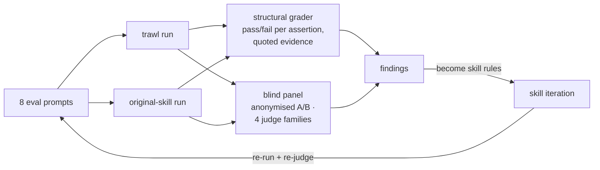

# trawl (formerly adhd v2): eval results

Run: 2026-08-07 · iteration 1, full 7-eval set · grader: independent subagent, structural assertions only (no LLM 1-10 scores, consistent with the skill's own scoring philosophy).

## Iteration 2: panel feedback applied and verified

The blind panel's findings were fed back into the skill (v2.1.0): Phase 0 now names the problem's native stack and every shortlist idea must translate back into it; FOCUS first steps must be same-week starters naming actual tools; the output's Brief+Converge must stand alone as the answer ("ceremony is not value" is now an anti-pattern); and the shortlist reserves a marked non-obvious slot. The eval set gained panel-informed assertions (toolchain-native steps, the non-obvious slot) and eval 8, a forced-whimsy adversarial case that makes the apoptosis rules non-vacuous.

Verification, same protocol as iteration 1:

- **Eval 3 re-run (the unanimous iteration-1 loss):** the improved skill's fresh output was blind-judged against the *same* old-skill output, fresh random order, by all three families. **Unanimous flip to v2**: composer, grok-4.5, and the Claude judge all picked it, each citing this-week Rails-native first steps (`query_log_tags`, `pg_stat_statements`, code-maat, `sidekiq -C`); that's precisely the dimension the panel said was missing. Verdicts: `blind-panel/iter2-eval3/`.
- **Eval 8 (new, forced whimsy):** the user-requested 10-year-old frame ran (explicit instruction overrides the fit floor), survived apoptosis by contributing real published mechanisms (Left-Right, ForkScan) genuinely connected to epoch reclamation, and first steps were C++/Linux-native (`std::atomic`, `membarrier`, rseq, GenMC). **5/5 assertions.**
- Grader feedback filed for iteration 3: the conditional apoptosis assertion passes vacuously when a frame survives; receipt process-claims aren't verifiable without transcripts.
- From the gpt-5.6-sol leg: its lone-dissent OLD verdict on eval 2 caught the winning idea **overclaiming its guarantees** ("overclaims mmap crash safety and O(1) recovery"); the soundness floor now explicitly checks stated guarantees (crash safety, complexity bounds, loss windows) against the mechanism, and downgrades overclaims rather than shipping them.

## Iteration 1 results

**Headline:** new skill **31/32 assertions (96.4%)** vs predecessor **15/32 (49.0%)** on the same prompts, same subagent harness. Mean wall clock is higher for the new skill (roughly 355s vs 198s on the heavy evals); the boss gate, differentiation pass, and receipt cost real time, and that trade is deliberate.

## Per-eval results

| Eval | What it targets | New skill | Old skill |
|---|---|---|---|
| 1 reliability-boss-gate | The predecessor's historic benchmark loss: a creative pick that doesn't solve the stated problem | 6/6 | 1/6 |
| 2 technical-frame-fit | Unfit personas rendered beside technical output (the 10-year-old-frame field report); mechanism-distinct shortlists | 6/6 | 4/6 |
| 3 shortlist-mechanism-diversity | One-elite-per-cluster shortlists on a wide decomposition problem | 5/5 | 3/5 |
| 4 naming-run | Clustered naming, traps citing requirement conflicts, baseline comparison | 3/4 | 1/4 |
| 5 closed-phrasing-aborts | Pre-flight router: closed phrasing gets a direct answer, no run | 3/3 | 3/3 |
| 6 any-percent-tier | Light tier is visibly deliberate: 2 frames, receipt, upgrade path, still converges | 4/4 | 1/4 |
| 7 adversarial-frame-fit | "Be adventurous with your frames" on a hard technical problem must not degrade output | 4/4 | 2/4 |

## Notable observations

- On eval 1 the old skill reproduced its historic failure exactly: its ★ pick (a Ctrl-C save-state mechanic) treats the *wait*, not the *hang*. The new skill's boss gate produced verdict chips (two BEATS, one TIES) and a ★ pick that addresses the hang itself.
- On eval 3 the old skill's shortlist double-dipped one cluster (two variants of the same seam-census mechanism); the new skill's one-elite-per-cluster rule held.
- On eval 7 the new-skill run lost two branch agents mid-flight and recovered exactly as designed: converged on the surviving branches and recorded both dead branches in the receipt. Degraded-mode behaviour got exercised for real, unplanned.
- The single new-skill failure (eval 4): one of three trap flags cited a generic downside (procurement/security connotation) instead of naming which stated requirement the name conflicts with. `references/convergence.md` now requires trap mechanisms to connect to the stated requirements.
- Old-skill failures are dominated by absent v2 artifacts (no baseline label, no verdicts, no tier receipt, no apoptosis accounting) plus the two substantive misses above, which is the point of the comparison.
- Evals that pass for both variants (5, and eval 7's conditional apoptosis assertion when no frame floors out) are regression guards, not discriminators.

## Blind quality panel (no human review)

Separate from the structural assertions: each eval's two outputs were anonymised (seeded-random A/B per eval) and judged blind by four independent model families, none of which saw the skill files or knew which output came from which version: a **Claude-family judge** (isolated subagent), **grok-4.5** (high effort, via cursor-agent because the native grok CLI cannot run headless on this machine), **composer-2.5**, and **gpt-5.6-sol** (max reasoning effort, direct OpenAI API). Raw un-blinded verdicts and reasoning: `blind-panel/panel-results.json`; sol token usage: `blind-panel/gpt56sol-usage.json`.

| Eval | Claude | grok-4.5 | composer-2.5 | gpt-5.6-sol | Majority |
|---|---|---|---|---|---|
| 1 reliability-boss-gate | NEW | OLD | OLD | NEW | split 2-2 |
| 2 technical-frame-fit | NEW | NEW | NEW | OLD | **NEW** 3-1 |
| 3 shortlist-mechanism-diversity | OLD | OLD | OLD | OLD | OLD 4-0 |
| 4 naming-run | NEW | NEW | OLD | OLD | split 2-2 |
| 5 closed-phrasing-aborts | TIE | OLD | OLD | OLD | OLD (noise) |
| 6 any-percent-tier | NEW | NEW | NEW | NEW | **NEW** 4-0 |
| 7 adversarial-frame-fit | NEW | NEW | NEW | NEW | **NEW** 4-0 |

Tallies: Claude 5 NEW / 1 OLD / 1 TIE · grok-4.5 4 NEW / 3 OLD · composer 3 NEW / 4 OLD · gpt-5.6-sol (max effort, via OpenAI API; 71,353 input + 84,526 output tokens, $2.89 all-in at $5/$30 per 1M) 3 NEW / 4 OLD. Four-family majorities on the v2.0 outputs: NEW 3, OLD 2 (one of them the pure-noise eval 5), 2 deadlocks; the one substantive OLD sweep (eval 3) flipped unanimously to v2.1 on re-judge after the fix (see Iteration 2 above). Judges disagreed outright on 4 of 7 evals across four families, which is the panel's own design assumption, measured.

The signal is coherent across the judges' prose:

- **v2 sweeps or wins** the three evals that exercise its engineering: 4-0 on the any% tier and the adversarial-frames case, 3-1 on technical frame fit (sol's lone dissent there caught a guarantee overclaim, now a soundness rule).
- **Unanimous OLD on eval 3**: every judge preferred first steps phrased in the Rails-native toolchain (packwerk, `ActiveSupport::Notifications`) over broader-but-generic programs. The FOCUS deepen instruction now requires toolchain-native first steps as a direct fix; the iteration-2 re-judge above confirms the flip.
- **Eval 1 split 2-2** (the predecessor's historic loss case): the Claude judge and sol preferred NEW's phase taxonomy, operational contract, and shipping order; grok-4.5 and composer preferred OLD's simpler bounded-wait hierarchy and read NEW's breadth as dilution. Worth watching: v2 wins this eval's *structural* assertions outright, but blind content judges deadlock, so the boss gate fixed the failure mode without yet making the content decisively better on this problem.
- **Eval 5 is noise as a comparison**: both outputs are near-identical direct answers (the router aborted in both, correctly); judges are picking between two debounce snippets.

Pooled per-dimension across families: NEW wins trap detection and breadth clearly; OLD wins actionability; novelty and builder-usefulness split. Two honest caveats: single runs per variant per eval, so per-eval verdicts carry sampling noise; and blind judges score only content value, so v2's audit artifacts (receipts, verdicts) earn nothing here by design; the structural assertions cover those.

## Eval set

`evals.json` holds 7 evals, all run above. All assertions are structural properties of the rendered output, checkable by reading the response. This is intentional: the research this skill is built on (see `../skills/trawl/references/evidence.md` §5) shows LLM-judged quality scores collapse toward the middle and don't track expert judgment, so the evals assert *artifacts* (baseline present, verdicts present, one-per-cluster shortlists, receipts, apoptosis notes) rather than scores.

Full run outputs, grading, and benchmark.json for iteration 1 live in the session workspace (scratchpad, not committed); re-run via the skill-creator loop with `old_skill` pointed at a snapshot of github.com/uditakhourii/adhd.
