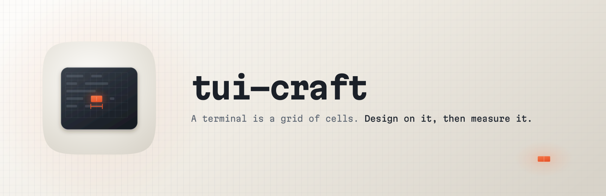
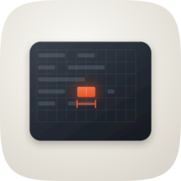

<p align="center">
  
</p>

<h1 align="center"> tui-craft</h1>
<p align="center">
  
  
  
  
</p>

Design, mock, build and review terminal interfaces against what a terminal
actually draws, not against the code or the drawing that meant to draw it.

The gap between those is where terminal bugs live. `len("🚀 Deploy")` is 8 in
Python and 9 cells on screen, and that one cell tears the panel border on every
row below it. You cannot see that by reading the source, and you cannot see it by
sketching a layout in a code block either, because sketching one means counting
characters and characters are not cells.

So both skills here start from a cell grid instead.

## Two skills

| Skill | When | What it works on |
|---|---|---|
| **`tui-design`** | Before the app exists. Designing, laying out, mocking, comparing two layouts, proving a screen fits at 80x24. | A spec you write, compiled into a real frame. |
| **`tui-craft`** | Once it runs. Building, reviewing, polishing, deciding whether it ships. | A frame captured from the running program. |

They share one width function, which is the reason they sit in one plugin. A mock
measured by different arithmetic from the capture it will later be compared
against disagrees with the instrument for reasons that have nothing to do with
the design, and the disagreement looks exactly like a layout bug.

The split between them is author versus instrument, not "does a program exist
yet". A composed frame supports claims about a design: what it occupies at this
size, whether its roles form a ladder, whether its selection survives losing
colour. It supports no claim about a running program. Those need a capture.

## What it does

**Captures the running app.** `tui_capture.py` drives your TUI under a pty at a
fixed size, replays its byte stream through a terminal model, and emits a typed
cell grid with provenance attached: the command, the size, `TERM`, which parser
ran, and a hash of the raw bytes.

```bash
python3 scripts/tui_capture.py --cmd "./myapp" --cols 100 --rows 30 \
  --settle 1.2 --keys "j,j,Enter,/,f,o,o" --dump -o frame.json
```

**Runs the arithmetic.** `tui_gates.py` reads that frame and checks the things
nobody eyeballs correctly:

| Gate | What it catches |
|---|---|
| `border-integrity` | A box that opens and never closes on the same column |
| `width-arithmetic` | A row shoved past its neighbours by a double-width glyph |
| `overflow-wrap` | Content that ran off the edge and continued mid-word |
| `truncation-marker` | Text cut with no ellipsis to say it was cut |
| `shelf-containment` | An inset border label that crowded out its own rule |
| `glyph-risk` | Replacement characters, and Nerd Font glyphs that need a font your reader may not have |
| `colour-inventory` | The colour count, and a frame with no bold and no dim anywhere |

Every finding comes back with a row and a column, so you can go and look at it.

**Then you look.** The capture prints a character matrix with column rulers, and
that's the artifact to read. Misalignment that's invisible in a screenshot is
obvious against a ruler:

```
     000000000011111111112222222222333333333344444444445555555555
     012345678901234567890123456789012345678901234567890123456789
     ------------------------------------------------------------
  0 |┌ Pipelines ───────────────────────────────────────────────┐
  1 |│ deploy   prod-east-1                Active               │
  2 |│ build    日本語ビルド                     Running
  3 |│ test     staging-eu-west-2-canary   Failed               │
  4 |└──────────────────────────────────────────────────────────┘
```

Row 2 is missing its right border. The CJK string measured 6 characters and
drew 12 cells.

## The rule

A claim about a screen needs a captured frame. Not the source, not a description,
not a mock in a fenced code block.

If capture fails, that's the result you get: `capture blocked`, with what was
tried. It's never a reason to fall back on reading the code and saying it looks
about right. That failure mode is the reason this exists; its predecessor carried
4,900 lines of sound design advice and no way to see a single frame of output.

Hand-drawn frames are still useful for proposing a layout. They're labelled
`mock`, and they can't support a finding.

## Two producers, one schema

If you own the source, your framework already knows how to render itself for
testing. `frame_from_ansi.py` turns that output into the same frame, so
`teatest`, Ratatui's `TestBackend`, Textual's `run_test` and
`ink-testing-library` all feed the same gates.

```bash
python3 scripts/frame_from_ansi.py frame.ansi --cols 100 --rows 30 -o frame.json
```

Snapshot tests skip the host negotiation though (real colour depth, real font,
the terminal's own width handling), so run one pty capture before you ship.

## What it knows

**A pattern catalogue** built from 48 shipped TUIs, analysed frame by frame.
Every pattern names the app it came from, so you can check it. The border used
as a metadata shelf rather than a fence. Mnemonics marked on the thing they
operate, including the one form I haven't seen documented anywhere else: the Jira
TUI puts each field's jump key on that field's own border. Focus signalled twice,
because a terminal has no hover and no shadow. Six ways to draw a chart at one
character of resolution.

**An anti-pattern list** where every entry shipped in a real application.
Truncation with no marker. A footer that wraps mid-word. A modal with no scrim
and no way out. Block art below its legible size. `→ Shfit front`, which is in a
finance TUI right now.

**Terminal constraints, cited rather than asserted.** `NO_COLOR` before any
capability check. Why UAX #11 isn't sufficient on its own, in the standard's own
words. OSC 11 to ask the terminal whether it's light or dark instead of assuming
it's dark. DEC mode 2026 against frame tearing. `gh a11y` as the shipped blueprint
for an accessible mode, since a 2D grid and a screen reader's 1D stream don't
otherwise meet.

Sources are in `references/evidence.md` and the full research is in
`docs/deep-research/`.

**`docs/` is provenance, not reading material.** Nothing loads it and nothing
should: the 899 lines under `docs/deep-research/` are the raw research reports
that the two `references/evidence.md` files were written from, and
`docs/corpus-analysis.md` is the app index that makes every "Observed: `<app>`"
claim in the pattern catalogue falsifiable. They sit outside the skill-loading
path deliberately (they cost install weight and zero context) and they are there
so a claim can be checked against its source, not so anyone reads them front to
back.

## Designing a screen: `tui-design`

You cannot capture a screen that does not exist. The usual substitute is a
terminal layout drawn by hand, and it is almost always wrong for a mechanical
reason rather than a careless one: one wide glyph puts every column after it off
by one, the border stops closing, and the drawing looks fine in the message that
produced it because nothing in that message measured anything.

So the spec contains no column numbers. You declare what the screen holds and how
it divides, and a compiler does every piece of cell arithmetic.

```bash
python3 scripts/tui_mock.py spec.json -o pipelines-ideal-80x24.json --dump --gate
```

`--gate` compiles, then runs the design gates and tui-craft's arithmetic gates on
the result and combines every exit code, so the arithmetic pass cannot be the step
that gets skipped. Both gate scripts only return a non-zero exit under `--strict`,
which `--gate` passes for you. To run them one at a time instead:

```bash
python3 scripts/tui_design_gates.py pipelines-ideal-80x24.json --strict
python3 ../tui-craft/scripts/tui_gates.py pipelines-ideal-80x24.json --strict
```

That second path resolves only from the `tui-design` directory, which is why
`--gate` derives both script locations from its own file instead.

What did not fit comes back as a fit report with a non-zero exit: a column
narrower than its own content, a border label too wide for its rule, a panel whose
fixed children want more room than it has. Those are findings a hand-drawn mock
cannot produce.

Three gates can fail a design, and each is a principle rather than a corpus
average:

| Gate | The rule |
|---|---|
| `role-ladder` | Roles carrying information clear 3:1, roles the reader must read clear 4.5:1, and nothing meant to be quieter out-contrasts what it is quieter than |
| `state-carrier` | A row distinguished from its siblings stays distinguished when colour is removed, so a background fill is not enough |
| `focus-channels` | A focused element differs on at least two channels, since one signal is all a terminal gets to spare |

Everything measured from the corpus is reported beside the result and never used
to fail: role budget, rail concentration, panel fill, chrome share. The corpus is
48 shipped applications, 27 of whose 34 colour-measurable frames carry a glyph
role under 3:1. It is evidence about what ships, not an authority on contrast.

`assets/example-failing.json` is there to be run. It is a *spec*, so compile it
first: the design gates read a frame, and handing them a spec is a `KeyError`,
not a failed gate:

```bash
python3 skills/tui-design/scripts/tui_mock.py skills/tui-design/assets/example-failing.json -o /tmp/ef.json
python3 skills/tui-design/scripts/tui_design_gates.py /tmp/ef.json --strict   # 3 gates fail, exit 1
```

It fails all three gates on four planted defects, which is how you confirm a gate
can fail before trusting one that passes.

## What it doesn't do

It doesn't own design judgement. Hierarchy and restraint route to `design-craft`;
flow, the six states and the trunk test route to `ux-craft`; comparing two
rendered images routes to `be-my-witness`. This skill owns the medium, the
instrument, and the corpus.

It's also not for web or desktop GUI work.

## Installing

```
/plugin marketplace add fledgeling-co/fledgeling-plugins
/plugin install tui-craft@fledgeling-plugins
```

One install brings both skills. `tui_mock.py` imports its cell arithmetic from
`tui_capture.py` and refuses to run if it cannot, rather than guessing at widths
that every column depends on.

`pyte` is optional. Install it (`pip install pyte`, pure Python, no compiler) and
the capture uses it; without it the bundled parser runs instead, gated by 18
golden fixtures covering CJK, combining marks and ZWJ emoji. Run
`python3 scripts/tui_capture.py --self-test` and it tells you which one you're
getting. If the fixtures fail it refuses to report a captured frame at all,
because a parser that quietly mis-parses makes every gate downstream lie with
confidence.

`tui_gates.py --self-test` is the same idea one layer up: it drives each
arithmetic gate against in-code fixtures that should trip it and frames that
should not, so a gate that has stopped firing is caught before it reports a clean
frame. Both self-tests must exit 0: the capture one buys trust in the parser, the
gates one buys trust in the findings.

## Evals

Measured against no skill at all, which is the honest comparison. Results and
what they show, including where the baseline held its own, are in
[EVALS.md](EVALS.md).
