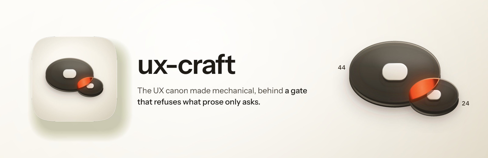
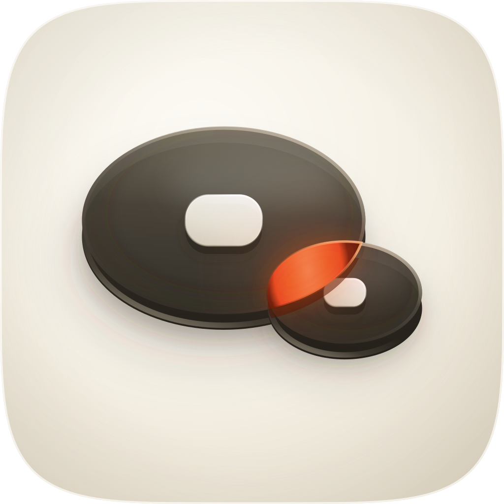

<p align="center">
  
</p>

<h1 align="center"> ux-craft</h1>

# UX Craft

<p align="center">
  
  
  
  
</p>

A Claude Code plugin for the UX half of building interfaces: forms, flows, states, error recovery, interface copy, and the review that catches what a screenshot hides. It pairs with **design-craft**: that one is the visual hands, this one is the UX brain.

> This README is the functional version. It gets its voice pass, its icon and its banner in the brand phase; the content below is accurate now.

## What it does

Three modes, picked from the shape of what you ask:

| You have | Mode | You get |
|---|---|---|
| Something that exists (code, a URL, a screenshot, an email, a flow description) | **Review** | A prioritised report with pasteable fixes, severity calibrated to user impact, and an honest list of what could not be checked |
| Something to build or mock (a screen, a flow, a form, an email) | **Build** | The goal sentence, the existing system matched, the flow shaped and settled, a counted state grid, the real words, then the gate |
| A question about behaviour ("why do users drop off", "modal or inline") | **Advise** | The answer in the first sentence, the mechanism chain behind it, both options argued honestly, and a rating of how strong the evidence actually is |

## The gate

`skills/ux-craft/scripts/ux-lint.py`: stdlib-only Python, no dependencies, two modes.

```bash
ux-lint.py --static src/checkout        # walk HTML/JSX/TSX/Vue/Svelte/CSS
ux-lint.py --probe http://localhost:3000/checkout   # measure a rendered page
```

It refuses the failures that ship silently: a `<div onclick>` carrying navigation with no role and no tabindex, `outline: none` with no focus style anywhere in the file, a placeholder standing in for a label, motion with no reduced-motion guard, a `<form novalidate>` with no per-field error states, lorem ipsum in the artifact, and any surface asserting its own verification. Warnings cover contrast where both colours resolve, competing primary actions, a destructive action whose only gate is a toast, a live region inserted with its text already inside it, and target sizes under the WCAG floor.

Three properties are the point:

- **Every finding names three things**: what you did, what the user silently gets, and the fix. Not "invalid".
- **Only exit 0 is a pass.** A run that examined zero files exits 2, because a clean sheet over nothing is a lie. A check that raised exits 4: unknown, not clean.
- **Every run prints a never-empty "Not checked" list.** A check that cannot measure says so rather than reporting zero. Screen-reader output, real keyboard traversal, colours behind a `var()`, and everything the render engine cannot see all appear there by name.

## The accessibility floor, resolved

The three touch-target numbers in circulation are not interchangeable, and mixing them produces a finding a client can disprove from the spec:

| Number | Standard | Level |
|---|---|---|
| **24 × 24 CSS px** | WCAG 2.2 SC 2.5.8 Target Size (Minimum) | **AA**, the only one a WCAG failure may cite |
| **44 × 44 CSS px** | WCAG 2.2 SC 2.5.5 Target Size (Enhanced) | **AAA**, a craft target; a miss is not an AA failure |
| **44 × 44 pt** | Apple Human Interface Guidelines | not WCAG; `pt` is density-independent |
| **48 × 48 dp** | Android / Material | not WCAG; `dp` is density-independent |

Both WCAG numbers were read at `w3.org` with their exceptions. Neither vendor page could be read at source in the session that wrote this, and the evidence file says so rather than smoothing it over.

## Install

```text
/plugin marketplace add fledgeling-co/fledgeling-plugins
/plugin install ux-craft@fledgeling-plugins
```

## What it knows about its own limits

`skills/ux-craft/references/evidence.md` rates the replication status of every behavioural law the skill cites, including the ones it argues against: nudge effects near zero after publication-bias correction, choice overload context-dependent rather than universal, Hick's Law largely failing to transfer to a structured interface, Miller's 7±2 misapplied twice over, type-to-confirm universally adopted and never measured. Every measured claim in the skill carries its run and date, and the two whose run was never recorded are marked as such.

The skill also carries a `Known limits` section: it cannot substitute for usability testing, cannot measure drop-off, and cannot verify assistive-technology behaviour. It is told not to promise any of those.

## References

Eleven, each justified by the failure it prevents rather than by a contents list.

| File | Without it |
|---|---|
| `review-playbook.md` | A review becomes a framework dump, and a render that failed gets reported as a pass |
| `flows-and-forms.md` | A form ships with one reachable state, a live region that never announces, and a list of 387 items with no way to find one |
| `psychology-laws.md` | Findings become taste and citations become name-drops |
| `evidence.md` | The skill holds its own claims to a lower standard than it holds its citations |
| `mobile-ux.md` | A desktop layout gets shrunk instead of prioritised, and hover carries something load-bearing onto a device with no hover |
| `email-ux.md` | The footer clips past Gmail's 102 KB limit and takes the unsubscribe link with it |
| `ai-product-ux.md` | An AI surface overwrites user work silently and treats retrieved content as trusted |
| `data-provenance.md` | A figure with no provenance renders as the strongest claim available |
| `ux-writing.md` | The copy reads as machine-written and the empty states say "No data" |
| `checklists.md` | The closing sweep runs from memory, which is where the legally-required links go missing |
| `model-calibration.md` | A model family that needs a cell to fill gets a paragraph to read |

## Browsers

Obscura only. Playwright, Puppeteer, chrome-devtools-mcp, Playwright MCP and browser-use are not used and not recommended. The playbook carries that engine's measured blind spots as a table, because a reviewer who does not know them files engine artifacts as product defects, and the sharpest one lands exactly on this skill's subject: a native radio input renders as nothing, which looks precisely like a missing affordance.

## Credit

Rebuilt from the `ux-craft:ux-craft` skill in the `diolog-plugins` marketplace, which supplied the canon, the review playbook, the psychology reference and the measured live-site defects that most of these rules are built on. The predecessor's two-tier evidence taxonomy with a declared `n=1`, its find-wide-then-filter-hard rule, its section arguing against its own citations, and its provenance reference are kept here largely as they were written, because they were better than anything a rewrite would have produced.
