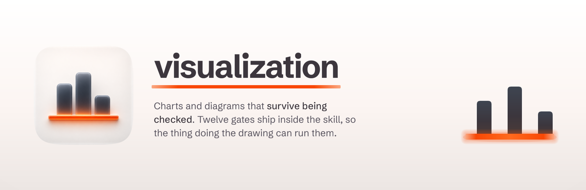

<p align="center">
  
</p>

<h1 align="center">visualization</h1>

<p align="center"><strong>Charts and diagrams that survive being checked.</strong><br />
A skill for Claude Code that picks the right form for your data, proves its colours work for colourblind readers, and runs twelve gates over its own output before handing it to you.</p>

<p align="center">
  
  
  
  
  
</p>

---

## What it does

Ask for a diagram or a chart, get one self-contained HTML file you can open in any
browser. No build step, no JavaScript required to read it, no external images.
Thirty-nine diagram types for structure and behaviour; fourteen chart forms for
quantities.

Ask an AI for a chart cold and you get whatever it feels like. This one has
rules it can't talk its way out of.

## What changed from the predecessor

It's a rebuild of [diagram-design](https://github.com/cathrynlavery/diagram-design)
by Cathryn Lavery. That skill is good. 39 layout grammars, six connector rules, a
semantic-pattern layer, an import pipeline for draw.io and Mermaid. All of it is
kept.

Two things are fixed. Both were measured, not argued.

**Its chart colours didn't work.** The predecessor picked five "editorial tone"
series colours by eye. All five sit below the chroma floor, the measured point
where a colour stops reading as a colour and starts reading as a grey with a tint.
The worst pair scored 10.3 against a floor of 15 for *normal* colour vision. So
this was never only a colourblindness problem.

The replacement keeps the same five hue families, re-stepped and re-ordered. It
clears every check in both modes, at 22.8.

**Its safety checks couldn't be run by the thing doing the drawing.** The
predecessor's repository holds 22 verifier scripts. Three shipped with the skill.
Its docs told the agent to run twenty of them, and an installed agent had none.
Every one of those rules quietly became prose. Twelve now ship inside the skill
and run against the file just written.

Both were then run against the same eight prompts and scored blind by judges from
four model families. The report card is 9 to 7; the panel is 5 to 2 with one
split, and one judge inverted the result entirely. Full numbers, method and the
honest losses are in [EVALS.md](EVALS.md).

## The three rules worth knowing

**Colour for multiple series is computed, not chosen.** Two or more series a
reader must tell apart, and the palette goes through a validator. It measures
lightness, saturation, colourblind separation and contrast, then returns pass or
fail. Your brand's colours are welcome. They get stepped and ordered until they
pass, or you're told plainly that your brand can't carry that many series and
should use fewer.

**A chart's geometry is a claim about numbers.** Bars start at zero; their
length is the comparison. There's never a second y-axis; where you align the two
scales is a drawing decision, and it invents a correlation. Areas encode by area,
not radius. Gaps in the data are drawn as gaps.

Ask it to zoom an axis so a small change looks big and it'll tell you what that
does to the reader, then offer the form that answers the same question honestly.

**Deletion is the default move.** Every node earns its place. The accent colour
goes on one or two things. Above nine nodes it's probably two diagrams, and if a
table would tell you the same thing, it says so instead of drawing.

## What you can check yourself

Every gate is a command with an exit code, run from the installed skill:

```bash
python3 scripts/self_check.py my-diagram.html          # accessible SVG, single-file safety
python3 scripts/verify-geometry.py my-diagram.html     # labels clipped by later-drawn nodes
python3 scripts/validate_palette.py "#3f7a33,#5b4a8f,#b07d18" --mode light
python3 scripts/verify-sankey.py my-flow.html          # does the flow actually conserve
```

Twelve of them. Label geometry, treemap areas, Sankey conservation, dumbbell
domains, slopegraph scales, beeswarm and bubble and bump and ridgeline positions,
legend tone claims, and the motion contract.

Note: read the exit code, not the printed output. Pipe a gate through `grep` or
`tail` and you get that tool's status instead. It's how a failure gets recorded as
a pass. That happened twice during this rebuild, which is why it's written down in
three places.

## What it won't do

It won't draw a one-bar bar chart. A single number with a change against it is a
stat tile, so it'll say so and make the tile.

It won't put two y-axes on one plot. No flag turns that on.

It won't generate a sixth series colour. Past five, fold the tail into "Other",
facet into small multiples, or use shape as well as hue. A generated sixth hue
collapses under colour-vision deficiency.

It won't export a PNG or SVG unless you ask. HTML is the source of truth; exports
are manual on purpose.

It won't invent a component to fill a layout gap on an import. It won't silently
drop one either. Anything cut gets reported in a fidelity ledger.

## Accessibility isn't a mode

Every visual ships as an accessible figure. `role="img"`, a resolving
`aria-labelledby`, a `<title>` naming the subject, and a `<desc>` that says what
the picture shows rather than narrating its shapes.

Charts also carry a table view, so no value lives only inside the geometry. Under
`prefers-reduced-motion` an animated file shows its complete static frame and
hides the playback controls.

## Installing

```
/plugin marketplace add fledgeling-co/fledgeling-plugins
/plugin install visualization@fledgeling-plugins
```

Then ask for what you want drawn. On the first visual in a project it'll ask
whether to match your brand. It can pull tokens from your website, a local design
system, or a saved profile. Or tell it to use the default and move on.

## Credit

The diagram half of this skill is [Cathryn Lavery's](https://github.com/cathrynlavery/diagram-design)
work, MIT licensed. The 39 layout grammars, the connector rules, the semantic
patterns, the import pipeline, and the verifiers that now ship inside the skill.

The chart method it merges with is the data visualisation skill bundled with
Claude Code. Its palette validator is the perceptual gate.
