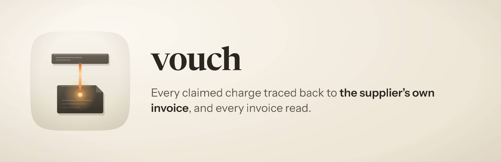

<p align="center">
  
</p>

<h1 align="center"> vouch</h1>

<p align="center"><strong>Every claimed charge traces to the supplier's own invoice, and every invoice was read.</strong><br />
A Claude Code skill that turns a period of card charges into a reimbursement claim: the form, the folder of invoices, and two reports somebody can sign.</p>

<p align="center">
  
  
  
  
</p>

---

## Why it exists

Vouching is the audit word for tracing a record back to the document it came from. It
is the whole job here, and it is the part that gets skipped, because the numbers add up
either way.

An expense claim assembled from a bank feed looks finished the moment the arithmetic
balances. What it cannot tell you is whether the charge on line forty is the company's
expense or your own, whether the invoice behind it exists, or whether you already
claimed it last year. Those are facts about documents, and a feed holds none of them.

Three things go wrong, and only one of them gets caught by whoever approves the claim.

**A number nobody can source.** An invoice reference invented from a payment
processor's account id. An amount derived from an exchange rate no document states. A
count typed into a sentence and left behind by the next pass. Each one reads exactly
like a sourced number, and on a real run each one happened.

**A row in the wrong bucket.** A personal subscription claimed as company spend, or a
company expense quietly dropped. The approver catches the first sort and never sees the
second, so exclusions get reported rather than deleted.

**A search that found nothing, read as proof there is nothing.** On the run this was
built from, a mail search silently ignored its own date filter and returned a confident
wrong answer. Enumerating the index directly retracted it. Absence needs an instrument
named beside it.

## What it does

It works through six stages, and each one has a denominator you can check.

**Builds the charge universe, then finds its holes.** It pulls the period from your
accounting MCP, then computes the days on which the account holds no transaction at
all. On the source run that found two gaps of 38 and 44 days on the main card, invisible
until somebody computed them, holding charges that belonged in the claim. Those windows
get backfilled from the card statement PDFs.

**Finds the invoice for every charge.** The mail index first, then the downloads folder,
then the supplier portal. It reads the mail index rather than searching it blind: find
the real billing senders, then query by sender and date. A PDF invoice beats an emailed
receipt every time, because only the invoice is authoritative for the number, the period
and the account it was issued to.

**Decides each row against three gates you supply.** The invoice names a company
account. The payment landed on a card you own personally. The charge is absent from the
prior claim. It reads the bill-to block of the invoice, never the delivery address of
the email that carried it, because those disagree often enough to matter.

**Matches one to one.** Two identical top-ups four days apart will both match whichever
invoice comes back first if you look them up independently. That happened, and the tally
still said two. Greedy nearest-date assignment with a used set on both sides took it from
seven of ten with two ambiguous to nine of ten, with the tenth correctly identified as
another account's.

**Emits from one source.** A claim CSV in your employer's own layout, invoices filed by
month and named for the invoice number printed inside them, and two unbranded HTML
reports: one for whoever approves the payment, one for whoever books it. Every count in
every template is derived at render. Hardcoded counts have rotted twice.

**Gates it.** Twenty-four blocking checks, each carrying the defect that motivated it.
The one that earns its keep opens every filed document and requires its filename to
appear inside it, which is what makes "name the file after the invoice number" a safe
convention rather than a hopeful one. An earlier pass had put fourteen rows on the wrong
month by keying them to a billing email.

## Where it gets its facts

It reads what you already have rather than asking you to export anything.

- **A personal-accounting MCP** for the card feed. The source run used
  [PocketSmith](https://github.com/pocketsmith/mcp-server), and the skill is written
  against any equivalent: it needs transactions with a date, an account, an amount and a
  description, and it says which of those it could not get.
- **An Apple Mail index** through the [Sift MCP](https://github.com/lprhodes/sift), for
  the receipts and invoices already sitting in your mailbox. It reads the index
  directly, because the search API silently ignored its date filter.
- **Card statement PDFs**, which state the local amount, the foreign amount and the
  conversion commission, and are the only honest source for a foreign charge.
- **Your downloads folder**, which usually already holds a third of the invoices.
- **Supplier portals**, driven through
  [proctor](../proctor/README.md) in your own signed-in browser. Cloudflare blocks
  headless automation on several of them, and when that happens the skill stops and
  hands you a page listing exactly what it still needs: date, supplier, estimated
  amount, the portal link and the account address the invoice should name. On the source
  run that page came back with nineteen invoices attached within minutes.

## Three decisions that are deliberately unfashionable

**A missing document means the row stays out.** Not an estimate, not a derived figure,
not a note promising to follow up. Two rows were about to be claimed at a rate no
document stated; the statements turned up and the real figures were 34 and 21 cents
higher. An invented figure is worse than a missing row, because a gap announces itself
and a wrong number does not.

**Exclusions are reported, never deleted.** The approved number should read as a result
rather than an assertion, which means the claim has to show what it declined and why.

**It never asserts a tax characterisation.** It states the arithmetic and cites the
document. Where it produces an optional deductibility or R&D column, that column is a
default position on the face of the expense, it says so in the report, and the
apportionment belongs to your accountant.

## Install

```
/plugin marketplace add fledgeling-co/fledgeling-plugins
/plugin install vouch@fledgeling-plugins
```

## Using it

Say what you want in your own words.

```
prepare my expense claim for the last financial year
which invoices am I still missing?
re-run the monthly claim
```

It will ask for the facts it cannot guess, in one round: the claim period, the card
endings with an owner for each, the company email addresses, the company's legal name
and registered address, the prior claim files to de-duplicate against, and your
employer's claim form. Every one of those can live in an environment variable instead;
`skills/vouch/references/configuration.md` names them.

Ask for the owner of every card ending, including ones you did not list. On the source
run a joint card was read as somebody else's and an old card of the claimant's was read
as a stranger's. Both were corrected by a human, and both would have silently shrunk the
claim.

## What it will not do

- **It will not get past Cloudflare.** Several supplier portals block an automated
  browser even with your real Chrome profile. It hands you a list instead of retrying.
- **It will not read a figure out of a PDF nobody can open.** Where the amount lives
  only in an attachment Mail never downloaded, it names the message and asks you to open
  it.
- **It will not decide an ambiguous row.** Where the invoice names neither a company nor
  a personal account and same-day correspondence does not settle it, the row goes to you
  with both readings stated.
- **It has only been run in one jurisdiction.** The tax vocabulary and rate are
  configurable and nothing hardcodes GST, but no run has produced a VAT claim.
  `skills/vouch/references/evidence.md` lists what has and has not been measured.

## Licence

MIT.
