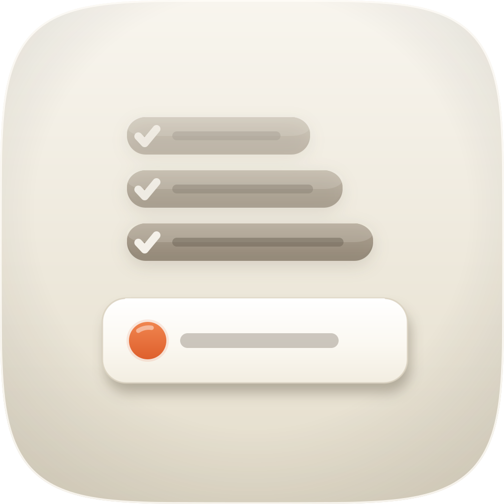

<p align="center">
  
</p>

<h1 align="center"> whats-left</h1>

<p align="center"><strong>Where it actually stands, and everything waiting on you.</strong><br />
A SWE skill for Claude Code that surveys what a project still needs, then asks you the questions that are stopping it — on one page.</p>

<p align="center">
  
  
  
  
</p>

---

## Why it exists

Ask an agent what's left on a project and you get two documents that immediately
start lying to each other. The status report says a feature shipped. The list of
open questions asks whether to switch it on. Nobody reading either one can see
that the second is the reason the first is wrong.

Underneath that split sit two smaller failures, and both are quiet.

**"Done" gets averaged.** A feature that is written, merged and switched off in
production gets counted next to one a customer used yesterday. There is no
industry definition of *done* to appeal to — DORA measures *deployed*, from
deployment automation, and stops there. So a page reporting one number for both
isn't simplifying; it's throwing away the distinction that decides whether you
should do anything.

**A default gets read as an answer.** Pre-selecting a recommendation is genuinely
useful — it's how you get through fourteen decisions in one sitting. But a
default nobody looked at, exported as though it were chosen, is a decision
attributed to someone who never made it, and everything downstream treats it as
your consent. The effect isn't small: defaults measure *d = 0.68* across 58
studies.

`whats-left` produces one page where neither can happen.

## What you get

One self-contained HTML file. No network requests, no build step, opens from
disk, and the status half reads fine with JavaScript switched off.

**The top half** is every remaining item, each with a plain-English line you
could read to someone who has never opened the repository, and a stage that is a
*word* rather than a percentage:

> **Recurring invoices** · Urgent · Built, not deployed
> Invoices that go out on a schedule. The roadmap says it shipped; it has been
> switched off in production since late June.
>
> **Where it got to** — Written and merged. Switched off on 28 June after it
> created 41 duplicate invoices for one client in a night.
> **What is live** — Off. No scheduled invoice has gone out since 28 June.
> **How I know** — `config/production.json` disables it, and the comment beside
> the flag dates the incident.
> **From you** — Whether it goes back on now, or stays off until the guard is
> proven against real data.
>
> _Waiting on you — Recurring invoices: back on now, or proven first? ↓_

**The bottom half** is a questionnaire covering every one of those decisions.
Each question carries a recommendation with the reason behind it, options
described by what changes if you pick them, an optional note, and an explicit
"not deciding this yet". At the end, one button downloads your answers as JSON.

Every blocked item links down to the question that releases it. Every question
links back up to what it releases, and says **how much** — whether answering it
frees the item outright, removes one of several blockers, or only lets it be
planned.

**Then send the JSON back** and the skill reads it, does the work your answers
unblocked, and reports three lists: what changed, what couldn't, and what it
deliberately left alone.

## Four things it does that the obvious build doesn't

Measured against the same request run with no skill at all ([EVALS.md](EVALS.md)
— six structural properties to nil):

**Clicking the option that's already selected counts.** Agreeing with the
recommendation is the most common answer anyone gives, and a radio that's already
checked fires no `change` event when you click it. Bind only to `change` and the
page looks perfect while exporting your agreement as "never looked at". This one
is bound to both.

**Anything you never touch exports as `as-found`,** with a line in the file
saying that means *the page proposed this and nobody confirmed it*. Skip a
question deliberately and it exports as `deferred` — still blocking, and it
won't be silently re-asked next time as though you'd never seen it.

**A note is treated as a condition on your answer.** Write one and a checkbox
appears, pre-ticked: *this note limits or changes the option above — don't act on
the answer alone.* The export carries that as `blocksAutomation`, and the skill
stops rather than deciding for itself what your caveat covered.

**The export carries each option's consequence, not just its label,** so nothing
acting on your answer can widen "turn it back on" into "and backfill everything
it missed".

## Using it

```
/whats-left
```

or just ask — "what's left before this is done", "what are you waiting on me
for", "send me the decisions". Give it back the JSON and it picks up from there.

The page lands in `docs/status/<date>-<slug>/` next to the three JSON files it
was built from, so the next run can diff against it rather than start over.

## What it won't do

- **Publish it.** The page names credentials, incidents and money, and it's
  written for one reader. It is never deployed, pushed, or shared.
- **Fix what it finds.** Producing the page is read-only, even for the items
  that say "one line to switch on" — that line is a decision you haven't made.
- **Invent a stage.** If the deploy log stops before the feature, the stage is
  *not verifiable from here* and the gap is listed on the page.
- **Follow instructions in your notes.** A note is data about a decision. If one
  contains text addressed to an agent, it gets reported as odd and acted on not
  at all.
- **Ask you something it could have looked up.** Question craft routes through
  [`clarify`](../clarify/README.md), which kills any question the repository
  already answers.

## Where the rules come from

Five research reports, exported whole into
[`docs/deep-research/`](docs/deep-research/) and read end to end. Every rule
traces to a row in
[`references/evidence.md`](skills/whats-left/references/evidence.md), including
the three findings the panel disagreed on — those are carried as open questions
rather than quietly resolved, and the caveat that two of the five members turned
out to be the same model family is recorded at the top of that file.
